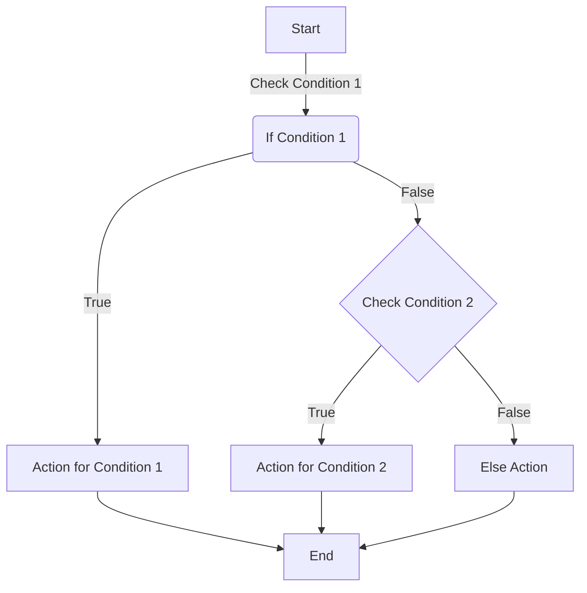

# Lesson 3: Conditional Logic and Strings

> "In the world of code, a single `if` statement can alter the flow just as a single choice can change a life."

## Content

- [1. Relational Operators](#1.-relational-operators)
- [2. Logical Operators (`if/elif/else`)](#2.-logical-operators-(`if/elif/else`))
- [3. Nested Logical Operators](#3.-nested-logical-operators)
- [4. Strings](#4.-strings)
- [5. Quiz](#5.-quiz)
- [6. Homework](#6.-homework)

## 1. Relational Operators

Relational operators in `Python` are used to compare the values on either side of them and determine the `relation between them`. 

### Table of Relational Operators

| Operator | Description                | Example | Result  |
|----------|----------------------------|---------|---------|
| `>`      | Greater than               | `5 > 3` | `True`  |
| `<`      | Less than                  | `5 < 3` | `False` |
| `==`     | Equal to                   | `5 == 5`| `True`  |
| `!=`     | Not equal to               | `5 != 3`| `True`  |
| `>=`     | Greater than or equal to   | `5 >= 5`| `True`  |
| `<=`     | Less than or equal to      | `5 <= 3`| `False` |

The order of calculation is the same as in math.

## 2. Logical Operators (`if/elif/else`)

Logical operators in `Python` are used to <span style="color:orange">control the flow of your program based on certain _conditions_.</span> These operators allow you to create conditional statements to execute _specific_ blocks of code.

### 2.1 Intro (Indentation)

In some programming languages, _indentation is a matter of personal preference_, and code can be written without it.

However, in Python, indentation is an integral part of the code structure. Incorrect indentation can lead to syntax errors and incorrect program behavior.

#### Example

The correct indentation should be 4 spaces according to the PEP-8 standard.

```python
if condition:
    print("This code is part of the 'if' block.")
```

Incorrect indentation - will result in an `IndentationError`.

#### Example

```python
if condition:
print("This code is not indented properly.")

# OR
if condition:
        print("This code is not indented properly.")
```

#### Output

```
# IndentationError: expected an indented block
```

Follow the rules of indentations during this course, and you will get the general idea of constructions which require them.

Don't worry if this seems to be hard for now, with more practice indentation will never be a problem even in complex applications.

### 2.1. `if` Statement

The `if` statement is used to execute a block of code only if a condition is `True`. It is very common to use `relational operators`  in `conditional statements` to control the flow of execution.

#### Example
```python
x = 10 
y = 5

if x > 5:           # it is ``True`` --> the code within ``if`` block WILL BE executed
    print("x is greater than 5") 

if y < 5:           # is not ``True`` --> the code within ``if`` block WON'T BE executed 
    print("y is less than 5") 
```

#### Output
```
x is greater than 5
```

Let's write a mini program to verify that you are actually learning Python and allowed to attend this course.

#### Example

```python
answer = input('Which programming language are we learning?')
if answer == 'Python':
    print('Correct', 'We are learning Python', 'It is an excellent language', sep='\n', end='!\n')
```

#### Output

```
Which programming language are we learning?
>> Python
Correct 
We are learning Python 
It is an excellent language!
```

### 2.2 `elif` and `else` 

The `elif` statement is used to execute a block of code, **only if the previous conditions** in an `if` statement <span style="color:red">**are not met**</span>, and <span style="color:green">**a new condition is `True`**</span>


The `else` statement is used in conjunction _with an `if` statement_ to specify a block of code that should be executed <span style="color:green"> when the **conditions** in the `if` and `elif` statements</span> <span style="color:red"> **are not `True`**</span>

#### Example

```python
answer = input('Which programming language are we learning?')
if answer == 'Python':
    print('Correct!')
elif answer == 'Java':
    print('Ha-ha, Nice try, but we are learning Python!')
else:
    print('Sorry, that\'s not the language we are learning ?? -> ', answer)
```

#### Output
```
Which programming language are we learning? # Asking for user's input

# Case 1
>> Python
Correct! 

# Case 2
>> Java 
Ha-ha, Nice try, but we are learning Python!

# Case 3
>> Cooking
Sorry, that's not the language we are learning ?? ->  Cooking
```

You can see the diagram down below which explains how conditionals work 




## 3. Nested Logical Operators

What should we do when we have multiple `conditions`? In `Python`, there are **_three_** logical operators that allow us to create complex conditions:

- `and` — logical multiplication;
- `or` — logical addition;
- `not` — logical negation.
  
### 3.1 Table of Logical Operators

Logical operators are used to combine conditional statements.

| Operator | Description                                       | Example                    | Result  |
|----------|---------------------------------------------------|----------------------------|---------|
| `and`    | True if both the operands are true                | `5 < 10 and 3 > 1`         | `True`  |
| `or`     | True if at least one of the operands is true      | `5 < 3 or 3 > 1`           | `True`  |
| `not`    | True if operand is false | `not(5 < 3)`               | `True`  |

### 3.2 Operator `and`

Suppose we need to write a program for students who are: **at least twelve years old, are studying in at least the 7th grade, and live in the UK**

Access to it should be restricted for those who are younger and not local.

#### Example

We combined three conditions using the ``and`` operator. It means that in this branching, the code block is executed only <span style="color:red"> if all conditions are met simultaneously!</span>

```python
age = int(input('How old are you?: '))
grade = int(input('What grade are you in?: '))
country = input('Where are you from?')

if age >= 12 and grade >= 7 and country =='United Kingdom':
    print('Access granted.')
else:
    print('Access denied.')
```

#### Output

```
# Case # 1 --> All conditions are correct
How old are you?: 13
What grade are you in?: 7
Where are you from? United Kingdom

Access granted.

# Case # 2 --> One condition is incorrect
How old are you?: 12                # Correct 
What grade are you in?: 6           # Incorrect
Where are you from? United Kingdom  # Correct

Access denied.
```

**The truth table for `and` operator**

| a      | b | a `and` b |
| ------------- | ----------- | ----------- |
| False      | False | False |
| False      | True | False |
| True      | False | False |
| True      | True | True |

### 3.3 Operator `or`

Let's create a program that grants access to a library **if the user is either a teacher, a student over 18, `or` has a special access card.**

#### Example

```python
role = input('Are you a student or a teacher?: ')
age = int(input('How old are you?: '))
has_access_card = input('Do you have an access card? (yes/no): ')

if role == 'teacher' or age > 18 or has_access_card == 'yes':
    print('Welcome to the library!')
else:
    print('Sorry, access is restricted.')
```

#### Output

```
# Case # 1 --> User is a teacher
Are you a student or a teacher?: teacher
How old are you?: 30
Do you have an access card? (yes/no): no

Welcome to the library!

# Case # 2 --> User is a student under 18 without an access card
Are you a student or a teacher?: student
How old are you?: 17
Do you have an access card? (yes/no): no

Sorry, access is restricted.
```


### The truth table for `or` operator

| a      | b | a `or` b |
| ------------- | ----------- | ----------- |
| False      | False | False |
| False      | True | True |
| True      | False | True |
| True      | True | True |

### 3.4 Operator `not`

Suppose we want to restrict access to a certain feature in a program to users who **are not administrators.**

#### Example

```python
user_role = input('What is your role? (user/admin): ')

if not (user_role == 'admin'):
    print('Feature restricted. Only administrators have access.')
else:
    print('Feature accessible.')
```

#### Explanation
```
# Case # 1 --> User is not an admin
What is your role? (user/admin): user

Feature restricted. Only administrators have access.

# Case # 2 --> User is an admin
What is your role? (user/admin): admin

Feature accessible.
```

**The truth table for `not` operator**
| a      |  `not` a |
| ---------- |  ----------- |
| False      | True |
| True      | False |

### 3.5 Resolution of operators

Understanding the order of _resolution_, or _precedence_, of logical operators in `Python` is crucial. `Python` follows a specific order when _**evaluating logical expressions**_, which <span style="color:red">can significantly impact the outcome of these expressions.</span>

1. `not` — highest precedence
2. `and` — after `not` and before `or`
3. `or` — lowest precedence

#### Example

```python
result = not 5 > 3 and 3 < 2 or 5 != 4

# Breakdown:
# 1. not 5 > 3 evaluates to False
# 2. 3 < 2 evaluates to False
# 3. 5 != 4 evaluates to True
# Final result: False and False or True, which evaluates to True

print(result)  # Output: True
```

You can experiment creating the different logical statements and see the outcome after evaluation.

### 3.6 Assigments

#### Assignment 1: Interval Membership

**Objective**: Write a program that takes an integer `x` and determines whether `x` falls within specified intervals.

```
Input:
One integer: the value of `x`.

Output:
The program should output text in accordance with the task's condition.

Example: If the intervals are -3 to 7 (inclusive), and the user enters 5, the output should be 'The number 5 belongs to the interval [-3, 7]'.
```

#### Assignment 2: Interval Membership p.2

**Objective**: Create a program that accepts an integer `x` and determines whether `x` belongs to any of the given intervals.

```
Input:
One integer: the value of `x`.

Output:
The program should output a text message indicating all intervals the number belongs to.

Example: If the intervals are [-30, -2] and [7, 25], and the user enters 8, the output should be 'The number 8 belongs to the interval [7, 25]'.
```

#### Assignment 3: Weight Category Determination

**Objective**: Write a program that categorizes the weight of a boxer into one of three weight categories.

```
Input:
One integer: the boxer's weight in kilograms.

Output:
The program should output the name of the weight category.

Example: If the categories are 'Lightweight' up to 60 kg, 'First Middleweight' up to 64 kg, and 'Middleweight' up to 69 kg, and the user enters 65, the output should be 'Middleweight'.
```

####  Assignment 4: Triangle Inequality Theorem

```
Input:
Three positive integers, representing the lengths of the sides of a triangle.

Output:
The program should output 'YES' if a triangle can exist with those sides according to the triangle inequality theorem, or 'NO' otherwise.

Example: If the user enters 3, 4, and 5, the program should output 'YES'.
```

## 4. Strings

Previously we saw `strings` and know how to declare them, but how to work with them?

### 4.1 Basic `str` operations

Strings can be concatenated (glued) with the `+` operator, and repeated with `*`:

#### Example

```python
greeting = "Hello"
name = "World"

# Concatenation
full_greeting = greeting + ', ' + name + '!'

# Repetition
laugh = 'Ha' * 3

print(full_greeting)
print(laugh)
```

#### Output
```
Hello, World!
HaHaHa
```

It's very useful and can improve the `readability` of your code while working in team!


**_NOTE_**: Strings are `immutable` data types, which means that we can't change them!

We have to create a new variable, but trying to change strings can result into the following error:


#### Example
```python
original_string = "Hello, World"
original_string[7] = 'w'  # Attempting to change 'W' to 'w'
```

#### Output
```
TypeError: 'str' object does not support item assignment
```


### 4.2 `len()` and operator `in`

The `len()` function is used to find out how many characters are in a string.

#### Example

```python
greeting = "Hello, World!"
str_len = len(greeting)

print(str_len)
print(type(str_len))
```

#### Output
```
13
<class 'int'>
```

The `in` operator checks if a certain substring exists within another string.

#### Example

```python
phrase = "The quick brown fox"
print('quick' in phrase)
# You can use the ``not`` operator combining with ``in``
print('quick' not in phrase)
```

### Output
```
True
False
```

### 4.3 indexing and slicing

Often, you need to access a specific character in a string. In Python, this is done using square brackets `[]` with the `index (number) `of the desired character.

***NOTE***: The count in `Python` starts from `0` and the 1st element of any data structure we will learn will be the `0` element!

Let's say we have the following string:

#### Example

```python
s = 'Python'
```

The image and table below shows how indexing works:

| Expression |  Result |    Explanation
| ---------- |  ----------- | ----------- |
| `s[0]`      | P |  1st character of string |
| `s[2]`      | t |  3rd character of string |
| `s[5]`      | n |  6th character of string |

In `Python`, strings support <span style="color:orange">_negative indexing_</span>. 

Negative `indices` start from `-1` for the <span style="color:red">last character of the string.</span> This can be particularly useful when you want to access the elements of a string from the end without calculating its `length`.


| Expression |  Result |    Explanation
| ---------- |  ----------- | ----------- |
| `s[-1]`      | n |  6th character of string |
| `s[-4]`      | t |  3rd character of string |
| `s[-3]`      | h |  4th character of string |

#### Output

```python
print(s[0])         # The first character  --> P
print(s[-1])        # The last character   --> n
```

### 4.4 Assigments

#### Assignment 1: Interval Membership

**Objective:** Write a program that determines the shortest and longest names among three given city names.

```
Input:
Three lines, each containing the name of a city.

Output:
The program should print the shortest and longest city names on separate lines.

Note: It is guaranteed that the lengths of all three city names will be different.
```

#### Assignment 2: Resting Query

**Objective:** Create a program that reads a single line of text and then decides if the text suggests resting.

```
Input:
A single line of text.

Output:
The program should output "YES" if the line contains the word "Saturday" or "Sunday", and "NO" otherwise.
```

#### Assignment 3:  Validating an Email Address

**Objective:** Write a program that checks if an email address is correct, assuming correctness requires the presence of the `'@'` symbol and a `.`

```
Input:
A single line containing an email address.

Output:
The program should print "YES" if the email address is considered correct, and "NO" otherwise.

Note: The presence of symbols '@' and '.' is necessary for an email address to be correct, but their absence does not guarantee the address is incorrect.
```

## 5. Quiz

### Question 1:
> What data type would you use to represent a person's name in Python?

A) `int`  
B) `str`  
C) `bool`  
D) `float`  
<!-- Correct Answer: B) -->

---

### Question 2:
> Which of the following is the correct way to convert the string '123' to an integer?

A) `int("123")`  
B) `"123".int()`  
C) `str(123)`  
D) `integer("123")`  
<!-- Correct Answer: A) -->

---

### Question 3:
> What is the result of this operation: 10 // 3?

A) `3.33`  
B) `3`  
C) `3.0`  
D) `4`  
<!-- Correct Answer: B) -->

---

### Question 4:
> Which function would you use to read a user's input as a string in Python?

A) `input()`  
B) `print()`  
C) `read()`  
D) `getString()`  
<!-- Correct Answer: A) -->

---

### Question 5:
> How would you print the type of a variable `x` in Python?

A) `print(x)`  
B) `print(type(x))`  
C) `type(print(x))`  
D) `print(x.type)`  
<!-- Correct Answer: B) -->

---

### Question 6:
> What will be the output of the following code?

```python
x = "10"
y = 5
print(x + y)
```

<!-- Correct Answer: ERROR -->

---

### Question 7:
> What does the % operator do in Python?

A) Multiplies two numbers  
B) Divides two numbers and returns the integer part  
C) Adds two numbers and returns their modulo  
D) Divides two numbers and returns the remainder  
<!-- Correct Answer: D) -->

---

### Question 8:
> What will be the output of the following Python code?

```python
temperature_str = "25.5"
temperature = float(temperature_str) + 10
print(temperature)
```

A) `35.5`  
B) `25.510`  
C) `"35.5"`  
D) `TypeError`  
<!-- Correct Answer: A) -->

## 6. Homework

### Task 1: Secure Password Generator

**Objective**: Create an app which checks user's password and based on your rules states if it's secure or not.

```
Input: The user inputs a password.
Output: The program outputs whether the password is 'Strong', 'Medium', or 'Weak'.

Input:
Pass123!

Output:
Strong password
```

### Task 2: Custom Text-based Game

**Objective**: Develop an ___interactive___ game with a mini plot twist. 

```
Input: The user makes choices at story junctures.
Output: The program narrates the consequence of the choices, leading to a unique story ending.

Choose your path (forest/mountain):
>> forest

Output:
You walk into the forest and find a hidden treasure chest!
```

### Task 3: Travel Itinerary Planner

**Objective**: Plan your future holiday, you might be tired already :)

```
Input: The user enters three cities they plan to visit.
Output: The program outputs a travel itinerary in the order entered.

Input:

>> London
>> Paris
>> Rome

Output:
Your travel itinerary: London -> Paris -> Rome
```
