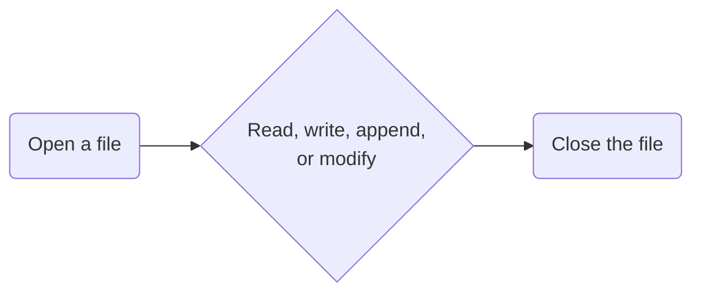

# Lesson 13: Files

> "Files are the gateways to the digital world, where data flows between code and storage."

## Content

1. [What is a File?](#1-what-is-a-file?)
1. [Working with Files](#2.-working-with-files)
1. [Exception Handling](#3.-exception-handling)
1. [Full/Relative Paths](#4-full/relative-paths)
1. [Context Manager `with`](#5.-context-manager-`with`)
1. [Working with Files of Different Formats](#6-working-with-files-of-different-formats)
1. [Quiz](#7.-quiz)
1. [Homework](#8.-homework)

## 1 What is a File?

A file is a collection of connected data or information stored in a computer memory.

Any type of data, such as text, images, software, or other objects, can be stored in files. Files can be accessed by users.

### 1.1 File Types

Text files and binary files are two main types of files. Text files, such as HTML, CSS, and TXT files, are accessible through text editors due to their readable characters. On the other hand, binary files store data in complex formats like images, music, and executable programs.

## 2. Working with Files

### 2.1 Introduction

In order to interact with a file in Python we must ***first open*** it, ***once*** the file is ***opened*** we you can ***perform*** a desired ***operation***, ***after*** the ***editing*** of the file is finished file ***must be closed***, <span style="color: red">otherwise the contents of a file might get corrupted or lost</span>. Therefore order of actions when working with files is as follows:




### 2.2 Open Files in Python

In order to open file in python use `open()` function, which has two attributes: the file name and the mode in which it will be opened.

#### Example

```python
file = open("file_name", "mode")
```

The available modes are:

| Mode | Description                                                                                                                       |
| ---- | --------------------------------------------------------------------------------------------------------------------------------- |
| r    | To read a file, open it. (default)                                                                                                |
| w    | To write, open a file. if the file doesn't already exist, creates a new one; otherwise, truncates the existing one.               |
| a    | Access a file without truncating it so that you can append data to the end of it. If the file does not already exist, creates it. |
| t    | Switch to text mode. (default)                                                                                                    |
| x    | For exclusive creation, open a file. The operation fails if the file already exists.                                              |
| b    | In binary mode, open.                                                                                                             |
| +    | To update a file, open it (reading and writing)                                                                                   |

You have to close file after you finish working with it to do that, use `close()` method.

#### Syntax:

```python
file.close()
```

### 2.3 Reading a File

To read contents of a file you can use `read()` method, it returns text of the file as a string.

#### Example

```python
file = open("assets/lesson_12/menu.py", "r")
file_text = file.read()
print(file_text)
file.close()
```

#### Output

```
# menu.py

def display_menu():
    """Print the main menu options for the application."""
    print("Please choose an option:")
    print("1. Say Hello")
    print("2. Perform a Calculation")
    print("3. Exit")
```

In Python there is method `readlines()`, it can be used to read contents of a file as well as `read`, but instead of returning one string, it returns a list of small ones(lines of text in the document). 

#### Example

```python
file = open("assets/lesson_12/menu.py", "r")
lines = file.readlines()
for line in lines:
    print(line)
file.close()
```

#### Output

```
# menu.py


def display_menu():

    """Print the main menu options for the application."""

    print("Please choose an option:")

    print("1. Say Hello")

    print("2. Perform a Calculation")

    print("3. Exit")
```

### 2.4 Writing to a File

Now you know how to read contents of a file, but if you want to edit it? For this purpose, in python exists method `write()` it writes a string value to a file.

```python
output_file = open("output_file", "w")  # if file doesn't exist yet, the program will simply create it
output_file.write("text")
output_file.close()
```

#### Output

Check the content of the file, there should be `text` string written inside.
```
text
```

If we want to write multiple lines to a file, we can use the `writelines()` method.

```python
file = open("output_file", "w")
lines = ["line 1\n", "line 2\n", "line 3\n"]
file.writelines(lines)
file.close()
```

#### Output(output_file)

```
line 1
line 2
line 3
```

### 2.5 Renaming and Deleting a File

To rename a file in Python, since there is no built-in way to do that in Python, we need 'os' library, particularly
the `os.rename()` method.

```python
import os

os.rename("old_file_name", "new_file_name")
```

To delete a file in Python use the `os.remove()` method.

```python
import os

os.remove("file_name")
```

### 2.6 Real Example

To demonstrate how all of this can be useful in real world programming, consider the following example:

***Objective***: The program that counts every word in a text file and outputs counts into another one:

```python
# Open the file(input) and read the data
input_file = open('input.txt', 'r')
file_text = input_file.read().replace(', ', ' ').replace('. ', ' ')
input_file.close()

# Count the repetitions of each word in the file
word_count = {}
words = file_text.split(' ')
for word in words:
    if word not in word_count:
        word_count[word] = 1
    else:
        word_count[word] += 1

# Open the output file and write the word_count dict in it
output_file = open('output.txt', 'w')
output_file.write(str(word_count))
output_file.close()
```

Create a file `input.txt` and paste any random text inside, I used the following one:

#### Example

```
The sun was shining bright on a beautiful day, with birds chirping in the trees and a light breeze blowing through the 
air. John walked down the street, whistling a tune and admiring the colorful flowers in the gardens. He stopped at the 
corner store to buy a newspaper, then continued on his way. As he walked, he thought about his upcoming vacation to the 
beach, and how he couldn't wait to relax in the sun and go swimming in the ocean. Suddenly, he heard a loud crash and 
turned to see a car accident on the road ahead. He rushed over to help and called 911 for assistance. The emergency 
responders arrived quickly, and John continued on his way, feeling grateful that he was able to make a difference in 
someone's time of need.
```

#### Output

Check `output.txt` file it should have been updated.

```
{'The': 2, 'sun': 2, 'was': 2, 'shining': 1, 'bright': 1, 'on': 4, 'a': 7, 'beautiful': 1, 'day': 1, 'with': 1,
 'birds': 1, 'chirping': 1, 'in': 5, 'the': 10, 'trees': 1, 'and': 7, 'light': 1, 'breeze': 1, 'blowing': 1,
 'through': 1, 'air': 1, 'John': 2, 'walked': 2, 'down': 1, 'street': 1, 'whistling': 1, 'tune': 1, 'admiring': 1,
 'colorful': 1, 'flowers': 1, 'gardens': 1, 'He': 2, 'stopped': 1, 'at': 1, 'corner': 1, 'store': 1, 'to': 6, 'buy': 1,
 'newspaper': 1, 'then': 1, 'continued': 2, 'his': 3, 'way': 2, 'As': 1, 'he': 5, 'thought': 1, 'about': 1,
 'upcoming': 1, 'vacation': 1, 'beach': 1, 'how': 1, "couldn't": 1, 'wait': 1, 'relax': 1, 'go': 1, 'swimming': 1,
 'ocean': 1, 'Suddenly': 1, 'heard': 1, 'loud': 1, 'crash': 1, 'turned': 1, 'see': 1, 'car': 1, 'accident': 1,
 'road': 1, 'ahead': 1, 'rushed': 1, 'over': 1, 'help': 1, 'called': 1, '911': 1, 'for': 1, 'assistance': 1,
 'emergency': 1, 'responders': 1, 'arrived': 1, 'quickly': 1, 'feeling': 1, 'grateful': 1, 'that': 1, 'able': 1,
 'make': 1, 'difference': 1, "someone's": 1, 'time': 1, 'of': 1, 'need.': 1}
```

### 2.7 File Methods


| Method          | Description                                        | Example                              | Output                        |
|-----------------|----------------------------------------------------|--------------------------------------|-------------------------------|
| `read()`        | Reads the entire contents of the file.             | `file.read()`                        | `"Hello, world!\nThis is a test file."` |
| `readline()`    | Reads a single line from the file.                 | `file.readline()`                    | `"Hello, world!\n"`           |
| `readlines()`   | Reads all the lines of the file and returns them as a list. | `file.readlines()`               | `["Hello, world!\n", "This is a test file."]` |
| `write()`       | Writes a string to the file.                       | `file.write("Hello, Python.")`       | - (modifies file content)     |
| `writelines()`  | Writes a list of strings to the file.              | `file.writelines(["Hello", "World"])`| - (modifies file content)     |
| `seek()`        | Changes the position of the file pointer.          | `file.seek(0)`                       | - (moves file pointer to the beginning) |
| `tell()`        | Returns the current position of the file pointer.  | `pos = file.tell()`                  | `10` (depends on the current position) |
| `flush()`       | Flushes the write buffer of the file.              | `file.flush()`                       | - (ensures data is written)   |
| `truncate()`    | Truncates the file to a specified size.            | `file.truncate(100)`                 | - (changes file size to 100 bytes) |

## 3. Exception Handling

It's crucial to manage exceptions while working with files in Python. The `FileNotFoundError`, `PermissionError`, and `IOError` exceptions are the most common when interacting with files. You can use a try-except block to handle file errors.

#### Example

```python
try:
    file = open("filename.txt", "r")
    contents = file.read()
    file.close()
except FileNotFoundError:
    print("File not found.")
```

### Output

```
File not found.
```

## 4 Full/Relative Paths

When interacting with files, you may define the file's location using a full or absolute path. 

The whole route to a file, starting from the root directory, is known as an absolute path. 

#### Example

```
Base/06.Lists.md --> This is a relative path
```

The path to a file relative to the active working directory is known as a complete path. You may use the os module to obtain the current working directory.

If you clone this project, the full path could be the path in the following example.

#### Example

```
/home/<username>/review_book/Base
```

***Note***: It may differ depends on which OS you are using.

```python
import os

cwd = os.getcwd()
```

Generally, it is preferable to use the `relative` path instead of the `full`, as if you another person runs your project, they will have a different full path, and the application might crash. 

## 5. Context Manager `with`

`with open` is a context manager in Python that offers a more effective and secure approach to handle resources like file streams.

It is advised that you use it while opening and working with files in Python.

The `with` statement is employed to surround a block of code's execution with methods specified by a context manager. 

The `open()` method serves as the context manager while processing files.


The syntax for using `with open` is as follows:

```python
with open("file_name", "mode") as file:
    # code to work with file goes here
```

When you use `with open`, `Python` automatically closes the file after the block of code included in the `with` statement completes running—even if an exception does.

```python
with open("file_name", "r") as file:
    contents = file.read()
    print(contents)
```

This is the best approach to follow working with files. So that it can help to prevent unnecessary errors which may occur.

#### Example

As an example for this topic we could rewrite the previous program that was counting words in a text using with open statement:

```python
# Open the file and read the data
with open('input.txt', 'r') as input_file:
    data = input_file.read().replace(', ', ' ').replace('. ', ' ')

# Count the occurrences of each word
word_count = {}
words = data.split(' ')
for word in words:
    if word in word_count:
        word_count[word] += 1
    else:
        word_count[word] = 1

# Open the output file and write the word counts
with open('output.txt', 'w') as output_file:
    output_file.write(str(word_count))
```

#### Output:

We will have the same output as we had before. But the approach towards working with files now has changed and became much safer.
 
```
{'The': 2, 'sun': 2, 'was': 2, 'shining': 1, 'bright': 1, 'on': 4, 'a': 7, 'beautiful': 1, 'day': 1, 'with': 1,
 'birds': 1, 'chirping': 1, 'in': 5, 'the': 10, 'trees': 1, 'and': 7, 'light': 1, 'breeze': 1, 'blowing': 1,
 'through': 1, 'air': 1, 'John': 2, 'walked': 2, 'down': 1, 'street': 1, 'whistling': 1, 'tune': 1, 'admiring': 1,
 'colorful': 1, 'flowers': 1, 'gardens': 1, 'He': 2, 'stopped': 1, 'at': 1, 'corner': 1, 'store': 1, 'to': 6, 'buy': 1,
 'newspaper': 1, 'then': 1, 'continued': 2, 'his': 3, 'way': 2, 'As': 1, 'he': 5, 'thought': 1, 'about': 1,
 'upcoming': 1, 'vacation': 1, 'beach': 1, 'how': 1, "couldn't": 1, 'wait': 1, 'relax': 1, 'go': 1, 'swimming': 1,
 'ocean': 1, 'Suddenly': 1, 'heard': 1, 'loud': 1, 'crash': 1, 'turned': 1, 'see': 1, 'car': 1, 'accident': 1,
 'road': 1, 'ahead': 1, 'rushed': 1, 'over': 1, 'help': 1, 'called': 1, '911': 1, 'for': 1, 'assistance': 1,
 'emergency': 1, 'responders': 1, 'arrived': 1, 'quickly': 1, 'feeling': 1, 'grateful': 1, 'that': 1, 'able': 1,
 'make': 1, 'difference': 1, "someone's": 1, 'time': 1, 'of': 1, 'need.': 1}
```

## 6 Working with Files of Different Formats

Python provides several libraries for working with files of different formats. Here are some of the most commonly used libraries:

- CSV - `csv` module
- JSON - `json` module
- XML - `xml.etree.ElementTree` module
- YAML - `pyyaml` module
- Pickle - `pickle` module

### CSV

Here is an example of how to read a CSV file using the `csv` module:

```python
import csv

with open("file.csv", "r") as file:
    reader = csv.reader(file)
    for row in reader:
        print(row)
```

#### Input(file.csv)

```
Country,GDP_per_capita
Luxembourg,110584
Ireland,88588
Switzerland,88224
Cayman Islands,77959
Norway,77544
Singapore,66176
United States,61280
```

#### Output

```
['Country', 'GDP_per_capita']
['Luxembourg', '110584']
['Ireland', '88588']
['Switzerland', '88224']
['Cayman Islands', '77959']
['Norway', '77544']
['Singapore', '66176']
['United States', '61280']
```

### JSON

Here is an example of how to read a JSON file using the `json` module:

```python
import json

with open("file.json", "r") as file:
    data = json.load(file)
    print(data)
```

#### Input(file.json)

```
{
  "name": "John Doe",
  "age": 35,
  "email": "johndoe@example.com",
  "address": {
    "street": "123 Main St",
    "city": "Anytown",
    "state": "CA",
    "zip": "12345"
  }
}
```

#### Output

```
{'name': 'John Doe', 'age': 35, 'email': 'johndoe@example.com', 'address': {'street': '123 Main St', 'city': 'Anytown', 'state': 'CA', 'zip': '12345'}}
```

### XML

Here is an example of how to read an XML file using the `xml.etree.ElementTree` module:

```python
import xml.etree.ElementTree as ET

tree = ET.parse("file.xml")
root = tree.getroot()

for child in root:
    print(child.tag, child.attrib)
```

#### Input(file.xml)

```
<root>
  <person>
    <name>John Doe</name>
    <age>35</age>
    <email>johndoe@example.com</email>
    <address>
      <street>123 Main St</street>
      <city>Anytown</city>
      <state>CA</state>
      <zip>12345</zip>
    </address>
  </person>
</root>
```

#### Output

```
person {}
```

### YAML

Here is an example of how to read a YAML file using the `pyyaml` module:

```python
import yaml

with open("file.yaml", "r") as file:
    data = yaml.load(file, Loader=yaml.FullLoader)
    print(data)
```

### Input(file.yaml)

```
- name: John Doe
  age: 35
  email: johndoe@example.com
  address:
    street: 123 Main St
    city: Anytown
    state: CA
    zip: '12345'
```

#### Output

```
[{'name': 'John Doe', 'age': 35, 'email': 'johndoe@example.com', 'address': {'street': '123 Main St', 'city': 'Anytown', 'state': 'CA', 'zip': '12345'}}]
```

### Pickle

Pickle is a specificly designed for Python file type, which allows us to store or save Python objects in memory. It is particulary useful in machine learning as it allows to store and transfer heavy AI models in regular memory instead of operative.

#### Example

```python
import pickle

# Write a Python object to a file
data = {"key": "value"}
with open("file.pkl", "wb") as file:
    pickle.dump(data, file)

# Read a Python object from a file
with open("file.pkl", "rb") as file:
    data = pickle.load(file)
    print(data)
```

## 7. Quiz

### Question 1:
> What does the `open()` function do in Python?

A) Opens a website URL in Python  
B) Opens a file in a specified mode  
C) Opens a new Python installation window  
D) Creates a new Python object  

<!-- Correct Answer: B) -->

### Question 2:
> What is the output of using the `readlines()` method on a file object?

A) A single string containing all lines of the file  
B) A list of strings, each representing one line of the file  
C) The first line of the file  
D) The last line of the file  

<!-- Correct Answer: B) -->

### Question 3:
> Which file mode allows you to append to the end of an existing file without truncating it?

A) '`r+'`  
B) `'w'`  
C) `'a'`  
D) `'x'`  

<!-- Correct Answer: C) -->

### Question 4:
> What does the `with` statement provide when working with file operations?

A) A way to compact the code into a single line  
B) Error checking mechanisms  
C) Automatic closure of the file  
D) Improved file read speeds  

<!-- Correct Answer: C) -->

### Question 5:
> What exception is raised if a file operation is attempted on a non-existent file without the appropriate handling?

A) `FileNotFoundError`  
B) `IOError`  
C) `OSError`  
D) `ValueError`  

<!-- Correct Answer: A) -->

## 8. Homework

### Task 1: Exception Safe File Reader

**Objective**: Create a function `safe_file_reader` that reads contents from a given file and handles any possible exceptions.

#### Requirements:

- The function should accept a file path as an argument.
- Use a `try-except` block to handle `FileNotFoundError` and print a friendly message if the file is not found.
- Use the `with` statement to ensure the file is properly closed after reading.
- Print the contents of the file if it is found and successfully opened.

### Task 2: File Content Reverser

**Objective**: Write a function `reverse_file_content` that reads a file, reverses its content, and writes it back to the same file.

#### Requirements:

- The function should take a file path as an argument.
- Read the original content of the file and reverse the order of lines.
- Write the reversed content back to the same file.
- Ensure all file operations are done within a `with` block to handle the file resource properly.


### Task 3: Batch File Renamer

**Objective**: Create a script `batch_rename` that renames all files in a directory by appending "_old" to their original names.

#### Requirements:

- Use the `os` module to list and rename files.
- Ensure the script checks if the directory exists and handle any exceptions.
- Only rename files (not directories).
- Print the old and new names of the files as they are renamed.

For additional functionality and tasks, try to use new modules and libs from the previous lesson, be creative, as it's high time you start developing your own applications!
