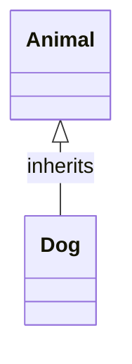
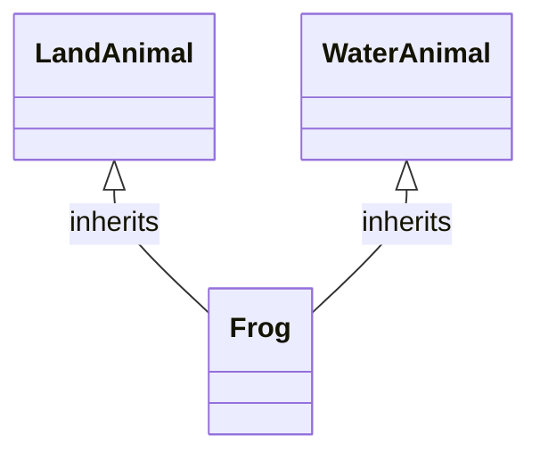
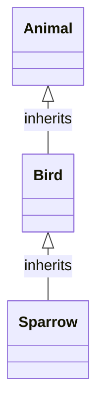

# Lesson 15: OOP (Object oriented programming) 

> "Object-oriented programming: the blueprint for building digital worlds, where data and behavior unite in elegant real world objects"

## Content

1. [Intro to OOP](#1.-intro-to-oop)
1. [Class VS Instance Attributes and Methods](#2.-class-vs-instance-attributes-and-methods)
1. [Class vs Instance methods + @staticmethod](#3.-class-vs-instance-methods-+-@staticmethod)
1. [Key Paradigms of OOP](#4.-key-paradigms-of-oop)
1. [Examples of good OOP designs](#5.-examples-of-good-oop-designs)
1. [Quiz](#6.-quiz)
1. [Homework](#7.-homework)

## 1. Intro to OOP

### 1.1 What is it?
Object-Oriented Programming (OOP) is a programming paradigm based on the concept of *_objects_*, which can contain data and code.

There are two main classifiers which object could have attributes and methods. Let's take a closer look on them!

### 1.2 Attributes vs Methods
| Classifier   | Attributes                      | Methods                             |
|--------------|---------------------------------|-------------------------------------|
| **Definition** | Attributes represent the <span style="color:orange">**_state or qualities of the object_**</span>, often called <span style="color:green">_fields_</span> or <span style="color:green">_properties_</span>. | Methods are <span style="color:orange">**_functions defined inside an object_**</span>. They represent the <span style="color:green">behavior</span> or <span style="color:green">actions</span> that <span style="color:red">**_an object can perform_**.<span style="color:red"> |
| **Usage**      | Used to <span style="color:orange">_**store information about the object**_, like size, color, or other properties.</span> | Used to define actions that can be performed by the object, like calculations, operations, or any other functions. |

Data is represented and structured in the following format. Below you can see the `attributes` and `methods` defined for the `dict` class. 

#### Example

```python
print(dir(dict))
```

#### Output

```
['clear', 'copy', 'fromkeys', 'get', 'items', 'keys', 'pop', 'popitem', 'setdefault', 'update', 'values']

#   clear           -> method  (because it's an operation on the object)   
#  'copy',          -> method  
#  'fromkeys'       -> method  
#  'get',           -> method  
#  ...
#  'values'         -> attribute (field of the object) -> returns all values of the dictionary
#  'items',         -> attribute
#  'keys',          -> attribute
```


### 1.2 Real world examples

There are lots of examples can be found just around the world. Let's take a look at car.

What color is it? What is the maximum speed? These are all - <span style="color:orange"> properties </span> of the object.

The car can drive, break, stall and rev. These are - <span style="color:orange">methods </span> of the object. 

Let's take a look at the table below with more examples:

| Real-World Object | Attributes                                 | Methods                             |
|-------------------|--------------------------------------------|-------------------------------------|
| _Car_               | `color`, `brand`, `horsepower`, `fuel_level`       | `drive()`, `brake()`, `stall()`, `rev()`    |
| _Bank Account_      | `account_number`, `balance`, `account_holder`    | `deposit(amount)`, `withdraw(amount)`, `check_balance()` |
| _Smartphone_        | `model`, `operating_system`, `battery_percentage`, `screen_size` | `call(number)`, `send_message(content)`, `take_photo()` |
| _Book_              | `title`, `author`, `number_of_pages`, `genre`      | `read_page(page_number)`, `bookmark_page(page_number)`, `close()` |

Same it can be represented in the world of programming. You simply create the `class`, define its `attributes` and its `methods`. It comes in handy, when you can have a custom `object` for specific needs.


### 1.3 Syntax
In `Python`, classes are defined using the `class` keyword, followed by the class's name and a colon. Inside the class, `methods` (functions) are _**defined to implement the behaviors of the objects**_.

_**Note**_: Take a look at indentation, in case it's wrong the `Pyhton` interpter will consider method as a function.


#### Example 

```python
class Car:

    def __init__(self, color, brand):       # params
        self.color = color  # attributes
        self.brand = brand

    def drive(self):        # method of the class
        print("This car is now driving.")

    def brake(self):        # method of the class
        print("The car has stopped.")

car_1 = Car('brown', 'bugatti')            # create a specific instance of the class (Calling __init__() under the hood)
car_2 = Car('blue', 'volvo')               

# Attributes can be accessed with a ``.(dot)`` notation, same as we've seen before with dictionary
print(f"Andrew Tate owns a {car_1.color} {car_1.brand}")  
print(f"Average person owns a {car_1.color} {car_1.brand}")

# Methods as well 
car_1.drive()   
```
#### Output

```
Andrew Tate owns a brown bugatti
Average person owns a brown bugatti
This car is now driving.                # Buggati is driving, while Volvo is stationary for now. 
```

#### Explanation

- We created a class `Car` with the following attributes `color` and `brand`, 2 instances of this `class` - (`car_1`, `car_2`) and called method `drive()` for the first instance.

- `self` - _**specific instance**_ of the class. By using `self`, we can access the _attributes_ and _methods_ of the class in `Python`. It binds the _attributes_ with the given _arguments_.

- `__init__(*args, **kwargs)` - is a **special method** that's _automatically called_ when a new `instance (object)` of a `class` is created. It is also know as `constructor` method. 

Consider `self` as reference to specific object, for example we are all people, but each person (`self`) is unique.

#### Example
```python
print(id(car_1))
print(id(car_2))
```

#### Output
```
140094732495696
140094732495760
```

_**Note**_: Calling `__init__()` initialising the newly created object's attributes with specific values, which we pass while creating an object.

_**Note**_: `car_1`and `car_2` are completly different objects, although both of them are instances of the same class, this can be prooved by using `id()` function.


Now you can see that it is very convinient way to store some data with Python classes, as you don't have to define keys and values like you did it using dictionary.


#### Example

```python
class Book:
    def __init__(self, title, author, is_borrowed=False):
        self.title = title
        self.author = author
        self.is_borrowed = is_borrowed

    def borrow_book(self):
        if not self.is_borrowed:
            self.is_borrowed = True
            return f"You have borrowed '{self.title}' by {self.author}."        # Yes, you can use this 
        else:
            return f"'{self.title}' is already borrowed."

    def return_book(self):
        if self.is_borrowed:
            self.is_borrowed = False
            return f"'{self.title}' has been returned."
        else:
            return f"'{self.title}' was not borrowed."

# Creating instances of ``Book``
book_1 = Book("1984", "George Orwell")
book_2 = Book("To Kill a Mockingbird", "Harper Lee")

# Borrowing the 1st book
print(book_1.borrow_book())

# Attempting to borrow the 1st book again
print(book_1.borrow_book())

# Borrowing the 2nd book
print(book_2.borrow_book())

# Returning the first book
print(book_1.return_book())

# Checking the status of the second book
print(f"Is '{book_2.title}' borrowed? {'Yes' if book_2.is_borrowed else 'No'}")   # BTW, we can define a method for that inside the class, just use your imagination!
```

#### Output

```
You have borrowed '1984' by George Orwell.
'1984' is already borrowed.
You have borrowed 'To Kill a Mockingbird' by Harper Lee.
'1984' has been returned.
Is 'To Kill a Mockingbird' borrowed? Yes
```

### 1.4 Object-Oriented vs Functional Programming?

Once we have learnt about functional and object oriented programmming, there is often sort of confusion exists which to use among both paradigms.

`Object-Oriented Programming (OOP)` is often chosen for <span style="color:red">_large_ </span>, <span style="color:red">_complex systems_</span> where encapsulating data and behavior into objects makes the code more <span style="color:green">_**manageable**</span>_, <span style="color:green">_**readable**</span>_ and <span style="color:green">_**reusable**_.</span>

It is <span style="color:orange">_great for modeling real-world entities_</span> and is commonly used in software development for `user interfaces`, `simulations`, and `large-scale applications`.

`Functional Programming` is often used in <span style="color:red">data science world</span>. Functions do specific things, but classes - are specific things.

Frankly speaking, in real world programming the majority of applications are written using `OOP`, as it is a modern approach for high-level languages. But it's a good practice to combine both paradigms and use functions with classes in your application.

## 2. Class VS Instance Attributes and Methods

When working with classes in `object-oriented programming`, it's crucial to understand the difference between <span style="color:orange">**_class attributes_**</span>  vs <span style="color:orange">**_instance attributes_**</span>.     

### 2.1 Instance Attributes


1. **_Instance attributes and methods_** are <span style="color:green">tied to a specific instance of a class</span>. 

2. **_Each instance_**<span style="color:green"> has its own copy of these attributes and methods.</span>

3. **_Changing an instance attribute_** <span style="color:red">only affects that particular instance, not all instances of the class.</span>


### 2.2 Class Attributes


1. **_Use these_** <span style="color:green"> when the value or behavior should be the same across all instances of the class.</span>
2. **_They are_** <span style="color:red"> not tied to any particular instance of the class.</span>
3. **_If the class attribute value is changed_**, <span style="color:red"> the change is reflected across all instances.</span> 


### 2.3 Syntax 

You can access the class attributes with several ways: `Class.class_attiribute` or `instance.class_attribute`.

#### Example

```python
class Vehicle:
    total_vehicles = 0  # Class attribute

    def __init__(self, make, model):
        self.make = make        # Instance attribute
        self.model = model      # Instance attribute
        Vehicle.total_vehicles += 1

# Creating instances of Vehicle
car1 = Vehicle("Toyota", "Corolla")
car2 = Vehicle("Ford", "F-150")

# Accessing class attribute
print("Total vehicles:", Vehicle.total_vehicles)

# Accessing instance attributes
print(car1.make, car1.model) 
print(car2.make, car2.model) 

"""
# As it was mentioned before, the value and behavior is the same across all instances of the class.
# Class attributes and methods can be accessed through the instances of that class.
"""
print(car1.total_vehicles == car2.total_vehicles)       # True
```

#### Output

```
Total vehicles: 2
Toyota Corolla
Ford F-150
True
```

#### Example

```python
class User:
    active_users = 0  # Class attribute

    def __init__(self, username):
        self.username = username  # Instance attribute
        User.active_users += 1


# Creating instances of ``User`` (calling __init__())
user1 = User("Alice")
user2 = User("Bob")

print(user1.active_users)
print(user2.active_users)
```

#### Output

```
2
2
```

#### Explanation

In each example, the `class attribute` is shared among all instances of the class and reflects a `property` or `statistic` that is relevant to the `class`. But outputing them using `.(dot)` notation is not really comfortable way to manipulate the `object`. There are some more efficient ways described below in `section 3`.


## 3. Class vs Instance methods + @staticmethod

In `Python` methods within a `class` can be categorized into three types based on their interaction with `class` or `instance` attributes / `instance methods`, `class methods`, and `static methods`. Each type serves its unique purpose and is defined differently.


### 3.1 Instance Methods

**_Definition_**: Functions defined inside a class that operate on instances of the class. They can freely **_access_** and **_modify_** `instance attributes` and other `instance methods`.

**_First Parameter_**: `self` - refers to the individual instance of the class.

**_Usage_**: Used for operations that  <span style="color:orange">require data specific to an individual object </span>.


#### Example

```python
class Vehicle:
    def __init__(self, make, model):
        self.make = make
        self.model = model

    # Instance method
    def display_info(self):
        return f"This vehicle is a {self.make} {self.model}."

car = Vehicle("Toyota", "Corolla")
print(car.display_info())  # Outputs: This vehicle is a Toyota Corolla.
```

### 3.2 Class Methods

**_Definition_**: `Class methods` are functions defined inside a class that **_operate on the `class itself`_**, rather than on instances of the class.
    
**_First Parameter_** `cls` - refers to the class itself, not the instance.

**_Decorator_**: `@classmethod` - indicates that the method is a class method.

**_Usage_**: Typically <span style="color:orange">used for operations that apply to the class **_as a whole_**, rather than to individual objects</span>.

```python
class Vehicle:
    total_vehicles = 0

    @classmethod
    def increment_total_vehicles(cls):
        cls.total_vehicles += 1

Vehicle.increment_total_vehicles()
print(Vehicle.total_vehicles)  # Outputs: 1
```

### 3.3 Static Methods

**_Definition_**: `Static methods` are functions defined inside a class that _**don’t implicitly access either `class` or `instance attributes`**_.

**_Decorator_**: `@staticmethod` - indicates that the method is a static method.

**_Usage_**: Typically  <span style="color:orange">used for utility functions that perform a task in isolation</span>. <span style="color:red">They can't modify class or instance state.</span>

```python
class Vehicle:
    @staticmethod
    def is_motorcycle(wheels):
        return wheels == 2

print(Vehicle.is_motorcycle(2))  # Outputs: True
print(Vehicle.is_motorcycle(4))  # Outputs: False
```

_**Note**_: Threre is no `First Parameter` passed as an argument to the method.


Understanding _**when**_ and _**how**_ to use each method type is <span style="color:red">crucial</span> for designing effective and logical classes and the whole system design.


#### Example


```python
class BankAccount:
    # Class attribute
    total_accounts = 0

    def __init__(self, owner, balance=0):
        self.owner = owner
        self.balance = balance
        # Increment the total accounts (NOTE: we can actually create a method which does this and call it in our constructor)
        BankAccount.total_accounts += 1  

    # Instance method (for direct interaction with ``specific object``)
    def deposit(self, amount):
        self.balance += amount
        return f"{self.owner}'s account: Deposited ${amount}. New balance: ${self.balance}."

    # Instance method (for direct interaction with ``specific object``)
    def withdraw(self, amount):
        if amount > self.balance:
            return f"{self.owner}'s account: Insufficient funds. Withdrawal denied."
        self.balance -= amount
        return f"{self.owner}'s account: Withdrew ${amount}. New balance: ${self.balance}."

    # Class method to get total accounts
    @classmethod
    def get_total_accounts(cls):
        return f"Total bank accounts opened: {cls.total_accounts}."

    # Static method to check if a withdrawal amount is within a daily limit
    @staticmethod
    def check_daily_limit(amount, daily_limit=500):
        return amount <= daily_limit

# Creating bank account instances
account1 = BankAccount("John Doe", 1000)
account2 = BankAccount("Jane Doe", 500)

# Calling instance methods
print(account1.deposit(500))
print(account2.withdraw(200))

# Calling class method
print(BankAccount.get_total_accounts()) 

# Calling static method
print(BankAccount.check_daily_limit(400))
print(BankAccount.check_daily_limit(600))
```

#### Output

```
John Doe's account: Deposited $500. New balance: $1500.
Jane Doe's account: Withdrew $200. New balance: $300.
Total bank accounts opened: 2.
True
False
```

You can experiment with all methods described above and create powerful custom classes according to the rules. 


## 4. Key Paradigms of OOP


There are several OOP concepts which every developer on the planet Earth <span style="color:red">must have to know </span>.


### 4.1 Encapsulation

`Encapsulation` is often considered the _first pillar_ of `Object-Oriented Programming`. It refers to the <span style="color:orange">_**bundling of data with the methods that operate on that data**_. </span>

It is used to <span style="color:orange">_**hide the internal representation, or state, of an object from the outside.**_ </span> 

Let's explore `Encapsulation` through a real-world example: a `Coffee Machine`. 

You (the customer) interact with it through a `simple interface`:

1. Selecting a type of coffee.
2. Placing a cup.
3. Pressing a button.

However, the internal processes are:

1. Grinding beans .
2. Heating water.
3. Mixing coffee and water with a specific pressure and temperature.

This is `encapsulation` in action - <span style="color:orange">_**exposing only the necessary controls to the user**_</span> and <span style="color:green">_**hiding the complex process**_</span>.


In programming, `encapsulation` is implemented through the use of `private`/`protected`/`public` `attributes` and `methods`.


In simple words it is called the access levels:


- **_Public Access_**: By default, _**all attributes and methods**_ in a `Python` `class` are `public`. They <span style="color:green">_can be easily accessed from outside the class_.</span>

- **_Protected Access_** `(_)`:  This is more of a convention than enforced by the language. It signals that these <span style="color:red">attributes and methods _**should not**_ be accessed directly</span>, even though `Python`<span style="color:green">_**does not strictly enforce this**_.</span>

- **_Private Access_** `(__)`:  Python performs `name mangling` on these names. 
This means that `Python` **_interpreter changes the name of the variable_** in a way that makes it harder to create `subclasses` that accidentally `override` the `private attributes` and `methods`.

The decent code which can represent `Encapsulation` as a concept is the following:  TODO

### Syntax

```python
class Smartphone:
    def __init__(self, brand, model):
        self.brand = brand  # Public attribute
        self.model = model  # Public attribute
        self.__battery_level = 100  # Private attribute (initially fully charged)
        self._installed_apps = []   # Protected attribute (initial app list)

    def install_app(self, app_name):
        """Public method to install a new app."""
        if app_name not in self._installed_apps:
            self._installed_apps.append(app_name)
            print(f"App '{app_name}' installed.")
        else:
            print(f"App '{app_name}' is already installed.")

    def uninstall_app(self, app_name):
        """Public method to uninstall an app."""
        if app_name in self._installed_apps:
            self._installed_apps.remove(app_name)
            print(f"App '{app_name}' uninstalled.")
        else:
            print(f"App '{app_name}' is not installed.")

    def show_installed_apps(self):
        """Public method to display installed apps."""
        print("Installed Apps:", self._installed_apps)

    def __check_battery(self, required_amount):
        """Private method to check if enough battery is available."""
        return self.__battery_level >= required_amount

    def get_battery_level(self):
        """Public method to check the battery level."""
        return f"Current battery level: {self.__battery_level}%"

# Creating and interacting with a Smartphone object
my_phone = Smartphone('Pixel', 'Pixel 5')

# Installing and uninstalling apps
my_phone.install_app('WhatsApp')
my_phone.install_app('Spotify')
my_phone.uninstall_app('WhatsApp')
my_phone.show_installed_apps()

# Using battery and charging
print(my_phone.get_battery_level())
my_phone.charge_phone(30)
```

#### Explanation

| Attribute/Method          | Type           | Access Level | Description                                                                                                                                                  |
|---------------------------|----------------|--------------|--------------------------------------------------------------------------------------------------------------------------------------------------------------|
| `brand`                   | Attribute      | Public       | Can be accessed both inside and outside the class. 
| `model`                   | Attribute      | Public       | Can be accessed both inside and outside the class. 
| `__battery_level`         | Attribute      | Private      | Can only be accessed and modified within the class. 
| `_installed_apps`         | Attribute      | Protected    | Intended for internal use within the class or subclasses, but can technically be accessed from outside (Don't do that!)|
| `install_app(app_name)`   | Method         | Public       | Can be accessed outside the class.
| `uninstall_app(app_name)` | Method         | Public       | Can be accessed outside the class.
| `show_installed_apps()`   | Method         | Public       | Can be accessed outside the class.|
| `charge_phone(amount)`    | Method         | Public       | Can be accessed outside the class.|
| `get_battery_level()`     | Method         | Public       | Can be accessed outside the class. |
| `__check_battery(amount)` | Method         | Private      | Can only be accessed within the class. Checks if the battery level is sufficient for a specified operation.                                                  |


#### Output

```
App 'WhatsApp' installed.
App 'Spotify' installed.
App 'WhatsApp' uninstalled.
Installed Apps: ['Spotify']
Current battery level: 100%
```

Basically, we created a good and solid interface for the user to interact with, moreover, we have hidden the techincal implementation from the user, which doesn't have to fully understand how it works inside, they would just use the `Smartphone` straightforward.

#### Example

```python
class CoffeeMachine:
    def __init__(self):
        self.__water_level = 1000
        self.__beans_quantity = 500
        self.__temperature = 90

    def make_coffee(self, coffee_type):
        if not self.__check_resources(coffee_type):
            return "Please refill the machine."
        return f"Enjoy your {coffee_type}!"

    def __check_resources(self, coffee_type):
        # Private method to check if there are enough resources to make the coffee
        if coffee_type == "espresso" and self.__water_level >= 50 and self.__beans_quantity >= 30:
            self.__use_resources(50, 30)
            return True
        # Additional conditions for other coffee types can be added here
        return False

    def __use_resources(self, water_used, beans_used):
        # Private method to use resources
        self.__water_level -= water_used
        self.__beans_quantity -= beans_used

    def refill_water(self, water_quantity):
        self.__water_level += water_quantity

    def refill_beans(self, beans_quantity):
        self.__beans_quantity += beans_quantity

# Interacting with the coffee machine
coffee_machine = CoffeeMachine()
print(coffee_machine.make_coffee("espresso"))  # Enjoy your espresso!
coffee_machine.refill_water(500)
```

#### Output

```
Enjoy your espresso!
```


The general usage: 

1. **_Data Hiding_**  The internal state of the coffee machine is hidden from the outside world. Users interact with a simple interface without worrying about the internal processes.

2. **_Access Modifiers_**:  Users cannot directly access the internal components (like the water heater or the grinder); they can only use the buttons provided.

3. **_Simplicity_**: The user of the coffee machine doesn't need to know the exact process of how coffee is made. They only select the type of coffee they want and let the machine handle the rest.

4. **_Maintenance_**: If something goes wrong inside the coffee machine, or if an improvement is made to the internal mechanism (like a more efficient grinder), it doesn’t affect the user's interaction with the machine. The interface remains the same.

### 4.1.1 `@property`

The `@property` decorator in `Python` <span style="color:green"> allows you to define methods in a class _that behave like attributes_. </span>  But behind the scenes, _**it can perform complex computations**_, such as `fetch data`, or `implement logic with constraints`.


**_Note_**: If you also need to define a `setter` function, you can use the `@property_name.setter` decorator, where `property_name` is the name of the `property`.

### Example 


```python
class CarEngine:
    def __init__(self):
        self._rpm = 0  # Engine RPM, protected attribute
        self._temperature = 70  # Engine temperature in Fahrenheit, protected attribute

    @property
    def rpm(self):
        """Get the current RPM of the engine."""
        return self._rpm

    @rpm.setter
    def rpm(self, value):
        """Set the RPM of the engine, ensuring it's within a safe operational range."""
        if 0 <= value <= 8000:
            self._rpm = value
            print(f"RPM set to {value}.")
        else:
            print("RPM must be between 0 and 8000.")

    @property
    def temperature(self):
        """Get the current temperature of the engine."""
        return self._temperature

    @temperature.setter
    def temperature(self, value):
        """Set the temperature of the engine, ensuring it's within a safe operational range."""
        if 50 <= value <= 250:
            self._temperature = value
            print(f"Temperature set to {value}°F.")
        else:
            print("Temperature must be between 50°F and 250°F.")

    def start_engine(self):
        """Simulate starting the engine."""
        if self._rpm == 0:
            self.rpm = 1500  # Setting RPM to a typical idle speed.
            print("Engine started.")
        else:
            print("Engine is already running.")

# Using the CarEngine class
my_car_engine = CarEngine()
my_car_engine.start_engine()  
print(f"Current RPM: {my_car_engine.rpm}")

# Trying to set the RPM and temperature
my_car_engine.rpm = 9000
my_car_engine.temperature = 300  

my_car_engine.rpm = 3000 
my_car_engine.temperature = 200 
```

#### Output 
```
RPM set to 1500.
Engine started.
Current RPM: 1500
RPM must be between 0 and 8000.
Temperature must be between 50°F and 250°F.
RPM set to 3000.
Temperature set to 200°F.
```

**_Use (Getters/Setters)_**: If you need to expose internal state, do it through (`getters`) and (`setters`) to maintain control over the state. <span style="color:red">**_This allows for validation, logging, or other controls each time an attribute is accessed or modified._**</span>

### 4.2 Inheritance

`Inheritance` allows us to define a class that inherits all the methods and properties from another class.
It's a way to form a relationship between classes, allowing for the creation of a more complex, yet organized system.


### 4.2.1 Why?

- **_Code Reusability_**: `Inheritance` <span style="color:green">promotes the reuse of code</span>. Once a behavior is defined in a `base class`, _**it can be inherited by other classes**_, <span style="color:red">avoiding duplication.</span>

- **_Extensibility_**: <span style="color:orange">Modifications and enhancements can be made in the base class and all inheriting classes will automatically incorporate the changes.</span> (Though in some cases it can violate `SOLID`, so be carefull with this)

- **_Hierarchy Creation_**: <span style="color:green">It helps in creating a _**hierarchical classification of classes**_ </span> <span style="color:orange">which is natural in many real-world scenarios.</span>

### 4.2.2 Syntax and Types of Inheritance


#### Single Inheritance

A child class inherits from one parent class. This is the simplest form of inheritance.
```python
class Animal:
    # Parent class code

class Dog(Animal):
    # Child class Dog inherits from Animal
```



#### Multiple Inheritance

A child class inherits from more than one parent class.

```python
class LandAnimal:
    # Code for land animals

class WaterAnimal:
    # Code for water animals

class Frog(LandAnimal, WaterAnimal):
    # Frog inherits from both LandAnimal and WaterAnimal
```



#### Multilevel Inheritance

A class inherits from a child class, making it a grandchild class.

```python
class Animal:
    # Base class code

class Bird(Animal):
    # Bird inherits from Animal

class Sparrow(Bird):
    # Sparrow inherits from Bird, which is a child of Animal
```



**_IMPORTANT_**: In order to build a good quality codebase with inheritance, you, as a programmer should analyse what classes have in common and identify <span style="color:red">_**the highest level of Abstraction**_.</span>  TODO link to abstraction

For example `Animal` and `Dog` have the following in common. They both can `walk()`, `sound()`, `eat()`. In this case, the `Animal` is the highest level of `Abstraction`. 


### 4.2.3 Method `super()`

`super()` function is a crucial part of the _**inheritance mechanism**_. <span style="color:orange"> It allows you to call methods from a parent or `sibling class` within a `child class`. </span>

```python
class Book:
    def __init__(self, title, author, ISBN):
        self.title = title
        self.author = author
        self.ISBN = ISBN
        print(f"Book '{self.title}' by {self.author} created. ISBN: {self.ISBN}")

    def display_info(self):
        print(f"Title: {self.title}, Author: {self.author}, ISBN: {self.ISBN}")

# Subclass ``EBook``
class EBook(Book):
    def __init__(self, title, author, ISBN, file_format):
        super().__init__(title, author, ISBN)  # Initialize the base class attributes
        self.file_format = file_format
        print(f"EBook format: {self.file_format}")

    def display_info_for_ebook(self):
        super().display_info()  # Display info from the base class method
        print(f"File Format: {self.file_format}")

# Subclass ``PrintedBook``
class PrintedBook(Book):
    def __init__(self, title, author, ISBN, weight):
        super().__init__(title, author, ISBN)  # Initialize the base class attributes
        self.weight = weight
        print(f"Printed Book weight: {self.weight} kg")

    def display_info_for_printed_book(self):
        super().display_info()  # Display info from the base class method
        print(f"Weight: {self.weight} kg")

ebook = EBook("The Python Journey", "Jane Doe", "123456789", "PDF")
ebook.display_info_for_ebook()

printed_book = PrintedBook("The Python Journey", "Jane Doe", "123456789", 1.5)
printed_book.display_info_for_printed_book()
```

#### Output

```
Book 'The Python Journey' by Jane Doe created. ISBN: 123456789
EBook format: PDF

Title: The Python Journey, Author: Jane Doe, ISBN: 123456789
File Format: PDF

Book 'The Python Journey' by Jane Doe created. ISBN: 123456789
Printed Book weight: 1.5 kg

Title: The Python Journey, Author: Jane Doe, ISBN: 123456789
Weight: 1.5 kg
```

#### Explanation

In this example, the `EBook` and `PrintedBook` classes inherit from the `Book` class. They use `super()` to initialize the `attributes` from the `Book` class and to extend the `display_info` method. 

This structure allows for shared behaviors and properties to be defined once in the `Book` class while enabling each subclass to have its own specialized attributes and methods, maintaining a clear and organized hierarchy.

Alway try to follow these rules working with inheritance:

- **_Ensure a Logical Hierarchy_**: The <span style="color:red">**_inheritance structure should reflect a logical and real-world hierarchy._**</span>

- **_Avoid Deep Inheritance Trees_**: Deeply nested inheritance can lead to complexity and fragility in your code. <span style="color:red">**_Prefer composition over deep inheritance where possible._**</span>

Think in advance about the structure of inheritance and you will never have any problems with code, except of `MRO`, heh, no spoilers!  

### 4.3 Polymorphism

`Polymorphism`, is translated from the Greek words `'poly'` (many) and `'morph'` (form), is a cornerstone concept in `Object-Oriented Programming` `(OOP)`. 

_It refers to the ability of different objects_ _**to respond to the same message—or in programming terms**_, the ability of _**different classes**_ to respond to the same _**method call—in their own unique ways**_.


We have encountered some `functions` in `Python` which use the same approach already:

#### Example
```python
print(len("Hello"))  # Works on a string
print(len([1, 2, 3]))  # Works on a list
```

#### Explanation

**Polymorphic Behavior**: The `len()` function returns the length of an object. It can be applied to various data types including `strings`, `lists`, `tuples`, and `dictionaries`.    

**How It Works**: Internally, `len()` calls the object's `__len__` method. <span style="color:orange">The implementation of `__len__` can differ depending on the object's class </span>, but from the user's perspective, `len()` consistently returns the size or length of the object.

So technically speaking it is the mechanism which allows the same function or operator to work with different types of objects, but the behaivor remains unchanged.

Same is applied to `min()`, `max()`, `+`, `*` operators and functions.

### Key Points:

- **_Code Reusability_**: Developers can write a function or method once and use it with objects of multiple classes.
- **_Flexibility in Code_**: New components are easy to integrate into the established system.
- **_Ease of Maintenance_**: As changes or enhancements are needed, developers can implement without the need to modify every implementation.

#### 4.3.1 Method overriding

In method `overriding`, a method in a `child class` _**has the same name**_, _**return type**_, and **_parameters_** as a method in its `parent class`.

<span style="color:orange">The version of the method that _gets executed_ _**depends on the type of the object invoking it**_.</span>

#### Example

```python
class Animal:
    def speak(self):
        print("This animal speaks")

class Dog(Animal):
    def speak(self):        # Overrides the parental method (same name, same return type, same params)
        print("Dog barks")

animal = Animal()
animal.speak()

dog = Dog()
dog.speak()
```

#### Output

```
This animal speaks
Dog barks
```


#### Example

```python
class Vehicle:
    def fuel_efficiency(self):
        pass

class Car(Vehicle):
    def fuel_efficiency(self):
        return "Car: Approximately 30 miles per gallon."

class Truck(Vehicle):
    def fuel_efficiency(self):
        return "Truck: Approximately 15 miles per gallon."

# List of different types of vehicles
vehicles = [Car(), Truck()]

for vehicle in vehicles:
    print(vehicle.fuel_efficiency())
```

#### Output

```
Approximately 30 miles per gallon.
Approximately 15 miles per gallon.
```

#### Explanation

Depending on the type of vehicle, the `overridden method` <span style="color:orange">_**provides specific fuel efficiency details**_.</span> 

There is one more type of `polymorphism` called `Operator Overloading`, but this will be explained during `dunder(magic) methods` section, though we have seen and worked with it already, it always worth knowing what's under the hood.

### 4.4 Abstraction

`Abstraction` in `Object-Oriented Programming` (`OOP`) is a <span style="color:orange">_**conceptual mechanism that focuses on identifying the essential aspects of an entity**_</span> while <span style="color:red">ignoring its detailed background and explanations.</span>

Sounds hard, right? Let's take an example from the real world (like a smart TV)

When you use a smart TV, _**you don't need to know all the technical details about how TVs work internally**_. 

Instead, you **_just use the remote control to switch it on, change channels, adjust the volume, and more_**. That means that you are using the highest level of abstraction and don't dive into the complex details.

#### Example

```python
"""
This can be a great example of how abstraction works, everything is hidden from the user and they still can use the player without having a look how it works inside
"""
class MusicPlayer:
    def __init__(self, song):
        self.song = song
        # Assume there are complex operations to load and prepare the song
        print(f"Loading the song: {self.song}")

    def play(self):
        # Complex operations to play music are hidden from the user
        print(f"Playing the song: {self.song}")

    def pause(self):
        # Complex operations to pause the music are hidden
        print(f"Pausing the song: {self.song}")

    def stop(self):
        # Complex operations to stop the music are hidden
        print("Stopping the playback.")

# Using the MusicPlayer
my_music_player = MusicPlayer("Beethoven - Symphony No.9")
my_music_player.play()
my_music_player.pause()
my_music_player.stop()
```

It's all about exposing only the necessary parts of the entity/class, simplifying what the user needs to interact with.

#### 4.4.1 Implementing Abstraction in Python

`Python`, being a _**dynamically-typed language**_, does not enforce `abstraction` as strictly as statically-typed languages such as `Java` or `C++`.

`Abstract classes` _serve as blueprints for other `classes`_.  They allow you to  <span style="color:red">define methods that **_must be created (overriden)_**</span> within any `child classes` built from the `abstract class`.

**_How to Implement_**:

- `abc Module`: `Python` provides the `abc (Abstract Base Classes)` module to define abstract **_base classes_**.

- `@abstractmethod` Decorator: You can use the <span style="color:orange">`@abstractmethod` decorator to define abstract methods within an abstract class</span>. 


```python
from abc import ABC, abstractmethod

class Shape(ABC):  # Inherits from ABC, making Shape an abstract class.
    """
    This class represent the highest level of abstraction. 

    You simply have to find what is common between it and its subsequent classes
    This can be: area, perimeter, volume etc..

    Same you can create the following hirearchy

    ``Animal`` is the highest level of abstraction, all animals have in common the following thinjgs such as: `speak()`, `eat()`, `drink()`, etc.. 
    """

    @abstractmethod
    def area(self):
        pass  # No implementation here. Subclasses MUST provide an implementation.
    
    @abstractmethod
    def perimeter(self):
        pass  # No implementation here. Subclasses MUST provide an implementation.

class Rectangle(Shape):
    
    def __init__(self, length, width):
        self.length = length
        self.width = width
        
    def area(self):
        return self.length * self.width
    
    def perimeter(self):
        return 2 * (self.length + self.width)
        
# rect = Shape()  # This will raise an error, as you can't instantiate an abstract class.
rect = Rectangle(10, 20)
print(rect.area())  
print(rect.perimeter())  
```

#### Output
```
200
60
```

**_Very important_**: `An abstract method` is a method that has a declaration but does not have an implementation. But the specific implementation can be added for the methods in child classes based on the `object`s` behaviour.  

### 4.4.2 Best Practices

Abstraction is a powerful tool in software development, but like any tool, it must be used judiciously.


You have to use each principle of the `Object Oriented Programming` wisely and consider everything in advance before taking an action.

The starting point is <span style="color:orange">to understand the needs of your application and the users to define abstractions that _**accurately reflect real-world entities and operations.**_ </span>


```python
"""
Imagine you're building an online store.

Initially, you might have a simple ``Product`` class. As the store grows, you recognize the need to categorize products. 

!!! Instead of creating separate classes for each category with duplicated code, you abstract the common features into the `Product` class and use subclasses for specific behaviors. !!! 

"""
class Product:
    def __init__(self, name, price):
        self.name = name
        self.price = price

class Book(Product):
    def __init__(self, name, price, author):
        super().__init__(name, price)
        self.author = author

class Electronics(Product):
    def __init__(self, name, price, warranty_period):
        super().__init__(name, price)
        self.warranty_period = warranty_period

# Usage
book = Book("The Pragmatic Programmer", 42.15, "Andy Hunt")
laptop = Electronics("SuperLaptop", 999.99, "1 year")
```


- **_Understand the Problem Domain_**: The <span style="color:red">**_level of abstraction should match the complexity of the problem you're solving_**.</span>

- **_Avoid Over-Abstraction_**: Over-abstraction occurs when you create too many layers or overly generic(natural) structures, making the code hard to understand and maintain. <span style="color:red">**_If a simple function or class will do, there's no need to abstract further._**</span>

- **_Prevent Under-Abstraction_**: Under-abstraction is when the code is too concrete, with repeated logic and lack of reusable components. 
<span style="color:red">**_Identify common patterns and behaviors in your code and abstract them into functions or classes._**<span>


Don't forget that you can refactor everything in the code no matter when and how  it was written, but try your best to design a stable application during the planning stage!

## 5. Examples of good OOP designs

Let's design a simple library management system and a zoo management system applying all the knowledge we have obtained during this lesson:


#### Example
```python
from abc import ABC, abstractmethod
from datetime import datetime, timedelta

# Abstract class LibraryItem (Abstraction and Inheritance)
class LibraryItem(ABC):
    def __init__(self, title, author, isbn):
        self._title = title  # Encapsulation: title is protected
        self._author = author  # Encapsulation: author is protected
        self._isbn = isbn  # Encapsulation: ISBN is protected
        self._checkout_date = None

    @abstractmethod
    def checkout(self, days=14):  # Abstract method (Abstraction)
        self._checkout_date = datetime.now()
        self._return_date = self._checkout_date + timedelta(days=days)

    @abstractmethod
    def get_return_date(self):  # Abstract method (Abstraction)
        if self._checkout_date:
            return self._return_date
        return "Item not checked out"

    def get_details(self):  # Encapsulation: Accessing protected attributes
        return f"Title: {self._title}, Author: {self._author}, ISBN: {self._isbn}"

# Concrete class Book inheriting from LibraryItem (Inheritance)
class Book(LibraryItem):
    def checkout(self, days=14):  # Polymorphism: Method overriding
        super().checkout(days)  # Call to parent method
        print(f"Book '{self._title}' checked out for {days} days.")

    def get_return_date(self):  # Polymorphism: Method overriding
        return super().get_return_date()

# Concrete class DVD inheriting from LibraryItem (Inheritance)
class DVD(LibraryItem):
    def checkout(self, days=7):  # Polymorphism: Method overriding with different default days
        super().checkout(days)  # Call to parent method
        print(f"DVD '{self._title}' checked out for {days} days.")

    def get_return_date(self):  # Polymorphism: Method overriding
        return super().get_return_date()

# Usage (we use the list of objects here)
library_items = [
    Book("The Pragmatic Programmer", "Andy Hunt", "123456789"),
    DVD("The Matrix", "Lana Wachowski, Lilly Wachowski", "987654321")
]

for item in library_items:
    print(item.get_details())
    item.checkout()
    print(f"Return Date: {item.get_return_date()}\n")
```

#### Output

```
Title: The Pragmatic Programmer, Author: Andy Hunt, ISBN: 123456789
Book 'The Pragmatic Programmer' checked out for 14 days.
Return Date: [Calculated Date]

Title: The Matrix, Author: Lana Wachowski, Lilly Wachowski, ISBN: 987654321
DVD 'The Matrix' checked out for 7 days.
Return Date: [Calculated Date]
```

#### Example 

```python
from abc import ABC, abstractmethod

# Abstract class Animal (Abstraction and Inheritance)
class Animal(ABC):
    def __init__(self, name):
        self._name = name  # Encapsulation: name is protected

    @abstractmethod
    def speak(self):  # Abstract method (Abstraction)
        pass

    @abstractmethod
    def preferred_food(self):  # Abstract method (Abstraction)
        pass

    def get_name(self):  # Encapsulation: Accessing protected attribute
        return self._name

# Concrete class Lion inheriting from Animal (Inheritance)
class Lion(Animal):
    def speak(self):  # Polymorphism: Method overriding
        return f"{self.get_name()} the Lion: Roar!"

    def preferred_food(self):  # Polymorphism: Method overriding
        return "meat"

# Concrete class Elephant inheriting from Animal (Inheritance)
class Elephant(Animal):
    def speak(self):  # Polymorphism: Method overriding
        return f"{self.get_name()} the Elephant: Trumpet!"

    def preferred_food(self):  # Polymorphism: Method overriding
        return "vegetation"

# Usage
zoo_animals = [
    Lion("Leo"),
    Elephant("Ella")
]

for animal in zoo_animals:
    print(f"{animal.get_name()} speaks: {animal.speak()} and prefers {animal.preferred_food()}")
```

#### Output

```
Leo speaks: Leo the Lion: Roar! and prefers meat
Ella speaks: Ella the Elephant: Trumpet! and prefers vegetation
```

Be creative with programming, try applying everything you have learnt with your custom classes and objects from the real world.

Remember that each application must have scalability, interactivity, readbility and usability. And here it is, now you are ahead of 90% of programmers!

## 6. Quiz

### Question 1:
> What is the output of the following code?

```python
class Dog:
    def __init__(self, name):
        self.name = name
    def speak(self):
        return self.name + " says Woof!"

class Cat(Dog):
    def speak(self):
        return self.name + " says Meow!"

pet = Cat("Paws")
print(pet.speak())
```

A) Paws says Woof!  
B) Paws says Meow!  
C) An error occurs  
D) None of the above  

<!-- Correct Answer: B -->

---

### Question 2:
> Which of the following is a principle of Object-Oriented Programming?

A) Recursion  
B) Polymorphism  
C) Synchronization  
D) Multithreading  

<!-- Correct Answer: B -->

---

### Question 3:
> In Python, what does the `__init__` method do?

A) Initializes a new thread  
B) Initializes a newly created object  
C) Acts as a destructor for an object  
D) None of the above  

<!-- Correct Answer: B -->

---

### Question 4:
> What does encapsulation mean in OOP?

A) Running multiple threads concurrently  
B) Bundling of data with methods that operate on that data  
C) Inheriting properties from a base class  
D) Overriding methods in the child class  

<!-- Correct Answer: B -->

---

### Question 5:
> Which keyword is used to create a class in Python?

A) `class`  
B) `object`  
C) `struct`  
D) `def`  

<!-- Correct Answer: A -->

---

### Question 6:
> How do you define a private attribute in a Python class?

A) By prefixing the attribute with an underscore `_`  
B) By prefixing the attribute with two underscores `__`  
C) By using the `private` keyword  
D) By defining the attribute outside of the class  

<!-- Correct Answer: B -->

---

### Question 7:
> What is inheritance in OOP?

A) The process by which an object acquires the properties of another object  
B) The process by which a class acquires the properties and methods of another class  
C) A function that a class performs  
D) A type of function in mathematical programming  

<!-- Correct Answer: B -->

---

### Question 8:

> What does the term "polymorphism" refer to in OOP?

A) The ability of a function to perform different tasks based on the object  
B) The ability of different classes to respond to the same function  
C) The method of packing the data and functions together  
D) The capability of a class to derive properties and characteristics from another class  

<!-- Correct Answer: B -->

---

### Question 9:
> Which of the following best describes an abstract class in OOP?

A) A class that cannot be instantiated and is designed to be subclassed  
B) A class that provides a simple interface to a complex system  
C) A template for creating objects  
D) A class designed for efficient memory allocation  

<!-- Correct Answer: A -->

---

### Question 10:
> In Python, how do you define an abstract method?

A) By using the `@abstract` decorator  
B) By prefixing the method name with `__`  
C) By using the `@abstractmethod` decorator from the `abc` module  
D) By declaring the method in an interface  

<!-- Correct Answer: C -->

---

### Question 11:
> Which OOP principle is illustrated by defining a method in a child class that has the same name as a method in the parent class?

A) Encapsulation  
B) Abstraction  
C) Inheritance  
D) Method Overriding  

<!-- Correct Answer: D -->

---

### Question 12:
> What is the output of the following code?
```python
class A:
    def speak(self):
        return "Class A Speaks"
    
class B(A):
    def speak(self):
        return super().speak() + " and Class B Speaks"

obj = B()
print(obj.speak())
```
A) Class B Speaks  
B) Class A Speaks and Class B Speaks  
C) Class A Speaks  
D) An error occurs  

<!-- Correct Answer: B -->

---

### Question 13:
> Which of the following statements about static methods in Python is true?

A) They can modify the state of an instance  
B) They cannot access or modify the class state  
C) They are declared using the `@staticmethod` decorator  
D) They must have at least one parameter  

<!-- Correct Answer: C -->

---

### Question 14:

> What does the `super()` function do in Python?

A) It returns the superclass of a class  
B) It calls a method from the parent class  
C) It initializes a superclass object

<!-- Correct Answer: B -->

## 7. Homework

### Task 1: Pet Simulator

**Objective:** Create a virtual pet simulator where users can adopt a pet, feed it, play with it, and monitor its health and happiness.

#### Requirements:

- Implement a `Pet` class with attributes for `name`, `hunger`, `happiness`, and `health`.
- Include methods to `feed`, `play`, and `check_status` of the pet. Feeding decreases hunger, playing increases happiness, and both actions affect health.
- Create a simple user interface in the console to interact with the pet. (Try even using classes for `Menu` in the console itself)


### Task 2: Story Game

**Objective:** Develop an interactive story game where choices made by the player lead to different outcomes. Use your imagination and create the whole story storing all nodes into a list afterall. 

#### Requirements:

- Design a `StoryNode` class representing each point in the story, with a narrative part and choices leading to other `StoryNode`s.
- Implement a method to display the story at the curent node and let the user make a choice.
- The game progresses based on the player's decisions until reaching an ending.

### Task 3: Art Gallery

**Objective:** Implement a system to manage an art gallery, including artwork registration, artist information, and artwork sales.

#### Requirements:
- Create `Artist` and `Artwork` classes, where each `Artwork` is associated with an `Artist`.
- The `Gallery` class should manage a collection of artworks, with methods to add artwork, sell artwork, and display available artworks.
- Implement features to track the total sales and current inventory of the gallery.
- Use `polymorphism`, `inheritance`, `abstraction` and `encapsulation` to organise your code.

### Task 4: Recipe System

**Objective:** Design a system to create, store, and display recipes, including ingredients, quantities, and cooking instructions.

#### Requirements
- Define `Ingredient` and `Recipe` classes, where a `Recipe` can contain multiple `Ingredients` and their quantities.
- The `Cookbook` class should aggregate multiple `Recipe`s, with methods to add new recipes, find recipes by ingredient, and display all recipes.
- Enhance user interaction with features like searching for recipes based on available ingredients.


### Task 5: Fitness Tracker

**Objective:** Build a simple fitness tracker that allows users to log exercises, track workout routines, and monitor progress.

#### Requirements
- Implement a `Workout` class with attributes like `date`, `exercise`, `duration`, and `intensity`.
- The `User` class should contain user details and a log of workouts, with methods to add a workout, summarize total activity, and set fitness goals.
- Provide insights to the user based on their activity logs, such as total hours worked out in a month or progress towards goals.
- In the end, it would be cool to add several methods which calculate the calories burnt during workout sessions.
