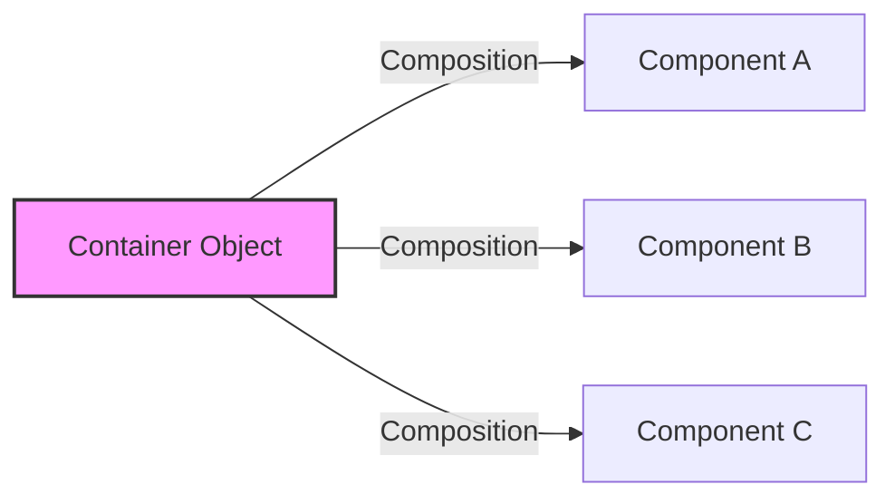
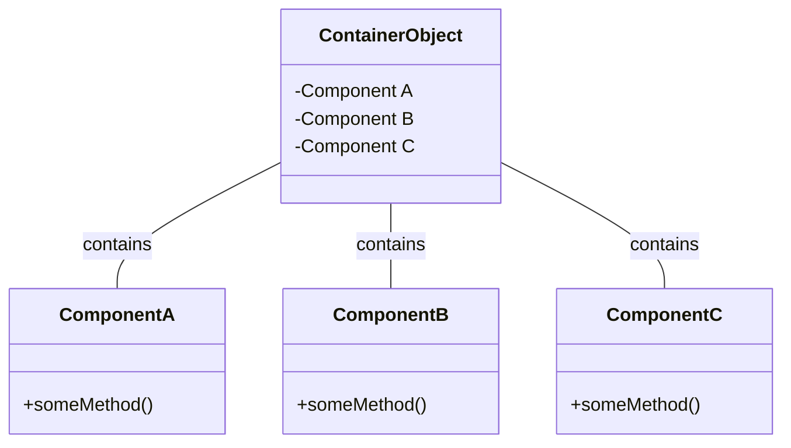
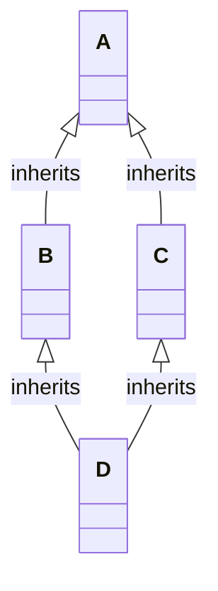

# Lesson 16: Intermediate OOP

> Yes, same quote again. Sorry, I have spent creativity out already :)

## Content

1. [Composition and Aggregation](#1.-composition-and-aggregation)
1. [Advanced Inheritance](#2.-advanced-inheritance)
1. [Dunder (Magic) Methods in `Python`](#3.-dunder-(magic)-methods-in-`python`)
1. [Enums](#4.-enums)
1. [Quiz](#5.-quiz)
1. [Homework](#6.-homework)


In object-oriented programming (OOP), composition and aggregation are two design techniques that allow you to build complex classes from simpler ones. 

Both techniques enable you to model a `"has-a"` relationship `between objects`, but they differ in terms of the lifecycle and ownership of the composed objects. 

## 1. Composition and Aggregation

### 1.1 Composition

Composition is a <span style="color:orange"> **_strong form_** of association where the **_composed object cannot exist independently_** of the owner.</span> 

**_Note:_** If the owner object is destroyed, the related objects are destroyed as well.

**Example**:

Let's consider a `Car` class. A car is composed of an engine, tires, and a steering wheel. <span style="color:orange"> These components are integral parts of the car.</span> <span style="color:red"> **_They don't make sense without the car._**</span>

The basic scheme for `Composition` will be the following:



```python
class Engine:
    def start(self):
        print("Engine started")

    def stop(self):
        print("Engine stopped")

class Tire:
    def inflate(self, pressure):
        print(f"Tire inflated to {pressure} psi")

class Car:
    def __init__(self):
        """
        Note that here we are passing the instances of the ``Engine`` and ``Tire`` classes. It means that we can access their ``attribures/methods`` within the ``Car`` class/  
        """
        self.engine = Engine()  # Composition
        self.tires = [Tire(), Tire(), Tire(), Tire()]  # Composition
        print("Car created with its engine and tires")

    def start(self):
        self.engine.start()  # Calling (Delegating) method to the `Engine`
        print("Car started")

car = Car()
car.start()
```

#### Explanation
In this example, the `Car` class is composed of `Engine` and `Tire` objects. The `Engine` and `Tire` objects are part of the `Car`'s lifecycle and do not exist independently of the `Car`.


#### Output
```
Car created with its engine and tires
Engine started
Car started
```


#### Example


Let's take a look on the `Computer` class. A computer is composed of a `CPU`, a `Memory`, and a `HardDrive`. 

These <span style="color:red">_**components are fundamental parts of a computer and are essential for its operation**_.</span>


```python
class CPU:
    def compute(self):
        print("Computing...")

class Memory:
    def load(self, data):
        print(f"Loading data: {data}")

class HardDrive:
    def read(self, address):
        print(f"Reading data from address: {address}")

class Computer:
    def __init__(self):
        self.cpu = CPU()  # Composition
        self.memory = Memory()  # Composition
        self.hard_drive = HardDrive()  # Composition
        print("Computer assembled with CPU, Memory, and Hard Drive")

    def boot(self):
        self.memory.load("Operating System")
        self.cpu.compute()
        self.hard_drive.read("0x00")
        print("Computer booted successfully")

computer = Computer()
computer.boot()
```

#### Explanation
It is a great example of <span style= "color:red">the strong association form between objects</span>. Once Computer is destroyed the `CPU`, `Memory`, and `HardDrive` become useless. As we can't use it anymore at all, they literally can't exist without each other. 

#### Output
```
Computer assembled with CPU, Memory, and Hard Drive
Loading data: Operating System
Computing...
Reading data from address: 0x00
Computer booted successfully
```


### 1.2 Aggregation

`Aggregation` is a <span style= "color:red"> **_weaker form_** </span> of association than `composition`. If you delete the container object, the content(objects inside the class) can live without container object.


**_Note_**: The same scheme applies to aggregation, but the key difference between composition and aggregations is how strong objects are assosiated to each other. 



#### Example

```python
class Book:
    def __init__(self, title):
        self.title = title

class Library:
    def __init__(self):
        self.books = []  # Aggregation

    def add_book(self, book: Book):
        self.books.append(book)     # book is an instance of class ``Book``

    def list_books(self):
        for book in self.books:
            print(book.title)

book1 = Book("1984")
book2 = Book("Brave New World")

library = Library()
library.add_book(book1)
library.add_book(book2)

library.list_books()
```

#### Explanation

A `Library` contains books, but <span style= "color:green">**_they can exist independently of the library._**</span>

`Books` can be added to or removed from the library <span style= "color:green">**_without affecting the existence of the books themselves._**</span>

#### Output

```
1984
Brave New World
```

#### Example

```python
class Professor:
    def __init__(self, name):
        self.name = name

    def teach(self):
        print(f"Professor {self.name} is teaching")

class University:
    def __init__(self):
        self.professors = []  # Aggregation

    def add_professor(self, professor):
        self.professors.append(professor)

    def start_classes(self):
        for professor in self.professors:
            professor.teach()

professor1 = Professor("John Doe")
professor2 = Professor("Jane Smith")

university = University()
university.add_professor(professor1)
university.add_professor(professor2)

university.start_classes()
```

Here, `University` and `Professor` have an aggregation relationship. Professors can exist independently of a university and can be part of multiple universities.


## 2. Advanced Inheritance

### 2.1 MRO (Method Resolution Order)

In simple terms, _Method Resolution Order_ (MRO) <span style="color:orange">it's the sequence in which classes are searched for a method or attribute</span>. 

The MRO <span style="color:red"> ensures that the _right method is executed_ in the presence of inheritance</span> <span style="color:red">_especially when multiple inheritance is involved._</span>

Suppose we have the following hierarchy of classes:



#### Example
```python
class A:
    def process(self):
        print("Process in A - The original recipe")

class B(A):
    def process(self):
        super().process()
        print("Process in B - Mom's twist to the recipe")

class C(A):
    def process(self):
        super().process()
        print("Process in C - Dad's twist to the recipe")

class D(B, C):
    def process(self):
        super().process()
         print("Process in D - Your own twist to the recipe")

d = D()
d.process()
```

The most common problem in Multiple inheritance is a `Diamond Problem`.

It occurs when a <span style="color:orange"> class inherits from two classes that both inherit from the same superclass.</span> <span style="color:red">It can lead to ambiguity in the method resolution path. </span>


#### Output

```
Process in A - The original recipe
Process in C - Dad's twist to the recipe
Process in B - Mom's twist to the recipe
Process in D - Your own twist to the recipe
```

#### Explanation
When you try to cook (`process()`) the recipe as `D`, `Python` looks at the `MRO` to decide how to combine these different versions. 

The `MRO` makes sure that:

- **_Step1_**: Your version comes first (`D`): It's the most specific, just like you'd prefer your own twist to the recipe.
- **_Step2_**: Then it checks `B` and `C`: These are like your mom's and dad's versions. <span style="color:red"> It respects the order you mention in class `D` (`B` first, then `C`).</span>
- **_Step3_**: Finally, it checks `A`: The original recipe, to make sure nothing is left out.

### 2.2 How to view Method Resolution Order?

In order to view the MRO of a class, you can use the __mro__ attribute or the `mro()` method.

#### Example
```python
print(D.__mro__)
# or
print(D.mro())
```

#### Output

```
(<class '__main__.D'>, <class '__main__.B'>, <class '__main__.C'>, <class '__main__.A'>, <class 'object'>)
[<class '__main__.D'>, <class '__main__.B'>, <class '__main__.C'>, <class '__main__.A'>, <class 'object'>]
```


This way, the `MRO` makes sure that `Python` uses the methods in a sensible, predictable order, especially when your classes (like these recipe versions) are related through multiple inheritances. 

It's `Python's` way of ensuring that the most "specific" version of your or method is used!

***IMPORTANT***: Bear in mind, that it is always the best to use composition over inheritance!

## 3. Dunder (Magic) Methods in `Python`

In `Python`, dunder methods are methods that allow instances of a class to interact with the `built-in functions and operators`.

To be honest it's my the most favourite feature in `Python`. As it is not only simplifies the interaction beetwen instances, but give you a lot in terms of object manipulating.  

Typically, they are not invoked directly, making it look like they are called by magic. 

We could group dunder methods but some categories:

### 3.1 Initialization, Construction and Descturction

- **`__init__(self, [...])`**: Initializes a new instance of a class.
- **`__new__(cls, [...])`**: Creates a new instance of a class. It's a class method (called before `__init__`) that returns a new instance of the class.
- **`__del__(self, [...])`**: Defines behavior for object destruction. It's called when an instance's reference count reaches zero, and `Python` is about to destroy the object.


#### 3.1.1 `__init__()`

We have worked with `__init__()` already, it is the constructor method of a class. 

It's called when an instance of the class is created. And basically we don't call it directly using `.` notation, it is done by the magic under the hood.


#### Example

```python
class House:
    def __init__(self, style, num_rooms):
        self.style = style
        self.num_rooms = num_rooms
        print(f"Building a {self.style} house with {self.num_rooms} rooms")

my_house = House("Victorian", 4)
```

#### Output
```
Building a Victorian house with 4 rooms
```

#### 3.1.2 `__new__()`
`__new__()` is the method called **_before_** `__init__()`. It's responsible for returning a new instance of your class. In most cases, you don't need to override `__new__()`, but it can be useful in certain advanced scenarios, like controlling the creation of a new instance (singleton patterns) or extending immutable types.

Don't worry if you don't fully understand when and how to use `__new__()`, we will come back to it during OOP design Patterns section

#### Example 
Consider `__new__()` as the manufacturing process of a car. It puts together the raw materials to build a new car and then passes the newly created car to the assembly line (the `__init__()` method) for further customization like painting and installing additional parts.

```python
class Car:
    _instances = []
    
    def __new__(cls, model):
        if model not in cls._instances:
            instance = super(Car, cls).__new__(cls)
            cls._instances.append(model)
            return instance
        else:
            print(f"{model} already exists.")
            return None

    def __init__(self, model):
        self.model = model
        print(f"Initializing {self.model}")

car1 = Car("Toyota")
car2 = Car("Honda")
car3 = Car("Toyota")  # This won't create a new instance
```

**Output**:
```
Initializing Toyota
Initializing Honda
Toyota already exists.
```


#### 3.3 `__del__()`

t's not meant to be an object destructor like in other programming languages,  but rather a method to clean up resources if necessary.

When you need to close a file, release a lock, or close a network connection when an object is about to be destroyed, `__del__` can be quite handy. 

#### Example 

```python
class DatabaseConnection:
    def __init__(self):
        self.connection = self.connect_to_database()

    def connect_to_database(self):
        print("Connecting to the database.")
        # Code to connect to database goes here
        return "DatabaseConnectionObject"

    def close_connection(self):
        print("Closing the connection to the database.")
        # Code to close database connection goes here

    def __del__(self):
        self.close_connection()

db_connection = DatabaseConnection()
del db_connection
```

#### Output

```
Closing the connection to the database.
```

#### Explanation

In most cases `Python` garbage collector does this job for us automatically, but overriding the `__del__()` can help programmer to clean up the resources, which are not needed, we don't want to have a hanging connection to the `DB`, unless we don't use it meanwhile, do we?

### 3.2 Representation

#### 3.2.1 `__str__()`
`__str__()` should return a user-friendly string representation of your object, making it more readable and useful for print statements or any situation where the object is presented to end-users.


#### Example

Consider `__str__()` as the way a user profile is displayed on a social media platform. You want it to be readable and informative.

```python
class UserProfile:
    def __init__(self, username, email):
        self.username = username
        self.email = email

    def __str__(self):
        return f"UserProfile(username='{self.username}', email='{self.email}')"

user = UserProfile("john_doe", "john@example.com")
print(user)
```

**Output**:
```
UserProfile(username='john_doe', email='john@example.com')
```

#### 3.2.2 `__repr__()`
`__repr__()` is used to return a string that would be a valid Python expression to recreate the object. It's aimed at developers and should be as unambiguous as possible.

#### Example

Consider `__repr__()` as a precise recipe for a dish. It includes exact amounts and types of ingredients, ensuring that someone can recreate the dish perfectly.

```python
class Ingredient:
    def __init__(self, name, quantity):
        self.name = name
        self.quantity = quantity

    def __repr__(self):
        return f"Ingredient(name={self.name!r}, quantity={self.quantity!r})"

ingredient = Ingredient("Sugar", "100g")
print(ingredient)
```

**Output**:
```
Ingredient(name='Sugar', quantity='100g')
```

As well, this methods can help you to debug your projects better, output objects in the way it is comfortable for you and improve code quality.

### 3. Collection/Container Emulation

| Method          | Syntax   | Description                                                                                     | Example                          |
|-----------------|----------|-------------------------------------------------------------------------------------------------|----------------------------------|
| `__len__(self)` | `len(obj)` | Returns the length of the container. Called by `len()`.                                       | `len(my_collection)`             |
| `__getitem__(self, key)` | `obj[key]` | Allows access to elements using the `self[key]` syntax.                              | `value = my_collection[key]`     |
| `__setitem__(self, key, value)` | `obj[key] = value` | Allows setting elements using the `self[key] = value` syntax.         | `my_collection[key] = value`     |
| `__delitem__(self, key)` | `del obj[key]` | Allows deleting elements using the `del self[key]` syntax.                       | `del my_collection[key]`         |
| `__contains__(self, item)` | `item in obj` | Checks if the container contains `item`. Called by `in`.                        | `if item in my_collection:`      |


The class `Menu` demonstrates the sort of a storage for items, and as we know already `dict` methods are perfect for storage managing and handling. 

#### Example

```python
class Menu:
    def __init__(self):
        self.items = {}

    def __setitem__(self, item, price):
        self.items[item] = price

    def __getitem__(self, item):
        return self.items.get(item, f"{item} not available")

    def __delitem__(self, item):
        if item in self.items:
            del self.items[item]        
        else:
            print(f"{item} not found in the menu")

    def __len__(self):
        return len(self.items)

    def __contains__(self, item):
        return item in self.items

    def __str__(self):
        return '\n'.join(f"{item}: ${price}" for item, price in self.items.items())

    def __repr__(self):
        return f"Menu({self.items})"

# Usage
my_menu = Menu()
my_menu["Coffee"] = 2.99      # calling ``__setitem__``
my_menu["Tea"] = 1.99
print(my_menu.items)

print(my_menu["Coffee"])      # calling ``__getitem__``
print(my_menu["Espresso"])

print(len(my_menu))           # calling ``__len__``

print("Coffee" in my_menu)    # calling ``__contains__``
print("Espresso" in my_menu)  

del my_menu["Tea"]            # calling ``__delitem__``
print(my_menu.items)  

print(str(my_menu))           # calling ``__str__``
print(repr(my_menu))          # calling ``__repr__``
```

#### Output 

```
{'Coffee': 2.99, 'Tea': 1.99}
2.99
Espresso not available
2
True
False
{'Coffee': 2.99}
Coffee: $2.99
Menu({'Coffee': 2.99})
```

### 4. Comparison and Arithmetic Operators

#### 4.1 Comparision 

| Method          | Syntax | Description                                                                                        | Example                          |
|-----------------|--------|----------------------------------------------------------------------------------------------------|----------------------------------|
| `__eq__(self, other)` | `obj1 == obj2` | Defines behavior for the `==` operator                                               | `if obj1 == obj2:`               |
| `__ne__(self, other)` | `obj1 != obj2` | Defines behavior for the `!=` operator                                               | `if obj1 != obj2:`               |
| `__lt__(self, other)` | `obj1 < obj2` | Defines behavior for the `<` operator                                                 | `if obj1 < obj2:`                |
| `__le__(self, other)` | `obj1 <= obj2` | Defines behavior for the  `<=` operator                                              | `if obj1 <= obj2:`               |
| `__gt__(self, other)` | `obj1 > obj2` | Defines behavior for the  `>` operator                                                | `if obj1 > obj2:`                |
| `__ge__(self, other)` | `obj1 >= obj2` | Defines behavior for the `>=` operator                                               | `if obj1 >= obj2:`               |
 
Imagine you're running an apple store. 

Apples can differ in `weight`, `type`, and `ripeness`. It would be helpful to compare apples based on these `attributes`, add their weights, or even get a combined ripeness score. 

This is comparison dunder methods come into play, allowing you (an owner) to define how apples should be compared or combined.

#### Example 

```python
class Apple:
    def __init__(self, weight, type, ripeness):
        self.weight = weight
        self.type = type
        self.ripeness = ripeness  # 1 to 10 scale

    # Use `str` for easy debugging 
    def __str__(self):
        return f"{self.type} apple, Weight: {self.weight}g, Ripeness: {self.ripeness}/10"
    
    # (==) Two apples are considered equal if they have the same type and ripeness
    def __eq__(self, other):
        return self.type == other.type and self.ripeness == other.ripeness

    # (!=) Defined by the type or ripeness
    def __ne__(self, other):
        return not (self == other)

    # (<): An apple is considered less than another if it's less ripe or, lighter
    def __lt__(self, other):
        if self.ripeness == other.ripeness:
            return self.weight < other.weight
        return self.ripeness < other.ripeness

    # (<=) Combination of less than and equality
    def __le__(self, other):
        return self < other or self == other

    # (>) Opposite of less than
    def __gt__(self, other):
        return not (self <= other)

    # (>=): Combination of greater than and equality 
    def __ge__(self, other):
        return not (self < other)


apple1 = Apple(150, "Golden", 7)
apple2 = Apple(200, "Golden", 8)

print(apple1 < apple2) 
print(apple2 > apple1)
print(apple2 >= apple1) 
print(apple2 <= apple1)
# And so on.. 
```

#### Output

```
True
True
True
False
```

#### 4.2 Arithmetic

| Method          | Syntax | Description                                                                                        | Example                          |
|-----------------|--------|----------------------------------------------------------------------------------------------------|----------------------------------|
| `__add__(self, other)` | `obj1 + obj2` | Defines behavior for the `+` operator.                                               | `result = obj1 + obj2`           |
| `__sub__(self, other)` | `obj1 - obj2` | Defines behavior for the  `-`. operator.                                             | `result = obj1 - obj2`           |
| `__mul__(self, other)` | `obj1 * obj2` | Defines behavior for the  `*`. operator.                                             | `result = obj1 * obj2`           |
| `__truediv__(self, other)` | `obj1 / obj2` | Defines behavior for the `/` operator.                                           | `result = obj1 / obj2`           |

Imagine you started living with your partner, and agreeded on the common family budget. 
Sasha earns less than Yehor but she wants his money in the wallet. She has a wallet with some money as well, how do we combine those wallets?

Let's take a look on the specific class `Wallet` with some amount of money in it.
#### Example
```python
class Wallet:
    def __init__(self, amount):
        self.amount = amount

    def __str__(self):
        return f"${self.amount}"

    # Add money to the wallet
    def __add__(self, other):
        if isinstance(other, Wallet):
            return Wallet(self.amount + other.amount)
        else:
            return Wallet(self.amount + other)

    # Subtract money from the wallet
    def __sub__(self, other):
        if isinstance(other, Wallet):
            return Wallet(self.amount - other.amount)
        else:
            return Wallet(self.amount - other)

    # Equality - Check if the amount in two wallets is the same
    def __eq__(self, other):
        return self.amount == other.amount

# Examples of using the class
wallet1 = Wallet(100)
wallet2 = Wallet(50)

# Add two wallets together
new_wallet = wallet1 + wallet2
print(new_wallet)

# Add a fixed amount to a wallet
updated_wallet = wallet1 + 20
print(updated_wallet)

remaining_balance = wallet1 - wallet2
print(remaining_balance)

# Check if two wallets have the same amount
print(wallet1 == wallet2)
```

#### Output

```
$150
$120
$50
False
```

After  dunder methods  are implemented, we can manage finances in a very intuitive way (I would even say in a more understandable way for human kind).


### 5. Attribute Access

Attribute access methods provide a way to manage how attributes are accessed, assigned, or deleted in your class. They offer a level of control over your class's attributes, allowing for validation, logging, or other custom behaviors.


| Method          | Syntax   | Description                                                                                       | Example                          |
|-----------------|----------|---------------------------------------------------------------------------------------------------|----------------------------------|
| `__getattr__(self, name)` | `obj.name` | Defines behavior when an attribute is accessed, and it's not found in the instance's dictionary.  | Accessing `obj.undefined_attr` calls `__getattr__('undefined_attr')` |
| `__setattr__(self, name, value)` | `obj.name = value` | Called when an attribute assignment is attempted.                                                 | `obj.attr = value` triggers `__setattr__('attr', value)` |
| `__delattr__(self, name)` | `del obj.name` | Called when an attribute deletion is attempted.                                                   | `del obj.attr` calls `__delattr__('attr')` |


#### 4.1 `__getattr__(self, name)`

`__getattr__` is called when an attribute is not found in an object's instance dictionary. It's useful for implementing a default behavior for missing attributes or for creating proxy objects.

**Example: Default Attributes in a Configuration**

#### Example 
```python
class Configuration:
    def __init__(self):
        self.settings = {"theme": "Light", "language": "English"}

    def __getattr__(self, name):
        # Return a default value if the setting is not found
        return f"Setting '{name}' not found. Using default value."

config = Configuration()
print(config.theme)             # calling ``__getatter__()`` under the hood
print(config.language)
print(config.font_size)
```

#### Output

```
Setting 'theme' not found. Using default value.
Setting 'language' not found. Using default value.
Setting 'font_size' not found. Using default value
```

#### 4.2 `__setattr__(self, name, value)`

`__setattr__` is invoked when an attribute assignment is made. It can be used to enforce constraints, perform validations, or automatically update related attributes.

**Example: Validating and Logging Attribute Changes**

```python
class Product:
    def __init__(self, name, price):
        self.name = name
        self.price = price


    def __setattr__(self, name, value):
        if name == "price" and value < 0:
            raise ValueError("Price cannot be negative.")
        print(f"Setting {name} to {value}")
        super().__setattr__(name, value)

product = Product("Coffee", 5)       # calling ``__setattr__()`` method 
product.price = 6     
product.quantity = 10
```

#### Output
```
Setting name to Coffee
Setting price to 5
Setting price to 6
Setting quantity to 10
```

#### 4.3 `__delattr__(self, name)`

`__delattr__` is called when an attribute deletion is attempted. It allows you to define behavior when attributes are deleted, such as preventing the deletion of certain attributes or performing cleanup operations.

**Example: Preventing Deletion of Critical Attributes**

```python
class ProtectedAttributes:
    def __init__(self):
        self._critical_data = "Sensitive Info"

    def __delattr__(self, name):
        if name == "_critical_data":
            raise AttributeError("Deletion of _critical_data is not allowed.")
        super().__delattr__(name)

protected_obj = ProtectedAttributes()
del protected_obj._critical_data           # calling ``__delattr__()`` method 
```

#### Output

```
Traceback (most recent call last):
  File "<string>", line 11, in <module>
  File "<string>", line 7, in __delattr__
AttributeError: Deletion of _critical_data is not allowed.
```

#### Explanation
**_Note:_** You can notice that it is very similar to `@property`, in fact `property` calls these methods under the hood and simplifies `E2E` interaction with a code for a programmer.

**_Note:_**  You must be extremely carefull implementing these attribute access methods, you can provide a more controlled and secure way to manage how attributes are accessed, assigned, or deleted in your classes. This can lead to bugs hard to debug in some cases, but if it's used wisely, you get an extremly powerfull tool to manage the class attributes directly. 


There are some more useful dunder methods such as `__iter__()` `__call__()` or `__enter__()` and `__exit__()`, but it will be described within design patterns and context managers sections, so keep going to matser `Python` skills!


## 4. Enums

`Enums` is an another way to structure your code and organize sets of related constants. It's a great instrument to use when you have constants which remain the same within your application structured within one class.


### 4.1 Syntax

`Enums` are defined by **_subclassing the `Enum` class_**. Each member of the enum has a `name` and a `value`.

#### Example

```python
from enum import Enum

class Color(Enum):
    RED = 1
    GREEN = 2
    BLUE = 3

# You can acess them either by name or by value
color = Color.RED     # by name
print(color)

color = Color(1)      # by value
print(color)
```

#### Output 

```
Color.RED
Color.RED
```


Each member of an `enum` has two main properties:

- name: The name of the member (e.g., `'RED'`).
- value: The value associated with the member (`1`).

#### Example
```python
# Exten the code above with the following: 
color = Color.RED
print(color.name)   # Output: RED
print(color.value)  # Output: 1
```

#### Output
```
RED
1
```

As well , if we take a look inside `enums` and call `dir()` function we can see that it has some methods and attributes which will come in handy. 

#### Example

```python
print(dir(Color))
```

#### Output

```
['BLUE', 'GREEN', 'RED', '__class__', '__contains__', '__doc__', '__getitem__', '__init_subclass__', '__iter__', '__len__', '__members__', '__module__', '__name__', '__qualname__']
```

Try and play around `enums`, you will find them much usefull than dictionaries we used before to store contants into. Especially with `isinstance()` and `type()` functions.


## 5. Quiz

### Question 1:
> In OOP, what distinguishes Composition from Aggregation?

A) Composition allows for dynamic changes to the relationship, whereas Aggregation is static.  
B) Aggregation implies ownership and the lifecycle of the contained objects is tied to the container object.  
C) Composition implies ownership and the lifecycle of the contained objects is tied to the container object.  
D) Aggregation is a "use-a" relationship, while Composition is a "has-a" relationship.

<!-- Correct Answer: C -->

### Question 2:
> What does Method Resolution Order (MRO) in Python solve?

A) It determines the order in which base classes are traversed when executing a method.  
B) It optimizes the code for faster execution of methods.  
C) It ensures that the correct constructor is called for creating an object.  
D) It provides a mechanism for multiple inheritance of attributes.

<!-- Correct Answer: A -->

### Question 3:
> How does Python's `__new__` method differ from `__init__`?

A) `__new__` method is used to instantiate a new object, whereas `__init__` is used to initialize the object.  
B) `__init__` creates a new instance and `__new__` initializes the created instance.  
C) `__new__` method can return an instance of another class, while `__init__` cannot.  
D) There is no difference; `__new__` and `__init__` can be used interchangeably.

<!-- Correct Answer: A -->

### Question 4:
> Which method in Python is called when an object is about to be destroyed?

A) `__delete__`  
B) `__remove__`  
C) `__destroy__`  
D) `__del__`

<!-- Correct Answer: D -->

### Question 5:
> What is the purpose of `__repr__` in Python?

A) To return a machine-readable representation of an object.  
B) To output a string that allows `eval()` to recreate the object.  
C) To represent the memory address of the object.  
D) To provide a pretty-print functionality for debugging purposes.

<!-- Correct Answer: B -->

### Question 6:
> In Python, which of the following is a use-case for the `__setattr__` method?

A) To intercept attribute access.  
B) To prevent the modification of attributes.  
C) To log attribute changes.  
D) All of the above.

<!-- Correct Answer: D -->

### Question 7:
> What is the primary benefit of using Enums in Python?

A) They provide a namespace for a set of identifiers.  
B) They allow the creation of unique constants that can be compared by identity.  
C) They serve as a drop-in replacement for dictionaries.  
D) They enable arithmetic operations on defined constants.

<!-- Correct Answer: B -->

### Question 8:
> Which problem does the C3 linearization algorithm in Python's MRO address?

A) The "Superclass Dilemma" problem.  
B) The "Diamond Inheritance" problem.  
C) The "Circular Dependency" problem.  
D) The "Multiple Constructors" problem.

<!-- Correct Answer: B -->

### Question 9:
> What is the purpose of `__getitem__` in Python?

A) It allows an object to behave like a function.  
B) It allows an object to be indexed like a list or dictionary.  
C) It allows the dynamic creation of new attributes.  
D) It allows an object to be called as an iterator.

<!-- Correct Answer: B -->

### Question 10:
> Which statement accurately describes the `__str__` and `__repr__` methods in Python?

A) `__str__` is used for an informal string representation of an object, while `__repr__` is formal.  
B) `__str__` can only be used for numeric data, while `__repr__` is for textual data.  
C) `__repr__` is used for debugging and development, while `__str__` is for end-user display purposes.  
D) `__repr__` returns a string that is readable by the interpreter, while `__str__` does not.

<!-- Correct Answer: A, C -->


## 6. Homework

### Task 1: Car Assembly

**Objective:** Simulate a car assembly process using composition where various parts come together to form a complete car.

#### Requirements:

- Define classes `Engine`, `Wheel`, `Body`, and any other components you find necessary.
- The `Car` class should be composed of these objects, and it can't exist without them.
- Methods within the `Car` class should delegate responsibilities to its components, like `start_engine` or `inflate_tires`.
- The program should allow creating a `Car` object with all its components.

### Task 2: Order System

**Objective:** Build an e-commerce order system where orders are composed of items, but the lifecycle of items is independent of the order.

#### Requirements:

- Define an `Item` class with properties like `name`, `price`, and `quantity`.
- The `Order` class should be composed of `Item` objects and include methods to add items, calculate the total, and finalize the purchase.
- Items should be able to exist without being part of an order, indicating aggregation.
- Users should be able to create an order, add items, and see the order total.
- Users can also create standalone items that are not part of any order.

