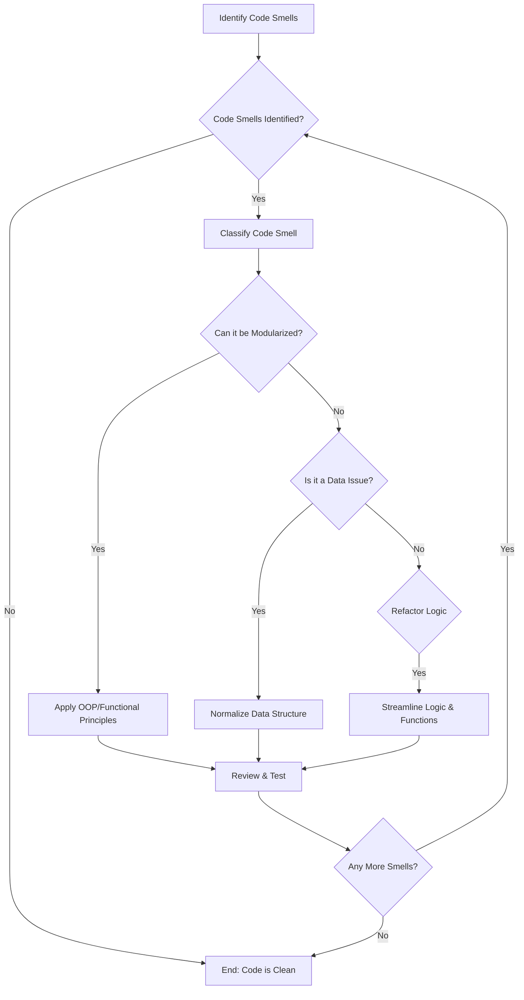
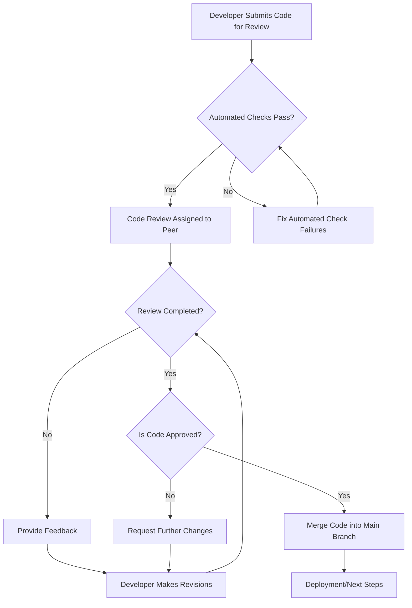
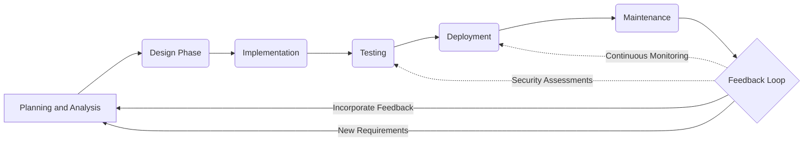

# Lesson 21: Refactoring and Code Review

> "Driving continuous evolution and excellence"

## Content

1. [The Importance of Refactoring and Code Review](#1.-the-importance-of-refactoring-and-code-review)
1. [Principles of Good Refactoring](#2.-principles-of-good-refactoring)
1. [Code reviews](#3.-code-reviews)
1. [Application Development Life Cycle](#4.-application-development-life-cycle)
1. [Homework](#5.-homework)

## 1. The Importance of Refactoring and Code Review

### 1.1 Refactoring

Refactoring is the process of restructuring code, while not changing its original functionality.

### Why do we need it?
- Refactoring improves the internal structure of the software.
- Refactored code is easier to understand and and modify. 

### 1.2 Code review

A code review is a peer review of code that helps developers ensure or improve the code quality before they merge and ship it.

It involves systematically examining source code, or overllok of the new feature once Merge Request is opened.

### Why do we need it?

- Fix mistakes overlooked in the initial development phase.
- Improving both the overall quality of the code.
- Enhancing developers' skills.

## 2. Principles of Good Refactoring

Let's take a look on some examples for each purpose of the code refactoring:

### 2.1 Understandability

**Bad Approach:**

```python
def calc(x, y, z):
    return x + y * z
```

This function is not clear in its purpose based on the parameter names and lacks context.

**Good Approach:**

```python
def calculate_total_price(quantity, price_per_item, tax_rate):
    return quantity * price_per_item * (1 + tax_rate)
```

Renaming the function and parameters makes the code self-documenting, clarifying its purpose and how it should be used.

### 2.2 Simplicity

**Bad Approach:**

```python
def process_data(data):
    if data is not None:
        if len(data) > 0:
            # Process data
            print("Processing...")
        else:
            print("Data is empty.")
    else:
        print("No data provided.")
```

This nested conditional structure is unnecessarily complex.

**Good Approach:**

```python
def process_data(data):
    if not data:
        print("No data provided or data is empty.")
        return
    print("Processing...")
```

Simplifying the conditionals makes the function easier to read and understand, your code works much faster.

### 2.3 Testability

**Bad Approach:**

```python
class UserManager:
    def __init__(self):
        self.users = []

    def add_user(self, user):
        self.users.append(user)
        # Directly sending an email
        send_email(user)
```

This class is hard to test due to the direct dependency on the email sending function.

**Good Approach:**

```python
class UserManager:
    def __init__(self, email_sender):
        self.users = []
        self.email_sender = email_sender

    def add_user(self, user):
        self.users.append(user)
        # Using dependency injection for email sending
        self.email_sender.send(user)
```

By using dependency injection, the class becomes easier to test, especially if `email_sender` can be mocked.

### 2.4 Performance

**Bad Approach:**

```python
def find_duplicates(items):
    duplicates = []
    for i in range(len(items)):
        for j in range(i + 1, len(items)):
            if items[i] == items[j] and items[i] not in duplicates:
                duplicates.append(items[i])
    return duplicates
```

This approach has a high computational complexity, making it inefficient for large lists.

**Good Approach:**

```python
def find_duplicates(items):
    seen = set()
    duplicates = set()
    for item in items:
        if item in seen:
            duplicates.add(item)
        else:
            seen.add(item)
    return list(duplicates)
```

Using sets to track seen items and duplicates significantly improves the function's performance. 


### 2.5 Best Practices

1. **Extract Function:** Breaking down large functions into smaller, more manageable ones.  
2. **Rename Variable:** Use more descriptive names.  
3. **Remove Duplicate Code:** Identify and eliminate repetitive code patterns.  
4. **Simplify Conditional Expressions:** Make conditional logic easier to read and understand.

Don't forget to refer to `SOLID`, `DRY`, `KISS` and `YAGNI` principles during development and refactoring stages.

### 2.6 `Code Smells`

Code smells are patterns in the code that indicate potential issues or poor design choices. They're not bugs, code can function correctly, but they suggest areas that might benefit from refactoring. 

In order to proceed with successful refactoring towards improving the codebase, the best approach will be to recognise code smells as the first step.

| Code Smell              | Description                                                                                                                                 |
|-------------------------|---------------------------------------------------------------------------------------------------------------------------------------------|
| **Long Methods**        | Methods that are too lengthy, making them hard to read, understand, and maintain.                                                           |
| **Large Classes**       | Classes that have too many responsibilities, making them complex and difficult to manage.                                                   |
| **Duplicate Code**      | Repetitive code blocks that appear in multiple places, leading to maintenance challenges.                                                   |
| **Magic Numbers**       | The use of unexplained numbers in the code that convey unclear meaning.                                                                     |
| **Feature Envy**        | A method that frequently uses data or methods from another class more than its own, indicating misplaced responsibilities.                  |
| **Switch Statements**   | Overuse of switch statements or long if-else chains, often a sign that polymorphism could be better utilized.                               |
| **Primitive Obsession** | Using primitive data types instead of small objects for simple tasks (e.g., currency, ranges, special strings for phone numbers, etc.).     |
| **Data Clumps**         | Groups of variables that are passed around together in various parts of the program, suggesting a need for a new object or structure.       |

Let's create a complex `Python` application example that includes these code smells.

#### Example

```python
# Initial version with code smells

class Employee:
    def __init__(self, name, type_code):
        self.name = name
        self.type_code = type_code

    def calculate_pay(self, hours_worked, hourly_rate):
        if self.type_code == 1:  # Regular employee
            return hours_worked * hourly_rate
        elif self.type_code == 2:  # Manager with fixed bonus
            return hours_worked * hourly_rate + 100
        # Additional conditions may be added here for other types

    def send_email(self, message):
        print(f"Sending email to {self.name}: {message}")

employee = Employee("John Doe", 1)
pay = employee.calculate_pay(40, 20)
employee.send_email(f"Your pay this period is: {pay}")
```

#### Output

```
Sending email to John Doe: Your pay this period is: 800
```


#### Code smells

- **Long Method:** `calculate_pay` method contains logic that could be split out.
- **Switch Statements:** The use of `if-elif` chain for type checking.
- **Primitive Obsession:** Using a primitive type (`type_code`) to represent employee type.
- **Feature Envy:** The `send_email` method might be better suited to a class responsible for communication.
- **Large Class & Duplicate Code:** As more methods like `calculate_pay` are added, `Employee` class will grow and duplicate code for different employee types.

#### Refactored 

```python
from abc import ABC, abstractmethod

# Utilizing Polymorphism and SRP
class Employee(ABC):
    def __init__(self, name):
        self.name = name

    @abstractmethod
    def calculate_pay(self, hours_worked, hourly_rate):
        pass

    def send_email(self, message):
        EmailSender.send(self.name, message)

class RegularEmployee(Employee):
    def calculate_pay(self, hours_worked, hourly_rate):
        return hours_worked * hourly_rate

class Manager(Employee):
    def calculate_pay(self, hours_worked, hourly_rate):
        return hours_worked * hourly_rate + 100

class EmailSender:
    @staticmethod
    def send(name, message):
        print(f"Sending email to {name}: {message}")

# Usage
employee = Manager("John Doe")
pay = employee.calculate_pay(40, 20)
employee.send_email(f"Your pay this period is: {pay}")
```

#### Output
```
Sending email to John Doe: Your pay this period is: 900
```

As you can see the output hasn't changed at all, it means that in most cases refactoring is not about changing the actual logic of an application, but the implementation itself.

#### Explaination

- **Polymorphism:** Replaced the `if-elif` chain with polymorphic classes that extend a common `Employee` interface, adhering to the `Open/Closed` Principle.
- **Eliminated Primitive Obsession:** Instead of using `type_code`, we now have distinct classes for each employee type.
- **Addressed Feature Envy:** The responsibility of sending emails is moved to a dedicated `EmailSender` class, focusing on communication.
- **Simplified Large Class Problem:** By dividing responsibilities among different classes, we reduce the chance of the `Employee` class becoming unwieldy.
- **Reduced Duplicate Code:** Specific behaviors are encapsulated in their respective classes, reducing code duplication.


The previous version of our application worked fine even without refactoring, but after we updated the codebase not only it became more readable, but the structure of our application is much easier to be scaled during further development.

Let's take a look at one more example, I will try to include all code smells which have been discussed already.

#### Example 

```python
class Task:
    def __init__(self, title, due_date, priority):
        self.title = title
        self.due_date = due_date
        self.priority = priority  # 1 for high, 2 for medium, 3 for low

    def display_task(self):
        if self.priority == 1:
            priority_str = "High"
        elif self.priority == 2:
            priority_str = "Medium"
        elif self.priority == 3:
            priority_str = "Low"
        print(f"Task: {self.title}, Due: {self.due_date}, Priority: {priority_str}")

class Project:
    def __init__(self, name):
        self.name = name
        self.tasks = []

    def add_task(self, title, due_date, priority):
        if not title or not due_date or priority not in [1, 2, 3]:
            print("Invalid task details")
            return
        new_task = Task(title, due_date, priority)
        self.tasks.append(new_task)

    def display_project(self):
        print(f"Project: {self.name}")
        for task in self.tasks:
            task.display_task()
```

Let's try to proceed with the following approach of refactoring and identify pain points of our application.

### 2.6 Refactoring workflow



Following the workflow above it took only 30 minutes for me to create a piece of cake from our previous version of application.

#### Refactored

```python
from enum import Enum, auto
from datetime import datetime

class Priority(Enum):
    HIGH = auto()
    MEDIUM = auto()
    LOW = auto()

class Task:
    def __init__(self, title, due_date, priority):
        self.title = title
        self.due_date = due_date
        self.priority = priority

    def display(self):
        priority_str = self.priority.name.capitalize()
        print(f"Task: {self.title}, Due: {self.due_date.strftime('%Y-%m-%d')}, Priority: {priority_str}")

class Project:
    def __init__(self, name):
        self.name = name
        self.tasks = []

    def add_task(self, task):
        self.tasks.append(task)

    def display(self):
        print(f"Project: {self.name}")
        for task in self.tasks:
            task.display()

# Usage
project = Project("Website Redesign")
project.add_task(Task("Design Mockups", datetime(2024, 1, 15), Priority.HIGH))
project.add_task(Task("User Testing", datetime(2024, 2, 1), Priority.MEDIUM))
project.display()
```

#### Output

```
Project: Website Redesign
Task: Design Mockups, Due: 2024-01-15, Priority: High
Task: User Testing, Due: 2024-02-01, Priority: Medium
```

The code becomes cleaner and more maintainable, good job comrades!

## 3. Code reviews

Code review is a systematic examination of source code, intended to find and fix mistakes overlooked in the initial development phase and improve overall code quality.


### 3.1 Code review workflow



The process is carried out by appropriate team members during submitting Pull Requests (PRs) into review according to the company policies.


### 3.2 Best Practices for Conducting Code Reviews

To maximize the effectiveness of code reviews, certain best practices should be followed:

- **Be Constructive:** Feedback should be positive, specific, and focused on the code. Suggest improvements and explain the reasoning behind them.
- **Keep It Small:** Aim for brief, focused code reviews to ensure attention to detail.
- **Automate Where Possible:** Utilize automated tools for code formatting, linting, and basic error detection to save time for reviewers.
- **Embrace Feedback:**  Encourage an open, respectful dialogue about suggested changes.

My personal checklist of code review for the majority of the projects will be:

1. **Correctness:**
   - Does the code do what it's supposed to do?
   - Are there any logical errors or bugs?

2. **Readability:**
   - Is the code clear and understandable?
   - Are variable and method names descriptive and appropriate?
   - Is the code well-commented, providing context where necessary? (Does the code speak for itself?)

3. **Architecture and Design:**
   - Is the code consistent with the overall project architecture?
   - Could the design be simplified or made more efficient?

4. **Performance:**
   - Are there any obvious performance issues?
   - Can any parts of the code be optimized?

5. **Security:**
   - Does the code introduce any security vulnerabilities?
   - Are data and sensitive information handled securely?

6. **Testing:**
   - Are there sufficient unit and integration tests?
   - Do tests cover edge cases as well as typical use cases?
   - Are tests clear and meaningful?

7. **Documentation:**
   - Is the code adequately documented, both in-line and in external documents?
   - Does the documentation accurately reflect the current state of the code?

8. **Consistency:**
   - Is the code consistent with the project's coding standards and conventions?
   - Does it follow the established practices for formatting, naming, and structuring?


As well you would want to understand if the changes can be integrated smoothly with the existing codebase and the code for a new feature will be easy to maintain and extend. Though sometimes it is not really obvious and we can't predict what the future holds for the project. Just don't forget that you can use a refactoring techniques at any time described above.

**_Note_:** You would want do develop your own code review checklist based on common issues relevant to your project 

**_Important_:** Don't obsess on the perfect code and refer to the checklist all the time. Once you understand the key principles that process will be handled automatically by you during each review you conduct.  


Use your time wisely and don't forget about deadlines, as programmers say if it works, don't touch it. :) 

### 3.3 Practice

Let's take a look on real cases, instead of theory, we'll come into practice straightforward:


#### Case 1: Performance Optimization

**Situation:** A developer submitted a pull request (PR) with a new feature implementation. The code was functional but not optimized for performance.

#### Before Review
```python
# Inefficient search for duplicates in a list
def find_duplicates(input_list):
    duplicates = []
    for i in range(len(input_list)):
        for j in range(i + 1, len(input_list)):
            if input_list[i] == input_list[j] and input_list[i] not in duplicates:
                duplicates.append(input_list[i])
    return duplicates

input_list = [1, 2, 3, 2, 1, 5, 6, 5, 5, 5]
print(find_duplicates(input_list))
```

**Review Process:**
- During the code review, a peer noticed that the new feature relied on a nested loop, leading to `O(n²)` time complexity for a task that could be accomplished with `O(n)`.
- The reviewer suggested leaving a commen on the pull request using a hashmap a.k.a set in `Python` to reduce computational complexity.

#### After Review

```python
def find_duplicates(input_list):
    seen = set()
    duplicates = set()
    for item in input_list:
        if item in seen:
            duplicates.add(item)
        else:
            seen.add(item)
    return list(duplicates)

input_list = [1, 2, 3, 2, 1, 5, 6, 5, 5, 5]
print(find_duplicates(input_list))
```

**Outcome:** The developer revised the implementation based on the feedback. This optimization led to a noticeable improvement in the feature's performance, especially with large data sets.

#### Case 2: Improving Code Maintainability

**Situation:** A developer's PR involved a complex algorithm that was hard to understand at first glance.

#### Before Review

```python
def complex_algorithm(data):
    # Complex operations
    result = data[0] 
    for i in range(1, len(data)):
        result = result ^ data[i]
    return result

print(complex_algorithm([1, 2, 3, 4]))
```

**Review Process:**
- The code review emphasized the lack of comments and documentation for the complex parts of the algorithm.
- The reviewer requested more detailed comments and the inclusion of a reference to the algorithm's source or explanation.

#### After Review

```python
# Well-documented complex algorithm
def complex_algorithm(data):
    """
    Performs a bitwise XOR operation on all elements of the input list.
    
    The algorithm iterates through the list, applying a bitwise XOR (^) operation
    between the current result and each element.

    Args:
        data (list of int): A list of integers to process.

    Returns:
        int: The result of the bitwise XOR operation on all list elements.
    """
    # Initialize result with the first list element
    result = data[0]
    # Iterate over the list starting from the second element
    for i in range(1, len(data)):
        result = result ^ data[i]  # Apply bitwise XOR operation
    return result

print(complex_algorithm([1, 2, 3, 4]))
```

**Outcome:** The developer added comprehensive comments and documentation, making the code easier for future maintainers to understand and modify if necessary.

### 3.4 Conclusion

The key to success in everything is to have a strong verbal communication between people. Don't hesitate to ask reviewers about anything on the PR, don't be scared to defend your point of view during the code review, of course try reasonably explain it with good arguments. And keep learning continiously as one person can't know anything and only group of enthusiastic people build the future together. 


## 4. Application Development Life Cycle

Application development lifecycle is a well-structured set of steps outlining app planning, creation, testing, deploying, and maintenance.

It is crucial for developers to understand the general workflow of app development. 




Let's make a quick overview of each stage developing a `Contact Management System`

### 4.1 Planning and Analysis

During this stage we gather requirements and define the project scope.


- **Objective:** Develop a scalable Contact Management System to store, retrieve, update, and delete contact information.
- #### Requirements
  - Store contacts with details such as name, email, phone number, and address.
  - Support `CSV` and `JSON` formats for data import and export.
  - Provide search functionality to find contacts by name.
- **Risk Assessment:** Consider data integrity, scalability, and user privacy.


### 4.2 Design Phase

Based on the requirements, the system architecture and user interfaces are designed. This phase includes both high-level architectural planning and detailed design of the application components. 

**_Note:_**  In complex applications you would want to create a separate documentation for different modules, preferably with visualisation in diagrams and graphs. 

- **Architecture:** Use a modular approach with separate classes for `Contact` and `ContactManager`.
- **ProjectStructure:** Split the application within submodules. 
- **Data Structure:** Use a `list` to store contacts and `dictionaries` for individual contact details.
- **Data Handling:** Implement modules for `CSV` and `JSON` data import/export.


#### Project Structure
```
/contact_management_system
    /src
        __init__.py
        contact.py
        contact_manager.py
        data_handler.py
    /tests
        __init__.py
        test_contact_manager.py
    requirements.txt
```

### 4.3 Implementation

This is where developers write the application, adhering to coding standards and best practices. Have fun :3


**`contact.py`** - Defines a `Contact` class.

```python
class Contact:
    def __init__(self, name, email, phone, address):
        self.name = name
        self.email = email
        self.phone = phone
        self.address = address
```

**`contact_manager.py`** - Manages a list of contacts, including add, update, delete, search, and data import/export functionalities.

```python
import csv, json
from contact import Contact

class ContactManager:
    def __init__(self):
        self.contacts = []

    def add_contact(self, contact):
        self.contacts.append(contact)

    def find_contact(self, name):
        return [contact for contact in self.contacts if contact.name == name]

    # Heh, re-write it to match SOLID 
    # Potenitally at some point the team of developers decide to refactor an application, this will be paraller stage with maintainance
    def export_to_csv(self, filepath):
        with open(filepath, 'w', newline='') as file:
            writer = csv.writer(file)
            writer.writerow(["Name", "Email", "Phone", "Address"])
            for contact in self.contacts:
                writer.writerow([contact.name, contact.email, contact.phone, contact.address])

    def import_from_csv(self, filepath):
        with open(filepath, 'r') as file:
            reader = csv.DictReader(file)
            for row in reader:
                self.add_contact(Contact(row['Name'], row['Email'], row['Phone'], row['Address']))
```

### 4.4 Testing

- **Unit Testing:** Write tests for each functionality in `ContactManager` — adding, updating, finding, and deleting contacts, as well as importing and exporting data.
- **Integration Testing:** Test the system as a whole to ensure different parts work together seamlessly.


**_Note:_** Unless we are doing `TDD` which is highly recommended, we would have 2 stages of testing. The first one is before implementation and the second is after. 


#### `test_contact_manager.py`

```python
import pytest
from src.contact import Contact
from src.contact_manager import ContactManager

def test_contact_creation():
    """Test the creation of a Contact object with valid attributes."""
    contact = Contact(name="John Doe", email="johndoe@example.com", phone="1234567890", address="123 Main St")
    assert contact.name == "John Doe"
    assert contact.email == "johndoe@example.com"
    assert contact.phone == "1234567890"
    assert contact.address == "123 Main St"

def test_invalid_email_contact():
    """Test Contact creation with an invalid email address."""
    with pytest.raises(ValueError):
        Contact(name="Invalid Email", email="invalid", phone="1234567890", address="123 Main St")

def test_add_contact():
    """Test adding a contact to the ContactManager."""
    manager = ContactManager()
    contact = Contact(name="Jane Doe", email="janedoe@example.com", phone="0987654321", address="321 Main St")
    manager.add_contact(contact)
    assert len(manager.contacts) == 1
    assert manager.contacts[0].name == "Jane Doe"

def test_find_contact():
    """Test finding a contact by name."""
    manager = ContactManager()
    contact = Contact(name="Find Me", email="findme@example.com", phone="1231231234", address="100 Main St")
    manager.add_contact(contact)
    found = manager.find_contact("Find Me")
    assert len(found) == 1
    assert found[0].email == "findme@example.com"

def test_duplicate_contact():
    """Test adding a duplicate contact."""
    manager = ContactManager()
    contact1 = Contact(name="Unique", email="unique@example.com", phone="1112223333", address="200 Main St")
    manager.add_contact(contact1)
    contact2 = Contact(name="Unique", email="unique2@example.com", phone="4445556666", address="300 Main St")
    with pytest.raises(ValueError):
        manager.add_contact(contact2)
```

### 4.5 Deployment

- Prepare a deployment checklist, including environment setup, dependency installation, and initial data load.
- Choose a deployment strategy that minimizes downtime and ensures data integrity.

Unfortunately, it is a very big topic to cover in this book.

### 4.6 Maintenance

- Monitor the application for issues, and regularly update the documentation.
- Incorporate user feedback to improve the system and add new features as required.

You can use logging for that ;)

### 4.7 Feedback Loop

- Gather user feedback through surveys, bug reports, and feature requests.
- Regularly review and analyze feedback to identify areas for improvement or new requirements.
- Implement changes based on feedback in iterative development cycles.

Repeat stage `4.1` - `4.7` for new feature to be developed. Don't forget to refer to refactoring at least on the quarterly basis. 

***Attention***: Combining all techniques described witihin this section can lead to a high quality code!

## 5. Homework

Refactor all your projects based on the requirements below.

1. **Code Structure**:
   - Your code should be neatly structured and divided into functions or classes as appropriate.
   - Include comments to describe your logic and thought process.
2. **Testing**:
   - Include test cases to demonstrate that your applications work correctly.
   - Don't forget to add test cases which suppose to break your application, ensuring that it exceptions are handled.
3. **Performance**:
   - Try to optimise and speed up your code during review.
   - Find yourself a person who could review your code and provide mentorship support.

***IMPORTANT***: Follow Application Development Life Cycle during refactoring and add new functionality to your projects. Good Luck!