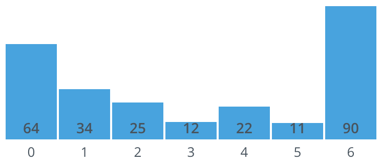
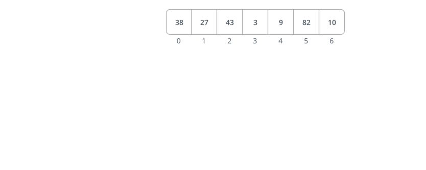
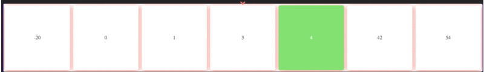

# Lesson 24: Algorithms

> "Like the gears in a well-oiled machine, algorithms synchronize data and logic to achieve seamless performance." 

## Content

1. [What are Algorithms?](#1.-what-are-algorithms?)
1. [Algorithmic Complexity (Big O Notation)](#2.-algorithmic-complexity-(big-o-notation))
1. [Sorting Algorithms](#3.-sorting-algorithms)
1. [Searching Algorithms](#4.-searching-algorithms)
1. [Dynamic Algorithms](#5.-dynamic-algorithms)

## 1. What are Algorithms?

Algorithms in Software Engineering are pre-defined collections of steps and instructions that let you solve complex tasks in an
efficient manner.

They can be implemented to accomplish tasks such as: sorting and searching data, performing mathematical
computations, processing text, or simulating real-world processes.

The choice of algorithm depends on the problem at
hand and factors such as the efficiency, speed, and resource consumption required.

## 2. Algorithmic Complexity (Big O Notation)

Big O notation is used in computer science to describe the performance or complexity of an algorithm. It assumes a
worst case scenario, thereby offering classification of an algorithm that doesn't rely on specific circumstances such as
hardware or size of input, supplementing it with a variable n.

Here's a table of basic Big O notations, ordered from least to most complex, where n is input size:

| Big O Notation | Name        | Description                                                            |
|----------------|-------------|------------------------------------------------------------------------|
| O(1)           | Constant    | Execution time remains constant regardless of the input size.          |
| O(log n)       | Logarithmic | The execution time grows logarithmically as the input size increases.  |
| O(n)           | Linear      | The execution time grows linearly with the input size.                 |
| O(n^2)         | Polynomial  | The execution time grows quadratically with the input size.            |
| O(2^n)         | Exponential | The execution time doubles with each additional element in the input.  |

### 2.1 O(1) Constant

.png)

With constant complexity name speaks for itself, it means that algorithm execution time will remain constant regardless
of the input size (n).

An example of O(1) algorithm would be something as simple as accessing an element of a list with an index.

#### Example

```python
list1 = [1, 2, 3, 4, 5]
list2 = [1, 2, 3, 4, 5, 6, 7, 8, 9, 10]

print(list1[3])
print(list2[3])
```

#### Output

```
4
4
```

#### Explanation

Here, accessing an element (`4`) will take the same amount of time for list1 and list2, regardless of the fact
that `list2`
is two times larger than `list1`

### 2.2 O(log(n)) Logarithmic

The execution time grows logarithmically as the input size increases.

.png)

Logarithmic complexity is a little difficult.

On practice, it means that an algorithm halves a data structure
with each execution, an easy-to-understand example of O(log n) would be binary search.

#### Example

Let's say we have a list of elements and we need to find an element with a particular value, for instance `4` in a sorted list.

```python
list1 = [-231, -20, 0, 1, 3, 4, 42, 54]

def binary_search(sorted_list, start, end, target):
    midpoint = (start + end) // 2

    if start >= end:
        return False
    if target > sorted_list[midpoint]:
        return binary_search(sorted_list, midpoint + 1, end, target)
    elif target < sorted_list[midpoint]:
        return binary_search(sorted_list, start, midpoint - 1, target)
    else:
        return sorted_list[midpoint]


if result := binary_search(list1, 0, len(list1), 4):
    print("element found:", result)
else:
    print("element not found")
```

#### Output

```
element found: 4
```

#### Explanation

1. `list1`, its start and end indexes and target element are passed as arguments to **_recursive_** `binary_search`.
2. if `start` exceeds `end` the function returns `False` indicating there is no such element.
3. if `target` is greater or less than midpoint element of an element, `binary_search` calls itself passing exactly half
   of the list to itself, as if target is more than middle, target will be in the second **half** of the least, and vice
   versa.
4. if `target` equals to midpoint element we return it, as we have found what we were looking for.

### 2.3 O(n) Linear

Linear complexity means that the algorithm visits every element from the list exactly once meaning that execution time
grows linearly with the input size.

.png)

In regard to python, iteration through a list would be considered to have linear complexity, because we are looking for an each
element.

An example of O(n) algorithm would be script that counts number of occurrences each element in a list.

#### Example:

```python
list1 = ['a', 'c', 'a', 'b', 'b', 'b', 'a', 'c', 'b']


def counter(list_to_count):
    counts = {}
    for element in list_to_count:
        if element in counts:
            counts[element] += 1
        else:
            counts[element] = 1
    return counts


print(counter(list1))
```

#### Output:

```
{'a': 3, 'c': 2, 'b': 4}
```

This algorithm has a time complexity of O(n), where n is the number of elements in the input list, because it iterates
through the list once, performing constant-time operations for each element.

### 2.4 O(n<sup>2</sup>) Polynomial

The execution time grows quadratically, cubically or even greater-ly with the input size.

.png)

See how the others pale in comparison to polynomial time? A polynomial function of the input is polynomial time.

If one loop through a list is O(n), one loop with one nested loop must be O(n<sup>2</sup>). An example of an algorithm
that has O(n<sup>2</sup>)
complexity is a basic list flattener.

```python
list1 = [['a', 'c'], 'a', ['b', 'b', 'b', 'a'], 'c', 'b']


def flattener(list_to_flatten):
    flattened_list = []
    for elem in list_to_flatten:
        if isinstance(elem, list):
            for elem_j in elem:
                flattened_list.append(elem_j)
        else:
            flattened_list.append(elem)

    return flattened_list


print(flattener(list1))
```

#### Output

```
['a', 'c', 'a', 'b', 'b', 'b', 'a', 'c', 'b']
```

#### Explanation

Here, we iterate through the elements of `list1` and  constantly executing `if`  to check if this element is a list itself.

If so,  we iterate through this element and record all nested elements into local `flattened_list` variable.

Otherwise, it records element straight away. Obviously, this code has some limitations, as it doesn't account for nested
lists in nested lists, but it is still a good example.

***NOTE***: This is a good example as it also showcases the fact that big O notation accounts for the worst key scenario
as here we describe algorithms complexity as O(n<sup>2</sup>) assuming that all elements in `list1` are lists
themselves, even
though in reality this might not be the case.

### 2.5 O(2<sup>n</sup>) Exponential

The execution time doubles with each additional element in the input.

.png)

An exponential growth is one of the fastest ways in which an algorithm's runtime can increase, and it's typically seen
in algorithms that solve problems through recursion, where the solution involves generating all possible cases.

A classic example of an algorithm with O(2<sup>n</sup>) complexity is the recursive calculation of Fibonacci numbers.

The recursive algorithm for computing the `nth` Fibonacci number directly implements the definition of exponential complexity.

#### Example

```python
def fibonacci(n):
    if n <= 1:
        return n
    else:
        return fibonacci(n - 1) + fibonacci(n - 2)

n = 10
print(f"fibonacci({n}) = {fibonacci(n)}")
```

#### Output

```
fibonacci(10) = 55
```

#### Explanation

Specifically, to calculate `fibonacci(n)`, it calculates `fibonacci(n-1)` and `fibonacci(n-2)` and sums up their results. Each of those calls then makes two more calls, and this process repeats until reaching the base case `(n <= 1)`.

***NOTE***: The inefficiency of the exponential growth in computational requirements illustrates the importance of
optimizing recursive algorithms, often through techniques such as memoization or by using iterative approaches.

You may have noticed during previous lessons that execution of `fibonacci` function took too long. Try to simplify the complexity of your applications and aim to make them as fast as possible.  

## 3. Sorting Algorithms

Sorting algorithms organize the elements of a list or array into a certain sequence, for example in ascending or
descending order. These algorithms aid in data organization allowing for optimized access and processing.

### 3.1 Bubble Sort

Bubble Sort is a straightforward comparison-based algorithm where each pair of adjacent elements is compared, and the
elements are swapped if they are not in order.

#### Example:

```python
def bubble_sort(arr):
    n = len(arr)
    for i in range(n - 1):
        for j in range(0, n - i - 1):
            if arr[j] > arr[j + 1]:
                arr[j], arr[j + 1] = arr[j + 1], arr[j]
    return arr


arr = [64, 34, 25, 12, 22, 11, 90]
sorted_arr = bubble_sort(arr)
print("Sorted array:", sorted_arr)
```

#### Output:

```
Sorted array: [11, 12, 22, 25, 34, 64, 90]
```

#### Explanation:



This example iterates over the list, comparing each element with the next one and swapping them if they're in the wrong
order. This process repeats until no swaps are needed, indicating that the list is sorted. It's a simple but inefficient
algorithm, mainly used for educational purposes.

**Complexity:** O(n^2) in the worst case, as it needs to make a series of passes through the list for each element.

### 3.2 Merge Sort

Merge Sort is a Divide and Conquer algorithm. It divides the input array in half, recursively sorts each half, and then
merges the sorted halves back together.

#### Example:

```python
def merge_sort(arr):
    if len(arr) > 1:
        mid = len(arr) // 2
        L = arr[:mid]
        R = arr[mid:]

        merge_sort(L)
        merge_sort(R)

        i = j = k = 0

        while i < len(L) and j < len(R):
            if L[i] < R[j]:
                arr[k] = L[i]
                i += 1
            else:
                arr[k] = R[j]
                j += 1
            k += 1

        while i < len(L):
            arr[k] = L[i]
            i += 1
            k += 1

        while j < len(R):
            arr[k] = R[j]
            j += 1
            k += 1

    return arr


arr = [38, 27, 43, 3, 9, 82, 10]
sorted_arr = merge_sort(arr)
print("Sorted array:", sorted_arr)
```

#### Output:

```
Sorted array: [3, 9, 10, 27, 38, 43, 82]
```

#### Explanation:



Merge Sort recursively splits the list into halves until it has lists of single elements and then merges those atomic
elements in sorted order to produce sorted sublists, which are then merged into a final sorted list. It's much more
efficient than Bubble Sort, especially for large datasets.

**Complexity:** O(n log n) in all cases because it divides the list into two halves and takes linear time to merge two
halves.

## 4. Searching Algorithms

Searching algorithms are designed for finding an item or group of items with specific properties within a collection of
items.

### 4.1 Linear Search

Linear Search is a simple method where the target value is searched sequentially in the list until a match is found or
the end of the list is reached.

#### Example:

```python
def linear_search(arr, x):
    for i in range(len(arr)):
        if arr[i] == x:
            return i
    return -1


arr = [5, 8, 1, 3, 7]
x = 3
result = linear_search(arr, x)
print("Element found at index:", result)
```

#### Output:

```
Element found at index: 3
```

#### Explanation:

The function iterates through each item in the list until it finds the target value, `3`, and returns
its index, `3`. If the element is not found, it returns `-1`.

**Complexity:** O(n), as it may have to check each element at worst.

### 4.2 Binary Search

Binary Search is an efficient algorithm for finding an item from a sorted list of items. It works by repeatedly dividing
in half the portion of the list that could contain the item, until you've narrowed down the possible locations to just
one.

#### Example:

```python
list1 = [-231, -20, 0, 1, 3, 4, 42, 54]


def binary_search(sorted_list, start, end, target):
    midpoint = (start + end) // 2

    if start >= end:
        return False
    if target > sorted_list[midpoint]:
        return binary_search(sorted_list, midpoint + 1, end, target)
    elif target < sorted_list[midpoint]:
        return binary_search(sorted_list, start, midpoint - 1, target)
    else:
        return sorted_list[midpoint]


if result := binary_search(list1, 0, len(list1), 4):
    print("element found:", result)
else:
    print("element not found")
```

#### Output:

```
Element found at index: 3
```

#### Explanation:



The function compares the target value (`10`) with the middle element of the array. If the target value is less than the
middle element, it repeats the process on the left subarray. If the target value is greater, it repeats on the right
subarray. This process continues until the target value is found or the subarray becomes empty.

**Complexity:** O(log n), as it splits the search area by half with each step.

## 5. Dynamic Algorithms

Dynamic programming is a strategy for solving problems by breaking them down into simpler subproblems, solving each
subproblem just once, and storing their solutions.

### 5.1 0/1 Knapsack Problem

The 0/1 Knapsack problem seeks to maximize the total value of items that can be carried in a knapsack, considering the
weight capacity of the knapsack.

***Definition of the problem***: Given N items where each item has some **weight** and **value** and also given a bag with capacity W, [i.e., the bag can hold at most W weight in it]. The task is to put the items into the bag such that the sum of values associated with them is the maximum possible. 


#### Example:

```python
def knapsack(values, weights, capacity):
    n = len(values)
    dp = [[0 for x in range(capacity + 1)] for x in range(n + 1)]

    for i in range(1, n + 1):
        for w in range(1, capacity + 1):
            if weights[i - 1] <= w:
                dp[i][w] = max(dp[i - 1][w], dp[i - 1][w - weights[i - 1]] + values[i - 1])
            else:
                dp[i][w] = dp[i - 1][w]

    return dp[n][capacity]


values = [60, 100, 120]
weights = [10, 20, 30]
capacity = 50
print(f" Maximum value in knapsack = {knapsack(values, weights, capacity)}")
```

#### Output:

```
Maximum value in knapsack = 220
```

#### Explanation:

This solution uses dynamic programming to build up a table `dp` where each entry `dp[i][w]` represents the maximum value
that can be achieved with the first `i` items and a weight limit of `w`. The solution to the problem is found
in `dp[n][capacity]`.

**Complexity:** O(nW), where `n` is the number of items and `W` is the capacity of the knapsack. This is because it
iterates through each item and for each item through all weights up to `W`.

I am not a big fan of algorithms in general, but have a huge respect to them. I would suggest you to understand how they work and you will be able to analyse your applications to find areas for improvements.

Good luck and let's move on to Advanced Section! Happy Algorithming!