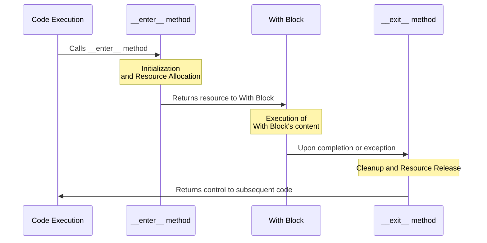

# Lesson 26: Context Managers

> "The gatekeepers of scoped behavior"

## Content

1. [Introduction](#1.-introduction)
1. [`contextlib`](#2.-`contextlib`)
1. [Nested context managers](#3.-nested-context-managers)
1. [Best Practices](#3.2-best-practices)
1. [Quiz](#4.-quiz)
1. [Homework](#5.-homework)

## 1. Introduction

Context managers are a feature in Python that provides a convenient way to manage resources.

In Python are implemented using the `with` statement, providing a way to allocate and release resources precisely when you need them. 

The most common use case we already encountered is file handling, ensuring that a file is closed once operations on it are completed, regardless of whether an error occurs.

### 1.1 The `with` Statement

The `with` statement simplifies exception handling by encapsulating common preparation and cleanup tasks in so-called context managers. It ensures that resources are properly managed.

#### Example

```python
with open('example.txt', 'r') as file:
    content = file.read()
    print(content)
```

#### Explanation
In this example, `open()` is a context manager that ensures the file is automatically closed after the block of code is executed, even if an exception is raised within the block.

This eliminates the need for explicit `file.close()` calls and makes the code cleaner and more readable.

### 1.2 Overview

**_IMPORTANT_**:  Note that, `with` statement is  syntax sugar of the programming language, under the hood it It implements two magic methods:

- `__enter__`: Executed at the beginning of the block following the `with` statement. It returns the resource to be managed (e.g., a file object).
- `__exit__`: Executed at the end of the `with` block, regardless of whether an exception occurred. It handles the cleanup, like closing a file.




Let's have some practice!

### 1.3.1 Managing Temporary Files

#### Example

**Objective:** Create a temporary file that is automatically removed after use.

```python
import os
import tempfile

class TemporaryFile:
    def __enter__(self):
        self.file = tempfile.NamedTemporaryFile(delete=False)
        return self.file

    def __exit__(self, exc_type, exc_val, exc_tb):
        self.file.close()
        os.remove(self.file.name)

with TemporaryFile() as temp_file:
    temp_file.write(b'Hello World!')
    print(f"Temporary file created at: {temp_file.name}")
```

#### Explanation

This context manager creates a temporary file in the system's designated temporary directory. 

- Upon entering the context (triggering the `__enter__` method) in `with` statement, it returns a file object that can be used to write data. 
- Exiting the context (triggering the `__exit__` method) automatically closes the file and removes it from the filesystem. 

---

### 1.3.2 Execution Time

**Objective:** Measure and print the time taken to execute a code block, aiding in profiling and optimization.

#### Example

```python
import time

class Timer:
    def __enter__(self):
        self.start = time.time()
        return self

    def __exit__(self, exc_type, exc_val, exc_tb):
        self.end = time.time()
        print(f"Elapsed time: {self.end - self.start:.2f} seconds")

with Timer() as t:
    # Some time-consuming operations
    for _ in range(1000000):
        pass
```

#### Explanation

The `Timer` context manager captures the current time upon entry and calculates the elapsed time upon exit.

- Upon entering the context (triggering the `__enter__` method) in `with` statement, it starts a countdown. 
- Exiting the context (triggering the `__exit__` method) automatically finishes the countdown and prints time taken to execute a code within a context manager.

Amazing, do you agree?

### 1.3.3 Feature Toggling

**Objective:** Temporarily enable or disable application features, useful for testing or conditional feature deployment.

#### Example

```python
class FeatureToggle:
    def __init__(self, feature, enabled=True):
        self.feature = feature
        self.enabled = enabled
        self.original_state = None

    def __enter__(self):
        self.original_state = getattr(settings, self.feature, None)
        setattr(settings, self.feature, self.enabled)

    def __exit__(self, exc_type, exc_val, exc_tb):
        setattr(settings, self.feature, self.original_state)

with FeatureToggle('NEW_FEATURE', enabled=True):
    # The NEW_FEATURE is temporarily enabled
    pass
```

#### Explanation

This context manager temporarily change the state of a feature flag in an application's settings.

- On entering it sets the feature's state to the desired value and stores the original state.
- Upon exit, it restores the feature to its original state.

I beleive that you will find practical applience of context managers, as you can see, it's a valuable and reliable tool.

## 2. `contextlib`

The `contextlib` module in Python provides utilities for working with context managers and the `with` statement. One of its most powerful features is the `contextmanager` decorator, which allows you to write a context manager using generator syntax, making it easy to create custom context managers without needing to define a class with `__enter__` and `__exit__` methods.

Now instead of classes we can use generator functions, simplifying development, readability and interaction with a codebase.  Let's take a look and I will re-write the previous examples.

### 2.1 Temporary Change of Directory

```python
import os
from contextlib import contextmanager

@contextmanager
def change_dir(destination):
    try:
        cwd = os.getcwd()
        os.chdir(destination)
        yield
    finally:
        os.chdir(cwd)

with change_dir("/tmp"):
    # Operations in /tmp
    print("Working in", os.getcwd())
# Back to original directory
print("Back to", os.getcwd())
```

### 2.2. Enabling Debug Mode Temporarily

For applications with a debug mode, you might want to enable it temporarily for a block of code:

```python
from contextlib import contextmanager

@contextmanager
def debug_mode(enabled=True):
    original_debug = settings.DEBUG
    settings.DEBUG = enabled
    try:
        yield
    finally:
        settings.DEBUG = original_debug

with debug_mode():
    # Code that runs with debug mode enabled
    perform_debug_operations()
```

### 2.3 Error Handling

Context managers can also be used to elegantly handle exceptions that occur within the `with` block.

```python
@contextmanager
def exception_handler():
    try:
        yield
    except Exception as e:
        print(f"Handled exception: {e}")

with exception_handler():
    raise ValueError("Something went wrong")
```

The examples above are more conceptual, than practical, but it's important that you understand the pylosophy behind the context managers:
    
- **Step1:** Enter the context state.
- **Step2:** Proceed within a local scope (Do something temporalily).
- **Step3:** Exit the context state and release resources.

## 3. Nested context managers

`Python` allows nesting of context managers, which can be useful when dealing with multiple resources that need to be managed together.

### 3.1 Managing Multiple Files

**Objective**: Reading from one file and writing to another simultaneously.

#### Example

```python
with open('input.txt', 'r') as input_file, open('output.txt', 'w') as output_file:
    for line in input_file:
        output_file.write(line.upper())
```

In some cases it can be useful, if both files have direct ties to each other.

### 3.2 Nested Timeout


**Objective**: Performing nested action where each call has its own timeout period.

#### Example

```python
from contextlib import contextmanager

@contextmanager
def timeout(time):
    def signal_handler(signum, frame):
        raise TimeoutError("Operation timed out")
    
    # Do something here? 
    try:
        yield
    finally:
        signal.alarm(0)

with timeout(10):
    with timeout(5):
        # Perform operation that must complete within 5 seconds
        # But the overall block should not exceed 10 seconds
        pass
```

We can set a time range using context manager between the beginning and ending.

## 3.2 Best Practices 

| Category      | Do                                                                 | Don't                                                                                     |
|---------------|--------------------------------------------------------------------|--------------------------------------------------------------------------------------------|
| **Resource Management** | Use context managers to explicitly manage resources, ensuring they are always properly released. | Don't use context managers where a simple try-finally block would suffice for resource management. |
| **Exception Handling**  | Ensure that exceptions are properly handled or propagated when implementing `__exit__` methods or using `@contextmanager`. | Don't ignore exceptions as they can lead to hidden bugs and unreliable application behavior. |

Avoid complex logic that can make the context manager difficult to read and understand. Keep it simple!

## 4. Quiz

### Question 1:

> What does the `__enter__` method do in a context manager?

A) It handles exceptions that occur within the context.  
B) It initializes the resource that needs to be managed.  
C) It cleans up and releases the resources.  
D) It validates input parameters for the resource.

<!-- Correct Answer: B -->

### Question 2:

> Which of the following is a correct way to use the `contextlib` module's `contextmanager` decorator for creating a context manager?

A) Using a class with `__enter__` and `__exit__` methods.  
B) Using a generator function with a single yield.  
C) Using a regular function with multiple return statements.  
D) Using a class without implementing any methods.

<!-- Correct Answer: B -->

### Question 3:

> What is the primary benefit of using context managers for file handling in Python?

A) Increasing the file read and write speed.  
B) Automatically closing the file regardless of whether an error occurs.  
C) Encrypting and decrypting file contents automatically.  
D) Compacting the file to save disk space.  

<!-- Correct Answer: B -->

### Question 4:

> What content does 'log.txt' contain after execution?

```python
with open('log.txt', 'w') as f:
    f.write('Begin logging\n')
    raise ValueError('Something went wrong!')
    f.write('End logging\n')
```

A) `'Begin logging\nEnd logging\n'`  
B) `'Begin logging\n'`  
C) `The file is empty.`  
D) `'End logging\n'`  

### Question 5:

> What will happen if an exception is raised in a context manager before reaching the `yield` in a `contextmanager` decorated generator?

A) The code will continue to execute normally.  
B) The exception will be suppressed.  
C) The `__exit__` method is called immediately.  
D) The part after `yield` will not execute.

### Question 6:

> How can you ensure that a block of code within a `with` statement completes execution before proceeding?

A) By using the `pass` statement.  
B) By using the `finally` clause.  
C) By nesting multiple `with` statements.  
D) By handling all exceptions within the context manager.  

## 5. Homework

### Task 1: Database Connection Manager
**Objective**: Create a context manager that handles opening and closing a database connection.

**Requirements**:

- Simulate opening a connection to a database.
- Ensure the connection is closed after operations, even if an error occurs.
- Handle exceptions gracefully and log them.

Happy Programming!