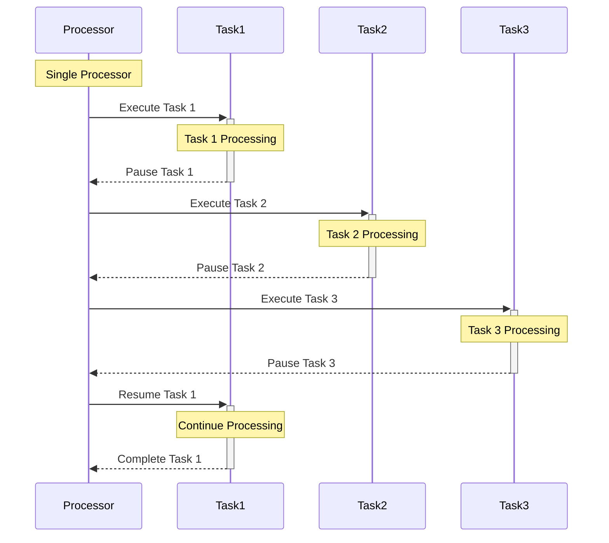
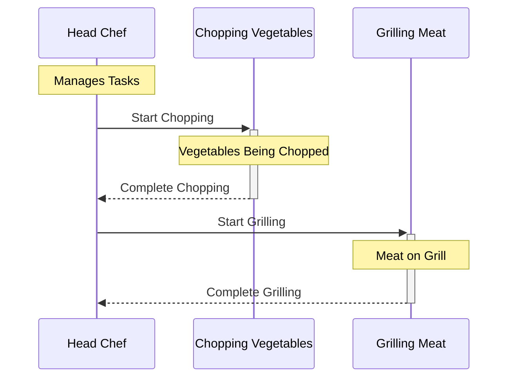
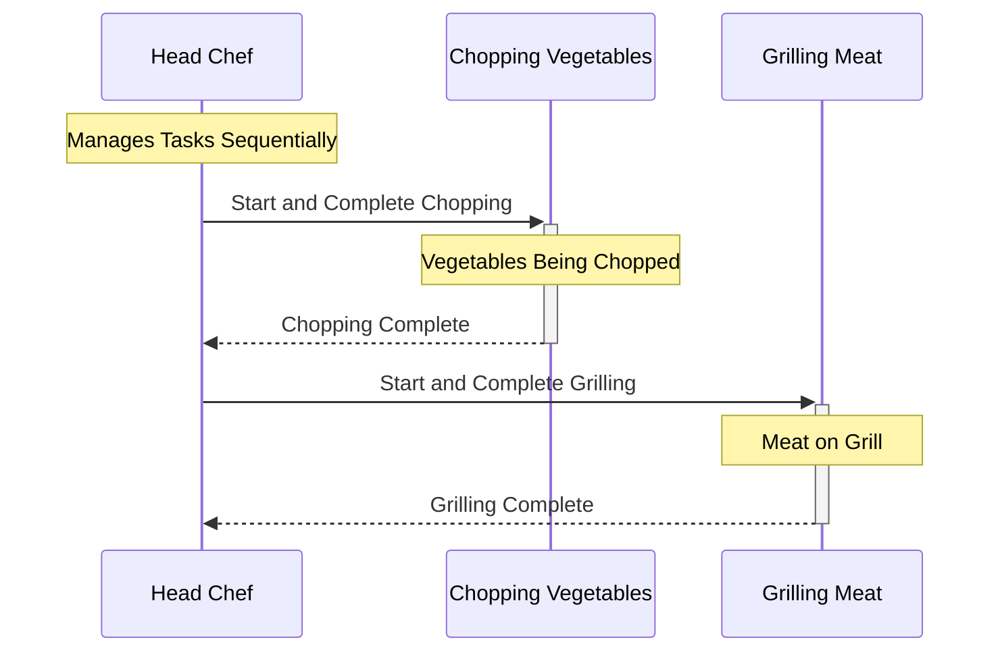
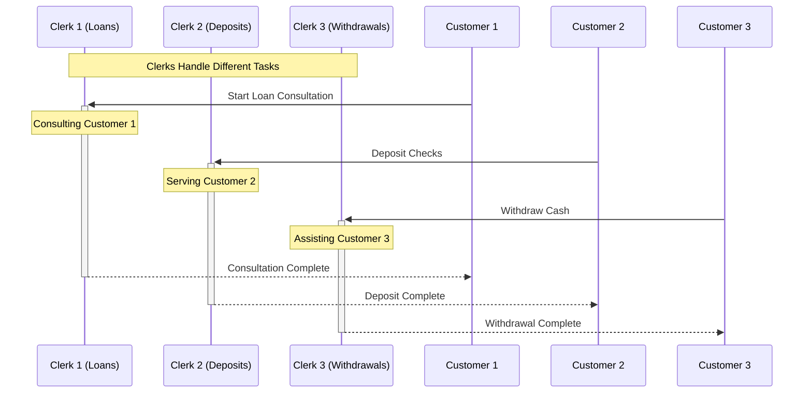
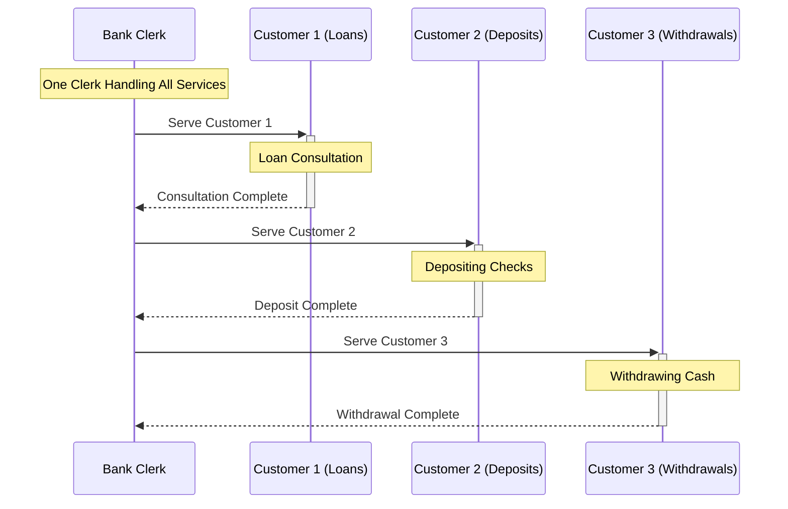
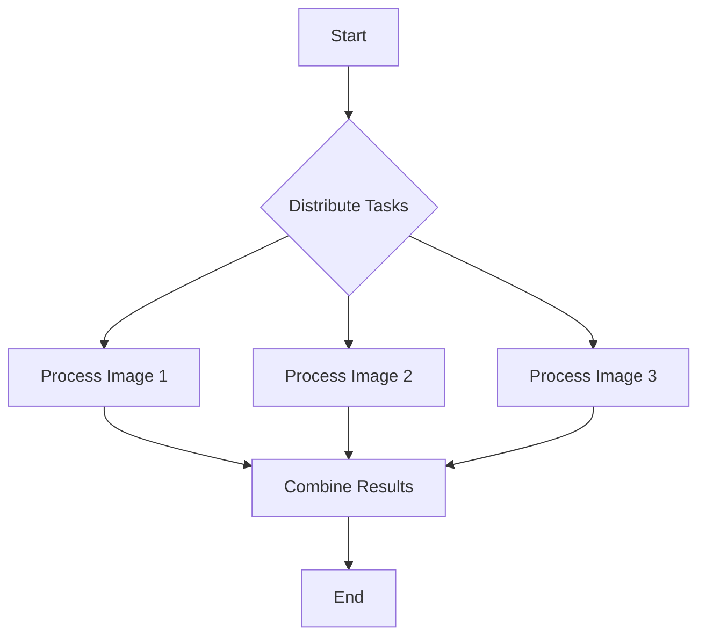

# Lesson 27: Concurrent and Parallel Programming

> "The art of programming is the art of organizing complexity, of mastering multitude and avoiding its bastard chaos as effectively as possible." - Edsger Dijkstra

## Content

1. [Concurrent Programming](#1.-concurrent-programming)
1. [Parallel Programming](#2.-parallel-programming)
1. [Key Differences](#3-key-differences)
1. [Homework](#4.-homework)

## 1. Concurrent Programming

The main problem of `Python` is being extremley slow in terms of perfomance. But we can achieve better results using practices described in sections [1-5], which is critical for developing high-performance applications in `Python`.

### 1.1 Definition

**Concurrency**: The ability of a program to be decomposed into parts that can run independently of each other. It's about dealing with lots of things at once.

### 1.2 The Restaurant Kitchen

**Objective**: The kitchen has one head chef (the processor) and several tasks that need to be done to prepare a meal, such as chopping vegetables and grilling meats.

To represent the concurrency correctly, chef is moving between all tasks. 

### 1.2.1 Concurrent 

Let's take a look at how should it work:

#### Explanation

- **Head Chef (Processor)**: Manages and switches between tasks, but can physically only do one task at a time.
- **Tasks (Concurrent Processes)**: Chopping vegetables, grilling meats, These tasks are set up and monitored concurrently.
- **Efficiency**: By managing multiple tasks and moving between them, the kitchen operates much faster.

Chef is able to perform only one task at a time (due to single-threading / GIL (Global Interpreter Lock) in `Python` ), though all components of the meal are prepared concurrently.

GIL will be covered during the next lesson, for now just try to understand the idea behind concurrent programming.

### 1.2.2 Synchronous

In a synchronous kitchen operation, tasks are completed one after another without overlap. The head chef focuses on one task completely before moving on to the next task.

That's the way we implemented applications before.

### 1.3 The Bank

**Objective**: Imagine a bank with a single service counter and multiple customers needing different services: depositing checks, withdrawing cash, and consulting on loan products.

### 1.3.1 Concurrent

In a concurrent version, multiple clerks (processors) are available to handle different banking tasks simultaneously,leading to efficient customer service and reduced waiting times.

This setup allows the bank to serve multiple customers at the same time, with each clerk focused on a specific task.

Let's take a look at how such model works in practice:

#### Explanation

- **Clerks (Processors)**: Each clerk is capable of handling a different banking task simultaneously.
- **Tasks (Concurrent Processes)**: Loan consultations, depositing checks, and withdrawing cash are examples of tasks being handled concurrently.
- **Efficiency**: This concurrent operation allows the bank to maximize its throughput, serving more customers efficiently and reducing overall wait times.

### 1.3.2 Synchronous

In a smaller bank with only one clerk, customers must be served one at a time. This synchronous approach means the clerk focuses on completing one customer's transaction before starting the next.

Again, this may lead to increased wait times, which is a bad case for our application. That's why concurrent approach will be the best in terms of building your applications.

## 2. Parallel Programming

As processors have evolved, increasing their clock speed has become more challenging due to physical and thermal limitations.

The solution has been to add more cores, allowing for more operations to be carried out simultaneously.

Parallel programming is designed to take advantage of this architecture by dividing tasks across these cores, significantly speeding up processing times for suitable tasks.

### 2.1 Definition

**Parallel programming**: is an approach that allows for the execution of many computations or processes simultaneously.

### 2.2 Image Processing App

**Objective**: In a photo editing application, multiple images need to be processed to apply a filter. Each image can be processed independently of the others, making this task an excellent candidate for parallel programming.

#### Explanation

- **Task Distribution**: The application divides the batch of images into individual tasks.
- **Parallel Processing**: Each image is processed in parallel, utilizing separate CPU cores.
- **Efficiency**: This approach significantly reduces the total processing time compared to processing each image sequentially.

Just as in life, time is the most valuable asset which should be used accordingly, that's why we usually refer to techniquest above - to save some time, even if it's a time of execution.

## 3 Key Differences

Let's summarise everything into the table, so that during designing of your application, you as a programmer would refer to:

| Aspect          | Concurrent Programming                                                                 | Parallel Programming                                                                  |
|-----------------|---------------------------------------------------------------------------------------|---------------------------------------------------------------------------------------|
| **Definition**  | Focuses on managing and executing multiple tasks that can run independently but not necessarily simultaneously. | Involves executing multiple computations or processes simultaneously, typically by utilizing multiple CPU cores. |
| **Execution**   | Tasks are decomposed into parts that can run independently, often interleaved or overlapping in time. | Tasks are executed at the same time, utilizing the computing power of multiple processing units. |
| **Use Case**    | Best for I/O-bound operations where tasks spend a significant amount of time waiting for external operations like network or disk I/O. | Best for CPU-bound tasks that require heavy computation and can be divided into independent subtasks for simultaneous execution. |
| **Python Tools** | `Threading`, `AsyncIO`                                                                    | `Multiprocessing`, `concurrent.futures` `(ProcessPoolExecutor)`                             |
| **GIL Impact**  | Affected by Python's GIL, making true parallel execution of threads impossible in CPython. However, tasks that are I/O-bound can still benefit from concurrency. | Bypasses the GIL by using separate processes instead of threads, allowing true parallel execution of code. |

Happy self-reflection and welcome to the Fast Python!

Sorry for raw and boring theory, without it we won't be able to create async applications.

## 4. Homework

Come up with concurrent and paralllel flows from the real world and visualise them in diagrams.