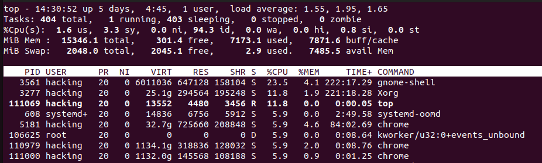
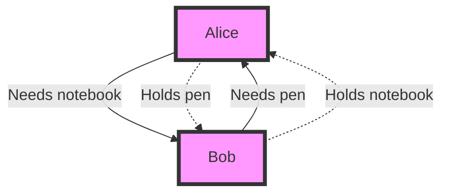
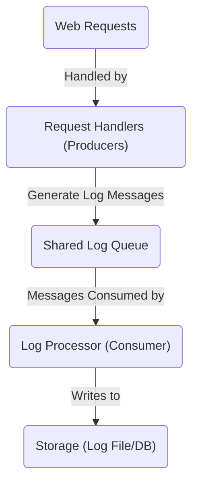

# Lesson 28: Threading

> "Concurrency is not parallelism, it’s better." - Rob Pike

## Content

1. [Introduction to Threads](#1.-introduction-to-threads)
1. [Threading](#2.-threading)
1. [Global Interpreter Lock (GIL)](#3.-global-interpreter-lock-(gil))
1. [Thread Communication](#4.-thread-communication)
1. [Daemon Threads](#5.-daemon-threads)
1. [Thread Pooling](#6.-thread-pooling)
1. [More Practice](#7.-more-practice)
1. [Quiz](#8.-quiz)
1. [Homework](#9.-homework)

## 1. Introduction to Threads

In the world of software development, the ability to perform multiple operations simultaneously can significantly enhance the responsiveness and performance of an application. Python's threading module offers a powerful tool for achieving such concurrency.

### 1.1 Definition of Threads

**Thread** often referred to as a lightweight process, is the smallest unit of processing that can be performed in an OS. 

In most modern operating systems, a thread exists within a process and shares resources such as memory, yet can execute independently. Threads within the same process can execute concurrently, making efficient use of CPU resources.

**NOTE**: In order to use threading in `Python` we would need to import a built in module  `threading`.

Let's take a look on the following examples:

#### Example

```python
import threading

def print_numbers():
    for i in range(5):
        print(i)

# Create a thread to run the print_numbers function
thread = threading.Thread(target=print_numbers)
thread.start()

# Continue executing the main program while the thread runs concurrently
print("Thread started!")
```

#### Output

```
0
1
Thread started!
2
3
4
```

**NOTE**: Thread is a separate object of `<class 'threading.Thread'>`.

### 1.2 Processes vs Threads

There is one important entity called process, people always confuse them with threads. Simply speaking, process is a separate application, a separate programm, and has a few distinquishing qualities from threads.

Take a look at the table below: 

| Aspect      | Process                                     | Thread                                   |
|-------------|---------------------------------------------|------------------------------------------|
| Memory      | Separate memory space                       | Shared memory space                      |
| Creation    | Slow and resource-intensive                 | Quick and efficient                      |
| Communication| Requires inter-process communication (IPC) | Directly communicate via shared variables|
| Dependency  | Operates independently                      | Part of a process                        |


You can view the processes calling `top` command on Linux/Mac OS systems or running the task manager o Windows.

#### Example

```
$ top
```

#### Output



As it was mentioned in a previous lesson, in Python you would need to use different modules to interact with `threads`/`processes` - `threading`/`multiprocessing`

Let's dive into practice and focus on `threading` this module.

### 1.3 Threading Use Cases

Threading is particularly beneficial in scenarios where an application needs to maintain responsiveness to user input while performing other tasks in the background, such as:

- **GUI Applications**: Keeping the UI responsive while processing data.
- **I/O Bound Applications**: Performing multiple network or disk operations concurrently.
- **Real-Time Data Processing**: Monitoring input from real-time data sources without blocking.

Let's take a look on a couple of examples below:

### 1.3.1 File Downloads

**Objective**: Consider an application that needs to download multiple files from the internet simultaneously.

The default implementation of apps which is known for us already will be in a synchronous manner.

#### Example

```python
import time

file_urls = ["http://example.com/file1.jpg", "http://example.com/file2.jpg", "http://example.com/file3.jpg"]

def download_file_sync(file_url):
    print(f"Starting download from {file_url}")
    time.sleep(3)  # Simulate download time
    print(f"Completed download from {file_url}")
    print("\n")


start_time_sync = time.time()

for url in file_urls:
    download_file_sync(url)

end_time_sync = time.time()
print(f"All files have been downloaded sequentially in {end_time_sync - start_time_sync} seconds.")
```

#### Output

```
Starting download from http://example.com/file1.jpg
Completed download from http://example.com/file1.jpg


Starting download from http://example.com/file2.jpg
Completed download from http://example.com/file2.jpg


Starting download from http://example.com/file3.jpg
Completed download from http://example.com/file3.jpg


All files have been downloaded sequentially in 9.006875276565552 seconds.
```

#### Explanation

We can see from the output that downloading files sequentially, could be time-consuming, and it's not the best approach which could be.

The application can download multiple files in parallel using `threading`. This significantly reduces the overall time required for all downloads to complete.

Let's re-write it applying concurency:

#### Example 

```python
import threading
import time

def download_file(file_url):
    print(f"Starting download from {file_url}")
    time.sleep(3)  # Simulate download time
    print(f"Completed download from {file_url}")

file_urls = ["http://example.com/file1.jpg", "http://example.com/file2.jpg", "http://example.com/file3.jpg"]

start_time = time.time()

for url in file_urls:
    threading.Thread(target=download_file, args=(url,)).start()

# Assuming downloads finish in 3 seconds, we wait slightly longer
time.sleep(3.5)

end_time = time.time()
print(f"All files have been downloaded concurrently in {end_time - start_time} seconds.")
```

**Note**: In real-world applications, relying on `sleep` to wait for threads can be unreliable. Proper synchronization methods or thread management techniques should be used instead.

#### Output

```
Starting download from http://example.com/file1.jpg
Starting download from http://example.com/file2.jpg
Starting download from http://example.com/file3.jpg
Completed download from http://example.com/file1.jpg
Completed download from http://example.com/file2.jpg
Completed download from http://example.com/file3.jpg
All files have been downloaded concurrently in 3.5027055740356445 seconds.
```

We can make a conclusion, that concurrent approach is much better and faster then sequential.

### 1.4 Web Server Request Handling

**Objective**: Let's create a web-server which handles the incoming requests from the client and check how Synchronous/Concurrent approaches could impact the time of request processing in general.

#### Example

Synchronous approach can lead to significant delays, especially if each request involves time-consuming operations.

```python
import time

def handle_client_request_sync(request_id):
    print(f"Synchronously handling request {request_id}")
    time.sleep(2)  # Simulate request processing time
    print(f"Request {request_id} completed\n")

requests = [1, 2, 3, 4, 5]

start_time_sync = time.time()

for request_id in requests:
    handle_client_request_sync(request_id)

end_time_sync = time.time()
print(f"All requests have been handled sequentially in {end_time_sync - start_time_sync} seconds.")
```

##### Output

```
Synchronously handling request 1
Request 1 completed

Synchronously handling request 2
Request 2 completed

...

Synchronously handling request 5
Request 5 completed

All requests have been handled sequentially in 10.005 seconds.
```

Again, getting the total time - the sum of processing all requests. Let's re-write this:

#### Example

Here, the web server handles each client request in a separate thread, allowing multiple requests to be processed in parallel. This significantly improves response time of the server.


```python
import threading
import time

def handle_client_request(request_id):
    print(f"Concurrently handling request {request_id}")
    time.sleep(2)  # Simulate request processing time
    print(f"Request {request_id} completed")

requests = [1, 2, 3, 4, 5]

start_time = time.time()

threads = []
for request_id in requests:
    thread = threading.Thread(target=handle_client_request, args=(request_id,))
    threads.append(thread)
    thread.start()

# Assuming each request finishes in 2 seconds, wait a bit longer than that
time.sleep(2.5)

end_time = time.time()
print(f"All requests have been handled concurrently in {end_time - start_time} seconds.")
```

##### Output

```
Concurrently handling request 1
Concurrently handling request 2
...
Concurrently handling request 5
Request 1 completed
Request 2 completed
...
Request 5 completed
All requests have been handled concurrently in 2.501 seconds.
```

**Note**: Real-world server applications would manage thread completion more robustly than using `sleep`.

Same here, don't hesitate to use threading in your applications to reduce the total execution time, but first I would want to take a deeper look on all features of `threading` module and introduce you to potential rabbit holes, which are extremely hard to debug :)

## 2. Threading

In computing, a thread is similar to each task you perform — it's a sequence of instructions that can be executed independently while contributing to the overall process.

### 2.1 Starting Threads

Starting a thread means initiating a separate flow of execution. Think of it as hiring another cook in the kitchen to handle a different task concurrently, so breakfast gets ready faster.

#### Example

```python
from threading import Thread
import time

def boil_water():
    print("Boiling water...")
    time.sleep(3)  # Simulating the time it takes to boil water
    print("Water boiled!")

# Create a thread for boiling water
water_thread = Thread(target=boil_water)

# Start the thread
water_thread.start()
```

#### Output

```
Boiling water...
Water boiled!
```

#### Explanation

In this example, calling `water_thread.start()` begins the execution of `boil_water` in a separate thread. This allows the program (or the main cook) to perform other tasks without waiting for the water to boil.

### 2.2 Joining Threads

Joining threads is a way of synchronizing tasks in the kitchen.

You wouldn't want to serve breakfast without the toast being ready, right? Joining ensures that the main flow of execution (the main thread) waits for other threads to complete their tasks before proceeding.

#### Example

```python
from threading import Thread
import time

def boil_water():
    print("Boiling water...")
    time.sleep(3)  # Simulating the time it takes to boil water
    print("Water boiled!")

# Create a thread for boiling water
water_thread = Thread(target=boil_water)

# Start the thread
water_thread.start()

# Wait for the water to boil
water_thread.join()

print("Now that the water has boiled, let's make coffee.")
```

#### Output
```
Boiling water...
Water boiled!
Now that the water has boiled, let's make coffee.
```

**IMPORTANT**: WITHOUT `join()` method we would not be able to synchronise threads and would have got the following output. 

**IMPORTANT**: This can lead to very unpleasant bugs and situations in production.

#### Output

```
Boiling water...
Now that the water has boiled, let's make coffee.
Water boiled!
```

#### Explanation

Here, `water_thread.join()` acts as an instruction to wait: "Don't start making coffee until the water has boiled." It ensures that the water boiling process is complete before moving on to the next step.

### 2.3 Locks

Locks, or mutexes, are tools for ensuring that only one thread at a time can execute a specific block of code. This is particularly important when multiple threads interact with shared data or resources.

#### Example

**Objective**: Imagine you're back in the kitchen, and this time you have only one frying pan, but multiple dishes that require it. To avoid a mess (race condition), you use a lock (the frying pan) to ensure only one dish is prepared at a time.

```python
from threading import Thread, Lock
import time

# The shared resource
frying_pan = Lock()

def cook_dish(dish_name):
    with frying_pan:
        print(f"Starting to cook {dish_name} with the frying pan.")
        time.sleep(2)  # Simulate cooking time
        print(f"{dish_name} is done!")

dishes = ["Scrambled eggs", "Pancakes", "Bacon"]

# Creating threads for each cooking task
for dish in dishes:
    Thread(target=cook_dish, args=(dish,)).start()
```

#### Explanation

In this example, the `frying_pan` lock ensures that only one thread (dish being cooked) can access the critical section (use the frying pan) at any given time. This prevents the dishes from "clashing," which in programming terms, translates to avoiding data corruption or unexpected outcomes due to concurrent modifications.

**IMPORTANT**: In case we would not want to use the Mutex mechanism, we would start cooking everything simultaneously on the `frying_pan` and encounter a mess.

#### Output

```
Starting to cook Scrambled eggs with the frying pan.
Scrambled eggs is done!
Starting to cook Pancakes with the frying pan.
Pancakes is done!
Starting to cook Bacon with the frying pan.
Bacon is done!
```

Frankly speaking mutex mechanisms were the hardest mechanims to understand, so I would like to include one more example, so that you understand it better.

#### Example 

**Objective**: Consider a bank account with a balance that can be accessed by multiple transactions at the same time. 

**IMPORTANT**: Without proper synchronization, simultaneous deposits and withdrawals could lead to incorrect account balances.

Let's implement the code which simulates `deposit` and `withdraw` operations:

```python
from threading import Thread, Lock
import random

# Bank account balance
balance = 100
account_lock = Lock()

def deposit():
    global balance
    for _ in range(5):
        with account_lock:
            amount = random.randint(10, 50)
            balance += amount
            print(f"Deposited ${amount}. New balance: ${balance}.")

def withdraw():
    global balance
    for _ in range(5):
        with account_lock:
            amount = random.randint(10, 50)
            if balance >= amount:
                balance -= amount
                print(f"Withdrew ${amount}. New balance: ${balance}.")
            else:
                print("Insufficient funds for withdrawal.")

# Creating threads for depositing and withdrawing
deposit_thread = Thread(target=deposit)
withdraw_thread = Thread(target=withdraw)

deposit_thread.start()
withdraw_thread.start()

deposit_thread.join()
withdraw_thread.join()

print(f"Final account balance: ${balance}")
```

#### Output

```
Deposited $12. New balance: $112.
Deposited $38. New balance: $150.
Deposited $31. New balance: $181.
Deposited $28. New balance: $209.
Deposited $39. New balance: $248.
Withdrew $26. New balance: $222.
Withdrew $15. New balance: $207.
Withdrew $14. New balance: $193.
Withdrew $23. New balance: $170.
Withdrew $17. New balance: $153.
Final account balance: $153
```

#### Explanation
In this example, each transaction (deposit or withdrawal) acquires the lock before modifying the balance and releases it afterward, ensuring the balance updates are atomic and preventing race conditions.

Try modifying the codebase and see what happens without locks.

### 2.4 DeadLocks

In concurrent programming, a deadlock is a situation where two or more threads are blocked forever, waiting for each other to release a resource they need. 
 
Imagine two friends, Alice and Bob, who need to borrow a pen and a notebook to jot down an idea. Alice has the pen, Bob has the notebook, and both need to use the other item at the same time.

If neither is willing to lend their item before getting the other, they end up in a standstill - this is a deadlock.



In terms of threads, a deadlock can occur when:

- Thread A holds Lock 1 and waits for Lock 2.
- Thread B holds Lock 2 and waits for Lock 1.
- Neither thread can proceed, leading to a permanent block.


### 2.4.1 How to avoid deadlocks?

**Lock Ordering**: Ensure that all threads acquire locks in the same order, even if they need to acquire multiple locks. This consistency prevents circular wait conditions.

#### Example
```python
from threading import Thread, Lock
import time

# Define the locks (resources)
lockA = Lock()
lockB = Lock()

# Bad practice: Potential for deadlock
def thread1_bad():
    with lockA:
        print("Thread 1 acquired Lock A")
        time.sleep(1)  # Simulate work, increasing the chance of deadlock
        with lockB:
            print("Thread 1 acquired Lock B")
            # Perform some action
    print("Thread 1 completed work")

def thread2_bad():
    with lockB:
        print("Thread 2 acquired Lock B")
        time.sleep(1)
        with lockA:
            print("Thread 2 acquired Lock A")
            # Perform some action
    print("Thread 2 completed work")

# Good practice: Avoiding deadlock
def thread1_good():
    with lockA:
        print("Thread 1 (good) acquired Lock A")
        time.sleep(1)
        with lockB:
            print("Thread 1 (good) acquired Lock B")
            # Perform some action
    print("Thread 1 (good) completed work")

def thread2_good():
    with lockA:
        print("Thread 2 (good) acquired Lock A")
        time.sleep(1)
        with lockB:
            print("Thread 2 (good) acquired Lock B")
            # Perform some action
    print("Thread 2 (good) completed work")

# Running the bad practice example (potential deadlock)
# Uncomment the lines below to run the bad practice scenario.
# Note: This may hang your program due to deadlock.

# t1_bad = Thread(target=thread1_bad)
# t2_bad = Thread(target=thread2_bad)
# t1_bad.start()
# t2_bad.start()
# t1_bad.join()
# t2_bad.join()

# Running the good practice example
t1_good = Thread(target=thread1_good)
t2_good = Thread(target=thread2_good)
t1_good.start()
t2_good.start()
t1_good.join()
t2_good.join()
```

#### Output

```
Thread 1 (good) acquired Lock A
Thread 1 (good) acquired Lock B
Thread 1 (good) completed work
Thread 2 (good) acquired Lock A
Thread 2 (good) acquired Lock B
Thread 2 (good) completed work
```

**Using a Timeout**: When attempting to acquire a lock, using a timeout can prevent a thread from waiting indefinitely. If the lock isn't acquired within the timeout period, the thread can release any locks it holds and retry later, thus breaking potential deadlock cycles.

#### Example

```python
from threading import Lock
import time

lock1 = Lock()
lock2 = Lock()

def try_to_avoid_deadlock():
    while True:
        if lock1.acquire(timeout=1):
            print("Lock 1 acquired")
            time.sleep(0.5)  # Simulate work

            if lock2.acquire(timeout=1):
                print("Lock 2 acquired")
                # Do something with both resources
                lock2.release()
            lock1.release()
            break  # Exit after work is done
        print("Retrying for locks")

try_to_avoid_deadlock()
```

#### Output

```
Lock 1 acquired
Lock 2 acquired
```

**IMPORTANT**: Whenever possible, use higher-level synchronization primitives like `Queue`, which are designed to handle concurrency in a safe way and can helps avoid low-level deadlock issues.

Let's take a look at a practical example, instead of theory

#### Example

Imagine two threads needing to access two shared resources: a database connection and a file. To avoid deadlock, we can apply lock ordering.

```python
from threading import Thread, Lock

database_lock = Lock()
file_lock = Lock()

def thread1_routine():
    with database_lock:
        print("Thread 1 acquired the database lock")
        with file_lock:
            print("Thread 1 acquired the file lock")
            # Access database and file

def thread2_routine():
    with database_lock:
        print("Thread 2 acquired the database lock")
        with file_lock:
            print("Thread 2 acquired the file lock")
            # Access database and file

thread1 = Thread(target=thread1_routine)
thread2 = Thread(target=thread2_routine)

thread1.start()
thread2.start()

thread1.join()
thread2.join()
```

#### Output

```
Thread 1 acquired the database lock
Thread 1 acquired the file lock
Thread 2 acquired the database lock
Thread 2 acquired the file lock
```

By ensuring both threads acquire the `database_lock` before trying for the `file_lock`, we prevent a deadlock scenario where each thread holds one resource and waits for the other.

### 2.5 Conditions

A `Condition` object in threading allows one or more threads to wait until they are notified by another thread.

This is useful when you need to ensure certain conditions are met before a thread continues execution.

#### Example

Imagine a scenario in a restaurant kitchen where the chef (Thread A) must wait until the ingredients are prepared by the kitchen staff (Thread B) before cooking.

```python
from threading import Condition, Thread
import time

condition = Condition()
dish = None

def chef():
    global dish
    with condition:
        print("Chef is waiting for ingredients to be prepared...")
        condition.wait()  # Chef waits until ingredients are ready
        print(f"Chef starts cooking with the prepared ingredients: {dish}.")

def kitchen_staff():
    global dish
    with condition:
        dish = "Fresh Tomatoes and Basil"
        print("Kitchen staff has prepared the ingredients.")
        condition.notify()  # Notify the chef that the ingredients are ready

Thread(target=kitchen_staff).start()
time.sleep(1)  # Simulating time delay for better output readability
Thread(target=chef).start()
```

#### Output

```
Kitchen staff has prepared the ingredients.
Chef is waiting for ingredients to be prepared...
```


### 2.6 Events

An `Event` is a simpler synchronization object compared to a `Condition`. An event manages an internal flag that threads can set (`event.set()`) or clear (`event.clear()`). Threads can wait for the flag to be set (`event.wait()`).

#### Example
```python
from threading import Event, Thread
import time

start_event = Event()

def background_process():
    print("Background process is waiting to start.")
    start_event.wait()  # Wait until the event is set
    print("Background process has started.")

def user_signal():
    time.sleep(3)  # Simulate the user taking time to provide input
    print("User signals to start the background process.")
    start_event.set()  # Signal the background process to start

Thread(target=background_process).start()
Thread(target=user_signal).start()
```

I haven't really used `Events` and `Conditions` on practice in production code, only in sandbox, but it's better to know they exist.

## 3. Global Interpreter Lock (GIL)

The Global Interpreter Lock (GIL) is one of the most controversial features of `Python`. It's a mutex that protects access to `Python` objects, preventing multiple threads from executing `Python` bytecodes at once.

### 3.1 Why does GIL exist?

The GIL was introduced to avoid the complexities and potential issues (such as race conditions, deadlocks, and data corruption) associated with multi-threaded access to Python objects.

### 3.2. Race Conditions

A race condition occurs when two or more threads access shared data and they try to change it at the same time.

Because the thread scheduling algorithm can swap between threads at any time, you don't know the order in which the threads will attempt to access the shared data. This can lead to unpredictable outcomes. Be extremely carefull as it is too hard to debug and also it kills your neuro system.

#### Example 

Consider two threads incrementing the same counter:

```python
from threading import Thread

# Shared variable
counter = 0

# Function to increment counter
def increment():
    global counter
    for _ in range(1000000):
        counter += 1

# Create threads
thread1 = Thread(target=increment)
thread2 = Thread(target=increment)

# Start threads
thread1.start()
thread2.start()

# Wait for both threads to complete
thread1.join()
thread2.join()

print(f"Final counter value: {counter}")
```

#### Output

```
Final counter value with lock: 18045604
```

#### Explanation

You might expect the final value of `counter` to be 2,000,000, but due to race conditions, it might be less because increments can be lost when both threads read, increment, and write back the value simultaneously.


The most straightforward and logical way to avoid race conditions is by using locks to synchronize access to shared resources.

```python
from threading import Thread, Lock

counter = 0
lock = Lock()

def safe_increment():
    global counter
    for _ in range(1000000):
        with lock:
            counter += 1

thread1 = Thread(target=safe_increment)
thread2 = Thread(target=safe_increment)

thread1.start()
thread2.start()

thread1.join()
thread2.join()

print(f"Final counter value with lock: {counter}")
```

### Output

```
Final counter value with lock: 2000000
```

#### Explanation
This example ensures that only one thread can increment the counter at a time, preventing race conditions.

It's extremly hard to find out the real cause of race conditions, so be always careful with shared resourses accross the program.

## 4. Thread Communication


Consider a server handling web requests, where it's crucial to maintain a log of all requests for monitoring, analysis, and debugging purposes. 

However, writing logs directly to a file for every request can significantly impact performance due to I/O operations.

In this scenario, a background log processing system can be implemented using `producer-consumer` pattern:

#### Example

```python
import queue
import threading
import time

log_queue = queue.Queue()

def handle_request(request_id):
=    print(f"Handling request {request_id}")
    time.sleep(1)
    log_message = f"Request {request_id} handled"
    # Place log message in queue
    log_queue.put(log_message)

def process_logs():
    while True:
        if not log_queue.empty():
            log_message = log_queue.get()
            # Simulate log processing (e.g., writing to a file)
            print(f"Logging: {log_message}")
            log_queue.task_done()
        else:
            # Wait for new log messages to avoid busy waiting
            time.sleep(1)

# Start threads for request handling
for request_id in range(5):
    threading.Thread(target=handle_request, args=(request_id,)).start()

# Start the log processing thread
log_thread = threading.Thread(target=process_logs)
log_thread.start()
```

#### Output

```
Handling request 0
Handling request 1
Handling request 2
Handling request 3
Handling request 4
Logging: Request 2 handled
Logging: Request 0 handled
Logging: Request 4 handled
Logging: Request 3 handled
Logging: Request 1 handled
```

**NOTE**: In a real application, the log processing thread would run indefinitely or until a shutdown signal is received. Btw, that's where daemon threads can come in handy.

#### Explanation




**Producer (Request Handler)**: Each thread handling web requests also generates log messages corresponding to request processing. Instead of writing logs immediately, these messages are placed in a shared `queue`.
  
**Consumer (Log Processor)**: A logging thread consumes messages from the queue and processes them, writing to a file, database, or external logging service. This separation allows request handlers to remain responsive and offloads the I/O-heavy logging task.

This is my favourite pattern and I recommend you to implement it with high level structures such as `Queue` which handles logic under the hood.

## 5. Daemon Threads

A daemon thread runs in the background and is not meant to hold up the program from exiting. Unlike regular (non-daemon) threads, the program can quit even if daemon threads are still running. 

They are typically used for tasks that run in the background without requiring explicit management by the programmer.


### 5.1 Use Cases

**Background Services:** Daemon threads are ideal for background tasks, such as periodic data backup, system monitoring, or managing connections in a network server.  

**Resource Management:** They can be used for automatic resource cleanup, like closing file handles or network connections when not in use.

**Asynchronous Execution:** Executing tasks that should not interfere with the main program flow, such as logging, data fetching, or heartbeats in a network protocol.

#### Example

```python
import threading
import time

def background_task():
    while True:
        print("Background task running...")
        time.sleep(1)

# Create a daemon thread
daemon_thread = threading.Thread(target=background_task, daemon=True)
daemon_thread.start()

# Main program will run for 5 seconds before exiting
time.sleep(5)
print("Main program is exiting.")
```

#### Output

```
Background task running...
Background task running...
Background task running...
Background task running...
Background task running...
Main program is exiting.
```

#### Explanation

In this example, `background_task` runs indefinitely as a daemon thread, printing a message every second.

The main program sleeps for 5 seconds and then exits. Because the daemon thread is running in the background, it does not prevent the main program from exiting. 

Once the main program exits after 5 seconds, the daemon thread is also terminated.


## 6. Thread Pooling

The `ThreadPoolExecutor` class from the `concurrent.futures` module provides a high-level interface for asynchronously executing callables. The executor manages a pool of worker threads to which tasks can be submitted.

**IMPORTANT**: We don't need manually to use locks or any other synchronisation techniques, that's all handled by `ThreadPoolExecutor`, and generally, the following approach is used in production due to its reliability.

### 6.1 Practice

When creating a `ThreadPoolExecutor`, you can specify the maximum number of threads in the pool. The executor will manage these threads for you, creating new threads as tasks are submitted and reusing idle threads whenever possible.

```python
from concurrent.futures import ThreadPoolExecutor

# Create a thread pool with 5 worker threads
with ThreadPoolExecutor(max_workers=5) as executor:
    # The executor manages the worker threads for you
```

Tasks can be submitted to the executor for asynchronous execution using the `submit()` method. This method schedules the callable to be executed and returns a `Future` object representing the execution.

```python
future = executor.submit(a_callable, arg1, arg2)
```

I recommend you to read some information about how schedular of OS decides when and which task should be called. It's indeed interesting information, but I am too tired already to write about this :)

### 6.2 Future Objects 

A `Future` object represents the result of an asynchronous computation. It provides methods to check whether the computation is complete, to wait for its result, and to retrieve the result once available.

### 6.3 Syntax

```python
# Check if the task is done
if future.done():
    # Get the result of the computation
    result = future.result()
```

Let's put it all together in the follwoing examples:

#### Example

Simulating the execution of tasks:

```python
import concurrent.futures
import time

def task(n):
    print(f"Executing task {n}")
    time.sleep(2)
    return f"Task {n} completed"

# Create a ThreadPoolExecutor
with concurrent.futures.ThreadPoolExecutor(max_workers=3) as executor:
    # Submit tasks to the executor
    futures = [executor.submit(task, n) for n in range(3)]
    
    # Retrieve and print the results
    for future in concurrent.futures.as_completed(futures):
        print(future.result())
```

#### Output

```
Executing task 0
Executing task 1
Executing task 2
Task 0 completed
Task 2 completed
Task 1 completed
```

#### Example

Consider a scenario where you have to process multiple files, such as reading them and performing some analysis or transformation.

```Python
from concurrent.futures import ThreadPoolExecutor
import os

def process_file(file_path):
    with open(file_path, 'r') as file:
        # Simulate some processing
        data = file.read()
        return f"Processed {os.path.basename(file_path)}: {len(data)} characters"

def main(file_paths):
    # Create a ThreadPoolExecutor
    with ThreadPoolExecutor(max_workers=3) as executor:
        # Use map to concurrently process the files
        results = executor.map(process_file, file_paths)
        
        # Print the results
        for result in results:
            print(result)

# TODO Create a file test.py in the root directory, before running the code
if __name__ == "__main__":
    file_paths = [
        "test.py",
        "test.py",
        "test.py",
    ]
    main(file_paths)
```

#### Output

```
Processed test.py: 790 characters
Processed test.py: 790 characters
Processed test.py: 790 characters
```

That's how IO-bound operations, such as file processing, within Python applications could be run achieving a significant performance improvement.

## 7. More Practice

For a comprehensive application, let's develop a simplified web server that handles incoming HTTP requests in parallel, logs each request asynchronously, and manages resources using threading techniques.

### 7.1 Application Overview

- **Web Server**: Accepts incoming requests and handles them in separate threads.
- **Logger**: Asynchronously logs request data using a producer-consumer pattern.
- **Resource Management**: Uses daemon threads for background tasks and ensures proper synchronization to prevent race conditions and deadlocks.

### 7.2 Implementation

**Step 1:** Setting Up the Web Server

```python
import socket
from threading import Thread, Lock
import queue
import time

# Queue for log messages
log_queue = queue.Queue()

def handle_client(connection, address):
    """Handles client requests."""
    try:
        request = connection.recv(1024).decode('utf-8')
        print(f"Received request from {address}: {request}")
        response = 'Hello World'
        connection.sendall(response.encode('utf-8'))
        
        # Log the request
        log_message = f"Handled request from {address}: {request}"
        log_queue.put(log_message)
    finally:
        connection.close()

def start_server(host='127.0.0.1', port=8080):
    """Starts the web server."""
    with socket.socket(socket.AF_INET, socket.SOCK_STREAM) as server_socket:
        server_socket.bind((host, port))
        server_socket.listen(5)
        print(f"Server listening on {host}:{port}")
        
        while True:
            conn, addr = server_socket.accept()
            client_thread = Thread(target=handle_client, args=(conn, addr))
            client_thread.start()
```

**Step 2:** Logging

```python
def process_logs():
    """Processes log messages asynchronously."""
    while True:
        log_message = log_queue.get()
        print(f"Logging: {log_message}")
        log_queue.task_done()
        time.sleep(0.1)  # Simulate processing time
```

**Step 3:** Resourses

Use locks to synchronize access to shared resources if needed. In this example, we might not have explicit shared resources, but if our server interacts with a shared database or file system, locks can ensure data consistency.

Add functionality for where server interacts with a file or DB and use mutex mechanisms.

**Step 4:** Run the server

```python
if __name__ == "__main__":
    server_thread = Thread(target=start_server)
    server_thread.start()
    server_thread.join()
```

**Step 5:** Daemon thread

The log processing thread is set as a daemon thread, ensuring it does not prevent the program from exiting. This is ideal for background tasks that should not block the main application from closing.

```python
# Start the log processing thread
log_thread = Thread(target=process_logs, daemon=True)
log_thread.start()
```

**Step 6:** Put it alltogether

```python
import socket
from threading import Thread, Lock
import queue
import time

# Queue for log messages
log_queue = queue.Queue()

def handle_client(connection, address):
    """Handles client requests."""
    try:
        request = connection.recv(1024).decode('utf-8')
        print(f"Received request from {address}: {request.split('\\r\\n')[0]}")
        response = 'Hello World'
        connection.sendall(response.encode('utf-8'))
        
        # Log the request
        log_message = f"Handled request from {address}: {request.split('\\r\\n')[0]}"
        log_queue.put(log_message)
    finally:
        connection.close()

def start_server(host='127.0.0.1', port=8080):
    """Starts the web server."""
    with socket.socket(socket.AF_INET, socket.SOCK_STREAM) as server_socket:
        server_socket.bind((host, port))
        server_socket.listen(5)
        print(f"Server listening on {host}:{port}")
        
        while True:
            conn, addr = server_socket.accept()
            client_thread = Thread(target=handle_client, args=(conn, addr))
            client_thread.start()

def process_logs():
    """Processes log messages asynchronously."""
    while True:
        log_message = log_queue.get()
        print(f"Logging: {log_message}")
        log_queue.task_done()
        time.sleep(0.1)  # Simulate processing time

# Start the log processing thread
log_thread = Thread(target=process_logs, daemon=True)
log_thread.start()

if __name__ == "__main__":
    server_thread = Thread(target=start_server)
    server_thread.start()
    server_thread.join()
```

You would need to open a terminal and send HTTP request to ensure that the server is working fine:

```
curl http://127.0.0.1:8080
```

#### Output

```
Received request from ('127.0.0.1', 59910): G
Logging: Handled request from ('127.0.0.1', 59910): GET / HTTP/1.1
Host: 127.0.0.1:8080
User-Agent: curl/7.81.0
Accept: */*
```

Now once you have such a valuable tool as threading it is great for you to look out through your existing projects and try to speed them up!

Happy Pythoning!

## 8. Quiz

### Question 1:
> What is a thread in the context of Python programming?

A) A module for handling errors and exceptions.  
B) A sequence of instructions that can be executed independently within the process.  
C) A tool for managing database connections.  
D) A method for writing data to files.

<!-- Correct Answer: B) -->

### Question 2:
> Which Python module provides support for threading?

A) `sys`  
B) `os`  
C) `threading`  
D) `multiprocessing`

<!-- Correct Answer: C) -->

### Question 3:
> How can threads be beneficial in a GUI application?

A) They allow for multiple windows to be opened simultaneously.  
B) They make the code simpler and easier to debug.  
C) They help in maintaining responsiveness while performing background tasks.  
D) They decrease the memory usage of the application.

<!-- Correct Answer: C) -->

### Question 4:
> What method is used to start a thread in Python?

A) `.start()`  
B) `.run()`  
C) `.execute()`  
D) `.launch()`

<!-- Correct Answer: A) -->

### Question 5:
> What does the `join()` method do in the context of threading?

A) It combines the output of multiple threads into a single output stream.  
B) It forces a thread to stop executing.  
C) It ensures that a thread completes its execution before the main program continues.  
D) It merges two separate threads into one.

<!-- Correct Answer: C) -->

### Question 6:
> What is the purpose of a daemon thread in Python?

A) To debug the application when an error occurs.  
B) To run in the background without preventing the main program from exiting.  
C) To handle all input/output operations automatically.  
D) To increase the priority of execution in multithreading.

<!-- Correct Answer: B) -->

### Question 7:
> Which is a common use case for implementing threading in network applications?

A) Reducing the cost of server hardware.  
B) Performing multiple network or disk operations concurrently.  
C) Encrypting data transmitted over the network.  
D) Automatically updating the application to the latest version.

<!-- Correct Answer: B) -->

### Question 8:
> What potential issue can arise from improper handling of threads?

A) Syntax errors in the code.  
B) The user interface becomes less attractive.  
C) Race conditions leading to unpredictable outcomes.  
D) Increased application licensing costs.

<!-- Correct Answer: C) -->

### Question 9:
> How can the Global Interpreter Lock (GIL) affect multithreaded Python programs?

A) It can increase the memory available to Python programs.  
B) It prevents multiple threads from executing Python bytecodes at once.  
C) It automatically optimizes the program for faster execution.  
D) It encrypts the Python bytecode for security.

<!-- Correct Answer: B) -->

### Question 10:
> What is the `ThreadPoolExecutor` used for in Python?

A) Managing a pool of worker threads to execute function calls asynchronously.  
B) Encrypting and securely storing passwords.  
C) Scheduling the execution of programs at specific times.  
D) Compressing files to save disk space.

<!-- Correct Answer: A) -->

## 9. Homework

**Objective:** Develop a multithreaded web crawler that not only fetches web pages from a list of URLs concurrently but also handles logging and error management using threading concepts.

#### Requirements:

Add everything we have learnt during this lesson, take a look at this snippet and proceed with coding!

```python
import threading
import requests
from bs4 import BeautifulSoup
from queue import Queue

class WebCrawler(threading.Thread):
    def __init__(self, url_queue, results_queue, shutdown_event):
        super().__init__()
        self.url_queue = url_queue
        self.results_queue = results_queue
        self.shutdown_event = shutdown_event

    def run(self):
        pass

if __name__ == "__main__":
    urls = []
    url_queue = Queue()
    results_queue = Queue()
    shutdown_event = threading.Event()
```
