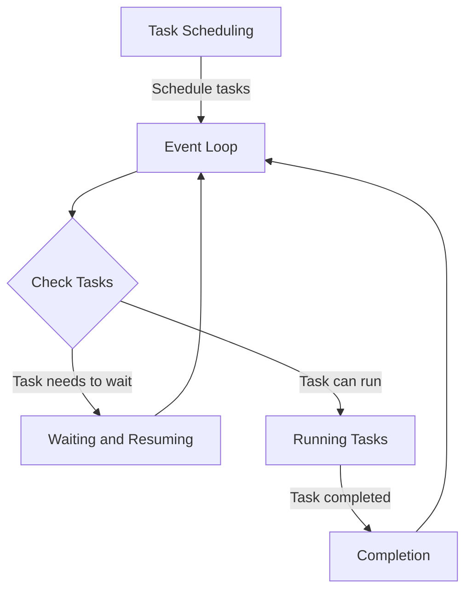
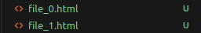

# Lesson 30: Asyncio

> "The conductor of asynchronous symphonies, and bugs xD"

## Content

1. [Introduction](#1.-introduction)
1. [Coroutines](#2.-coroutines)
1. [Event Loop](#3.-event-loop)
1. [Practice](#4.-practice)
1. [Scheduling Tasks](#5.-scheduling-tasks)
1. [Project and Debugging](#6.-project-and-debugging)
1. [Quiz](#7.-quiz)
1. [Homework](#8.-homework)

## 1. Introduction

Asynchronous programming is a concurrency model that allows certain operations, especially I/O-bound tasks, to run without blocking the execution of your program.

It's about doing other work while waiting for an I/O operation to complete, without the need for multi-threading or multi-processing.

### 1.1 Definition

**Non-blocking Execution**: Functions that perform lengthy operations (like network or file I/O) return immediately, allowing the program to continue running.

**Event Loop**: A programming construct that waits for and dispatches events or messages in a program. It facilitates the management of asynchronous tasks.

Let's compare both approaches:

| **Aspect** | **Synchronous** | **Asynchronous** |
|------------|-----------------|------------------|
| **Execution Flow** | Sequential. Each task must complete before the next begins. | Tasks run independently, allowing the execution of other tasks in the meantime. |
| **Resource Utilization** | Can lead to poor resource utilization during I/O operations, as the program waits for the operation to complete. | Improves resource utilization by freeing up the program to perform other tasks during I/O operations. |

## 2. Coroutines

Coroutines allow you to write code that looks sequential but actually executes asynchronously, pausing and resuming at specific points.

It is more about cooperation between routines – waiting for and yielding control to other routines.

Initially, Python used generators (Python < 3.5)  to yield values and execute asynchronously. They were a stepping stone towards full asynchronous support.

### 2.2 `async` and `await`

**`async`**: Declares a function as a coroutine. An `async` function can contain `await` expressions, and it doesn't run immediately. Instead, it returns an awaitable object.
  
#### Example

```python
async def fetch_data():
    pass

print(type(fetch_data()))
```

#### Output
```
<class 'coroutine'>
```

**Note:** This should raise the `RuntimeWarning`: coroutine `fetch_data` was never awaited.

**`await`**: Pauses the execution of the enclosing coroutine, waiting for an awaitable object (like another coroutine) to complete. This pause allows other tasks to run while waiting, making it non-blocking.

#### Example
```python
async def main():
    await fetch_data()
```

The use of `async` and `await` makes asynchronous code look and behave more like traditional synchronous code, though it's a concurrent execution.

## 3. Event Loop

Consider Event Loop like the conductor of an orchestra.

It keeps track of all the tasks that need to run, starts them at the right moment, and manages their execution until they're done.

### 3.1 How it works?

Python's `asyncio` library brings this concept into your programs. It runs an event loop that efficiently manages all your asynchronous tasks.

1. **Task Scheduling**: You tell the event loop about all the tasks (coroutines) you want to run by scheduling them.
2. **Running Tasks**: The event loop starts running the tasks. If a task needs to wait (say, for a file to download), it pauses that task and moves on to the next one.
3. **Waiting and Resuming**: Once the waiting is over (the file is downloaded), the task is resumed right where it left off.
4. **Completion**: This process continues until all tasks are done.




**NOTE**: You usually don't need to create or manage the event loop yourself, `asyncio` provides a high-level API for running asynchronous tasks. 

#### Example

```python
import asyncio

async def main():
    print("Hello")
    await asyncio.sleep(1)  # Simulate an I/O operation
    print("world")

# Running the main coroutine with asyncio
asyncio.run(main())
```

#### Output

```
Hello
world
```

#### Explanation

In this example, `asyncio.run(main())` is your entry point. It starts up the event loop, schedules your `main()` coroutine for execution, and keeps the program running until all tasks are completed.

## 4. Practice

Suppose we need to make an HTTP Request to the server. We would need to use the `aiohttp` library for making asynchronous requests

#### Example

**Note:** Install `aiohttp` into venv before running `pip install aiohttp`

```python
import aiohttp
import asyncio

async def fetch_page(url):
    async with aiohttp.ClientSession() as session:
        async with session.get(url) as response:
            return await response.text()

async def main():
    html = await fetch_page('https://google.com')
    print(html[:100])

asyncio.run(main())
```

#### Output

```
<!doctype html><html itemscope="" itemtype="http://schema.org/WebPage" lang="en-GB"><head><meta cont
```

### 4.2 Async File IO

For file IO, `asyncio` offers a different set of APIs, since disk operations can also block the event loop.

#### Example

**Objective**: We need to process a file very fast, using asynchronous approach

**Note:** Install `aiofiles` into venv: `pip install aiofiles` and create `example.txt` file before running. 


```python
import aiofiles
import asyncio

async def read_file(filename):
    async with aiofiles.open(filename, mode='r') as f:
        contents = await f.read()
        print(contents)

asyncio.run(read_file('example.txt'))
```

#### Output
```
test
test
```

Same approach and logic is applied to any I/O bound operation.

### 4.3 Multiple Async I/O Operations

`asyncio.gather` and `asyncio.wait` are two powerful functions for handling multiple asynchronous operations concurrently.

#### Example

**Objective**: We want to have a couple of different I/O operations, we would use `asyncio.gather` to create several tasks and run them asynchronously.  

```python
import asyncio

async def task(number):
    print(f'Starting task {number}')
    await asyncio.sleep(1)
    print(f'Finished task {number}')
    return number

async def main():
    results = await asyncio.gather(task(1), task(2), task(3))
    print(f'Task results: {results}')

asyncio.run(main())
```

#### Output

```
Starting task 1
Starting task 2
Starting task 3

Finished task 1
Finished task 2
Finished task 3
Task results: [1, 2, 3]
```

In conclusion, `asyncio` is all about managing asynchronous IO operations simpler and more efficient, much better than threading, and simplier to understand.

## 5. Scheduling Tasks

### 5.1 `asyncio.create_task`

The `asyncio.create_task()` function is used to schedule the execution of a coroutine: it wraps the coroutine into a `Task` and schedules its execution. 

The coroutine itself runs concurrently with other tasks and operations and doesn npt block the code itself.

#### Example

```python
import asyncio

async def my_coroutine():
    print('My Coroutine')
    await asyncio.sleep(1)
    return 'Coroutine Finished'

async def main():
    # Schedule the coroutine to run as an asyncio Task
    task = asyncio.create_task(my_coroutine())
    
    # Do other stuff in the meantime
    print('Doing Other Stuff')
    
    # Wait until the task completes
    result = await task
    print(result)

asyncio.run(main())
```

#### Output

```
Doing Other Stuff
My Coroutine
Coroutine Finished
```

#### Explanation

In this example, `my_coroutine` is scheduled to run as a task, allowing the main function to proceed with "Doing Other Stuff" before waiting for `my_coroutine` to finish.

### 5.2 Task Scheduling and Execution Order

**IMPORTANT**: If a task awaits another operation, the event loop can switch to running another task, effectively using concurrency, processing different operation.

#### Example

Tasks are executed in the order they are scheduled, considering their await expressions. 

```python
import asyncio

async def first_task():
    print('First Task Start')
    await asyncio.sleep(2)
    print('First Task End')

async def second_task():
    print('Second Task Start')
    await asyncio.sleep(1)
    print('Second Task End')

async def main():
    asyncio.create_task(first_task())
    asyncio.create_task(second_task())

    # Wait a bit for all tasks to finish
    await asyncio.sleep(3)

asyncio.run(main())
```

#### Output

```
First Task Start
Second Task Start

Second Task End
First Task End
```

#### Example
This example demonstrates that `second_task` can complete before `first_task` despite being scheduled after it, thanks to the asynchronous sleep.

To be honest, that's pretty much everything I wanted to talk in this lesson. Now it's high time for practice!

I would recommend to take a deeper look as well at Async Streaming Patterns, Custom Async Context Managers and Async Iterators for a better understanding of more features in asyncio, they are too wide to be covered in this book.

And of course refer to their [official documentation](https://docs.python.org/3/library/asyncio.html).

## 6. Project and Debugging

### 6.1 Web Scraper

**Objective:** Create a simple web scraper that fetches content from multiple URLs concurrently and saves the data to files.

**Tools:** `aiohttp` for asynchronous HTTP requests, `aiofiles` for asynchronous file operations.

**Step 1:** Install `aiohttp` and `aiofiles` using pip.
```bash
pip install aiohttp aiofiles
```

**Step 2:**  Use `aiohttp` to make concurrent GET requests to a list of URLs. and write the response content to files using `aiofiles`.

**Step 3:**  Put it alltogether.

#### Example

```python
import aiohttp
import aiofiles
import asyncio

async def fetch_url(session, url):
    async with session.get(url) as response:
        content = await response.text()
        return content

async def save_content(filename, content):
    async with aiofiles.open(filename, 'w') as file:
        await file.write(content)

async def main(urls):
    async with aiohttp.ClientSession() as session:
        tasks = [fetch_url(session, url) for url in urls]
        contents = await asyncio.gather(*tasks)
        
        save_tasks = [save_content(f'file_{i}.html', content)
                      for i, content in enumerate(contents)]
        await asyncio.gather(*save_tasks)

urls = [
    'https://google.com',
    'https://uk.yahoo.com/',
]

asyncio.run(main(urls))
```

#### Output 

You will see that 2 files are created with websites content in the root 
directory.



Now let's take a closer look on debuging of the async code

### 6.2 `pdb`

#### Example

```python
import pdb

async def main():
    pdb.set_trace()
    result = await some_coroutine()
    print(result)
```

#### Output

It will stop the execution of the code and can be very helpful for debugging purposes, where you as a programmer will be able to check each object itself.

```
lessons/test.py(35)main()
-> result = await fetch_url()
(Pdb) result
```

### 6.3 `debug=True`

#### Example

```python
import logging
import asyncio

logging.basicConfig(level=logging.DEBUG)
asyncio.run(main(), debug=True)
```

#### Output 

```
DEBUG:asyncio:Using selector: EpollSelector
DEBUG:asyncio:Get address info google.com:443, type=<SocketKind.SOCK_STREAM: 1>, flags=<AddressInfo.AI_ADDRCONFIG: 32>
DEBUG:asyncio:Get address info uk.yahoo.com:443, type=<SocketKind.SOCK_STREAM: 1>, flags=<AddressInfo.AI_ADDRCONFIG: 32>
```

## 7. Quiz

### Question 1:

> What is the primary purpose of asynchronous programming?

A) To increase the speed of CPU-bound operations.  
B) To manage I/O-bound and network operations efficiently without blocking code execution.  
C) To simplify complex algorithms.  
D) To enhance data processing capabilities of multi-core processors.  

<!-- Correct Answer: B -->

### Question 2:

> What does the `async` keyword signify in a Python function?

A) It pauses the execution of the function.  
B) It declares the function as a coroutine.  
C) It immediately executes the function.  
D) It makes the function execute multiple times.  

<!-- Correct Answer: B -->

### Question 3:

> Which statement about the event loop in `asyncio` is true?

A) The event loop can only run one task at a time.  
B) It blocks the main program until all tasks are completed.  
C) It manages the execution of multiple tasks by pausing and resuming them as needed.  
D) It runs synchronously with other Python threads.  

<!-- Correct Answer: C -->

### Question 4:

> In Python's `asyncio` library, how do you correctly handle multiple asynchronous tasks concurrently?

A) Using multiple threads.  
B) By nesting asynchronous functions.  
C) Using `asyncio.gather` to run them.  
D) By calling them sequentially.  

<!-- Correct Answer: C -->

## 8. Homework

**Objective**: Build an asynchronous application that makes multiple API calls, aggregates the data, and computes some statistics.

#### Requirements:

1. Use `aiohttp` for making API calls concurrently.
2. Make at least three different API calls to a public API (e.g., JSONPlaceholder or any other public API).
3. Aggregate the results and calculate the average or any other statistic of the fetched data.

#### Example

```python
import aiohttp
import asyncio

async def fetch_api_data(session, url):
    pass

async def main():
    urls = []

asyncio.run(main())
```

**Notes**: You need to install `aiohttp`

```
pip install aiohttp
```

Thanks for completing the course, I really appreciate your attention
and hope that my input was useful. 
 
Good luck in future endeavors!


