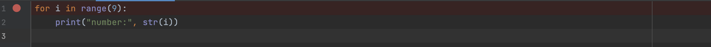
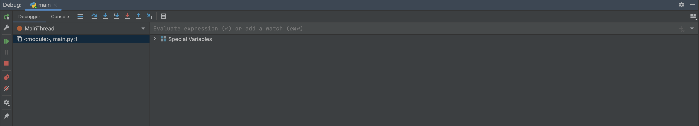
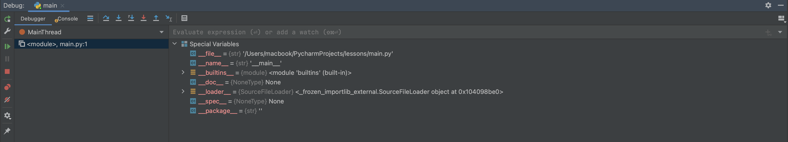
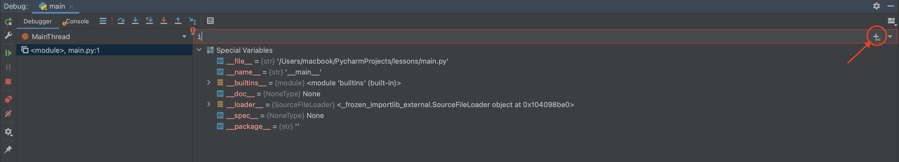
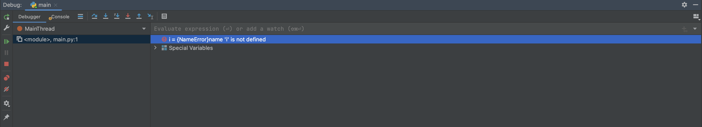
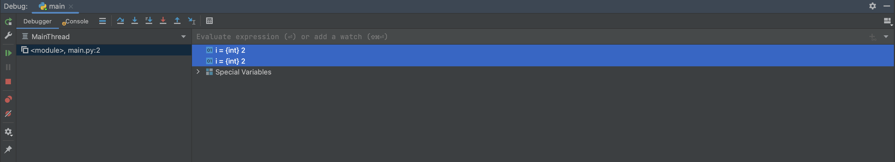

# Debugging in pycharm

To prepare PyCharm for debugging, you need to specify a so-called breakpoint. This is the line after which the debugger
will start and the code will step through. Since our program is small, we will tell the debugger to start from the
beginning. To put a breakpoint, you need to click the mouse to the left of the needed line and to the right of its
number. A red circle will appear at this point, indicating that a pause will occur at this point. To remove the
breakpoint, you need to click on the red circle again.

Then you have to launch the debugger, in order to launch it you can either click on the debugger icon in up right corner
or press *shift + f9* if you use windows or linux and *option + D* on mac.

We now see two tabs: *Debugger* and *Console*. In the console, we see everything that the program has displayed so far.
Since we stopped execution at the very beginning, the console will be empty for now. It is the debugger window that is
of interest to us, since here we can track the change of all variables. As you can see, we already have a list of
Special Variables, in which you can see the values of such utility variables as `__name__`.

To start tracking a new variable, enter the name of the variable to the input field and click on a plus icon. First, we
will see the inscription name 'i' is not defined, which means that our variable has not even been created yet.

Let's then tell the debugger to process the next line of code. It is important to note here that there are 2 main
ways of stepping: *step into* and *step over*.

### step into

When stepping into, the debugger will "enter" inside all functions and other constructs if it encounters them. So, if
the debugger comes to calling some function func(), then it will go to the part of the code where its contents are
described. To make one step into, press F7.

### step over

With the step over, the debugger will not “enter” all functions and other constructs, but will simply execute the
entire code of the function without stopping and continue execution further. To make one step over, press F8.

### Process itself

In our example, it doesn't matter what to use, since we don't have any functions. So let's use the over step.
When stepping through each line, we will go through the loop 9 times and see how the variable i changes 9
times:
 

*press F8*

*press F8*, twice(because we go to the loop line itself firstly)

*press F8*, twice(because we go to the loop line itself firstly)

You can either stop debugging manually or wait until the debugger has processed all the lines in the program, which is
almost never found in practice. You can also create multiple breakpoints.

### Conclusion

All in all, debugging is an indispensable thing in the development of real projects, because it is the most effective
tool for finding errors.
