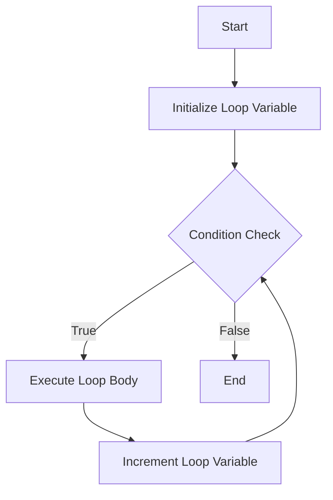

# Lesson 4: Strings and Loops

> "Strings hold characters, loops repeat actions. That's coding in a nutshell."

## Content

1. [Strings in the PC memory (encodings, ascii/unicode), `ord()`, `chr()`](#1.-strings-in-the-pc-memory-(encodings,-ascii/unicode),-`ord()`,-`chr()`)
1. [Slicing](#3.-slicing)
1. [Methods of Strings](#4.-methods-of-strings)
1. [Introduction to loops](#5.-introduction-to-loops)
1. [Quiz](#6.-quiz)
1. [Homework](#7.-homework)

## 1. Strings in the PC memory (encodings, ascii/unicode), `ord()`, `chr()`

We have already worked with strings a lot, but really, how does it work under the hood?

### 1.1 How it works

Strings in a computer's memory are stored as sequences of `bytes`. To represent strings of text, a computer has a system that maps these byte `sequences` to `characters`. This system is called a character encoding.

Two common character encoding systems are `ASCII` and `Unicode`:

### 1.2 `ASCII` `(American Standard Code for Information Interchange)`

 It uses `7 bits` to represent `128 unique characters`, which includes letters, numbers, and control characters. 
 
***NOTE:*** ASCII is limited to English characters and _does not support_ international text.


### 1.3 `Unicode` 


It is a comprehensive `encoding system` designed to represent text in most of the world's writing systems. Unlike ASCII, Unicode uses a variable-length encoding system, which can be `8`, `16`, or `32` bits long.


***NOTE***: This encoding allows to represent over a million unique characters.


### 1.4 `ord()`, `chr()`

`Python` provides two functions to interact with character encodings:


1. `ord(c)`: Given a string representing one Unicode character, `ord()` _returns an integer_ representing the `Unicode` code point of that character. For example, `ord('a')` returns the integer `97`.

2. `chr()` Given an integer representing a `Unicode` code point,` chr()` _returns a string representing the character_.

***NOTE***: This is not used in the production environments, but we will a have a homework based on this material, so get acquainted.

#### Example

```python
print(ord('a'))
print(chr('97'))
```

#### Output

```
97
a
```

These functions allow us to convert between a character's `byte` and its `str` representations.

It will be very helpful once we start working with files later.

### 2. String Formatting

`Python` provides several ways to format strings. Two common methods are `raw strings` and `formatted string literals`.


### 2.1 Raw Strings (`r` strings)
Raw strings are useful when you need to use lots of backslashes, like defining a file path on `Windows`/`Linux`/`Mac OS`. In a raw string, backslashes are treated as literal characters and not as escape characters, but as a part of the string.

#### Example
```python
path = r"C:\Users\Name\Documents\file.txt"
print(path)
```

#### Output
```
C:\Users\Name\Documents\file.txt
```

### 2.2 Formatted strings Literals (`f` strings)

Formatted string literals, or `f strings`, are a way to embed expressions inside string literals using curly braces `{}`. They are concise and easy to use for embedding variables and expressions within a string. 

It really simplifies life using them, just compare two `print()` statements shown in the example below:

#### Example
```python
name = "Alice"
age = 25

# Without ``f`` strings
print("Hello, ", name, ".", "You are ", age, "years old.") 

# With ``f`` strings
greeting = f"Hello, {name}. You are {age} years old."
print(greeting)
```

#### Output

```
Hello, Alice. You are 25 years old.
```

## 3. Slicing

Slicing is a mechanism in `Python` which allows you to **extract a part of a string**, also known as a _substring_. 

### 3.1 The syntax

A slice is created by specifying two indices _**in square brackets**_, separated by a colon `[start:stop]` where  `start` <span style="color:green"> is the index where the slice starts </span> and `stop` <span style="color:red">is the index where the slice ends. </span> 

***NOTE***: The start index is included in the slice, but the stop index is not.

You can also include a 3rd parameter, `step`, which lets you skip characters within the slice `[start:stop:step]`.

Let's take a look closer on the table below:

| Index | 0   | 1  | 2  | 3  | 4  | 5  | 6  | 7  | 8  | 9  |
|-------|-----|----|----|----|----|----|----|----|----|----|
| Char  | a   | b  | c  | d  | e  | f  | g  | h  | i  | j  |
| Index | -10 | -9 | -8 | -7 | -6 | -5 | -4 | -3 | -2 | -1 |

We can ommit some inidces, and the count will be started from the `start`/`end`

#### Example

```python
s = "abcdefghij"
print(s[1:5])  # Extracts from index 1 to 4
print(s[:5])   # Extracts from the beginning to index 4
print(s[7:])   # Extracts from index 7 to the end
print(s[:])    # Extracts the whole string
print(s[::2])  # Extracts every second character from the string
print(s[::-1]) # Reverses the string
```

#### Output

```
bcde
abcde
hij
abcdefghij
acegi
jihgfedcba
```

***NOTE***: Python also supports `negative` indices in slicing, which counts <span style="color:red"> from the end</span> of the string <span style="color:red">backwards</span> 

#### Example

```python
s = "abcdefghij"

print(s[-4:-1]) # Extracts from the fourth-last to the second-last character
print(s[:-5])   # Extracts from the beginning to the fifth-last character
print(s[-3:])   # Extracts the last three characters
print(s[::-2])  # Extracts every second character from the string in reverse
```

#### Output

```
ghi
abcde
hij
jhfdb
```

### 3.2 Assigments

There will be only 2 assigments in this section, but they are a little bit tricky, good luck!

#### Assignment 1: Reverse a String

**Objective**: Write a program that takes a string as input and returns it in reverse order using slicing.

```
# Sample Input: 'Python'
# Sample Output: 'nohtyP'
```

#### Assignment 2: Palindromic Phrase Verifier

**Objective**: Develop a program that checks whether a word is a palindrome (reads the same backward as forward).

```
Input: The user inputs a word.
Output: The program states whether it is a palindrome.

Example:
Input: radar / level

Output:
This word is a palindrome.
```

## 4. Methods of Strings

In this section we will find out the real power of strings in `Python`.

### 4.1 Methods vs Functions

In Python, **functions** and **methods** both refer to blocks of code that perform tasks. <span style="color:red">The key difference</span> between them lies in _how they are used and invoked within the code._

### 4.1.1 Functions

A **function** is a standalone unit of code that performs a specific task. It can be called directly by its name and can work on different types of data. Functions can take inputs (arguments) and return outputs (results).

#### Example
```python
name = "Hello"
print(len(result))  # len() --> function
```

#### 4.1.2 Methods

A method is similar to a function, but <span style="color:red">it is associated with an object </span> and is called on that object using `dot(.)` notation.

```python
name = "hello"
print(result.capitalize())  # capitalize() --> method
```

You have to understand the following key points:

1. Functions are called by name and can be used independently of objects.
2. Methods are called on objects and often work with the data within those objects.

### 4.2 `dir()` and `help()`

The `dir()` function will list all the attributes of any object in `Python`.

#### Example

```python
print(dir(str))
```

#### Output
```
['__add__', '__class__', '__contains__', ... 'capitalize', 'casefold', 'center', 'count', 'encode', 'endswith', 'expandtabs', 'find', 'format', ...]
```

The `help()` function can be used to understand what a particular method does. 

```python
help(str.capitalize)
```

#### Output
```
Help on method_descriptor:

capitalize(self, /)
    Return a capitalized version of the string.
    
    More specifically, make the first character have upper case and the rest lower
    case.
```

These outputs will provide detailed information about the methods, which can be very helpful when you're trying to figure out how to use a particular string method or which method can be used on the object.

**Note**: Don't forget to refer to [the official documentation for `Python`](https://docs.python.org/3/)

### 4.3 Methods of strings

| Method              | Description                                                      | Example                | Output               |
|---------------------|------------------------------------------------------------------|------------------------|----------------------|
| `capitalize()`      | Capitalizes the first letter of the string.                      | `'hello'.capitalize()` | `'Hello'`            |
| `casefold()`        | Converts string to lower case for caseless matching.             | `'HELLO'.casefold()`   | `'hello'`            |
| `center(width)`     | Centers the string within a specified width.                     | `'hello'.center(10)`   | `'   hello   '`      |
| `count(sub)`        | Returns the number of occurrences of a substring.                | `'hello'.count('l')`   | `2`                  |
| `endswith(suffix)`  | Checks if the string ends with the specified suffix.             | `'hello'.endswith('o')`| `True`               |
| `find(sub)`         | Searches the string for a specified substring and returns the index. | `'hello'.find('e')` | `1`                 |
| `format(*args)`     | Formats the string into a nicer output.                          | `'{} world'.format('hello')` | `'hello world'`|
| `replace(old, new)` | Replaces occurrences of a substring with another.                | `'hello'.replace('e', 'a')` | `'hallo'`       |
| `strip(chars)`      | Trims leading and trailing characters (whitespace by default).   | `'   hello   '.strip()`| `'hello'`            |
| `upper()`           | Converts all characters of the string to uppercase.              | `'hello'.upper()`      | `'HELLO'`            |

Methods below are used tightly with a `list` data structure, which we will learn during next lessons. We will take a closer look on them later, just bear in mind that they exist!

| Method              | Description                                                      | Example                | Output               |
|---------------------|------------------------------------------------------------------|------------------------|----------------------|
| `join(iterable)`    | Joins the elements of an iterable by the string.                 | `'-'.join(['1', '2'])` | `'1-2'`              |
| `split(sep)`        | Splits the string at the specified separator.                    | `'1,2,3'.split(',')`   | `['1', '2', '3']`    |

### 4.4 Assignments

#### Assignment 1: The Name Corrector

**Objective**: Create a program that takes a user's name and ensures the first letter is capitalized and the rest are lowercase, regardless of how the user enters it.

```
Input: aLiCe        # Note, that you might want to use 2 methods to achieve the expected output
Output: Alice
```

#### Assignment 2: The Substring Counter

**Objective**: Write a script that counts the number of times a substring appears in a given string.

```
Input:
Enter the main string: hellohellohello
Enter the substring to count: ello

Output: The substring 'ello' appears 3 times in 'hellohellohello'.
```

### Assignment 3: The Alignment Formatter
**Objective**: Ask the user to enter a sentence and then display it centered within a `frame` of a specified width.

```
Input:
Enter your sentence: hello
Set the frame width: 4

Output:
    hello   
```

### Assignment 4: The Case Converter
**Objective**: Create a program that can convert a given string into either `uppercase` or `lowercase` based on the user's choice.

```
Input:
Enter your text: Python is Fun!
Choose 'upper' or 'lower': upper
Output: PYTHON IS FUN!
```

### Assignment 5: The URL Corrector
**Objective**: Write a program that ensures all URLs entered by a user start with `https://`. If it doesn't, add it to the beginning.

```
Input: Enter the URL: www.swetrix.com
Output: Corrected URL: https://www.swetrix.com
```

## 5. Introduction to loops

`Loops` are a powerful feature of computers, giving them the ability to perform _repetitive tasks_.


`Python` provides two primary types of loops:

- **_Counting Loops_** (`for`): Ideal for situations where  <span style="color:green">the number of iterations is known in advance.</span>
- **_Conditional Loops_** (`while`): These loops `continue` to execute <span style="color:orange">until a certain condition is met.</span>

#### Syntax

```python
for variable_name in range(number_of_iterations):
    code_block          
    # Note that we need to use indentation for this construction
```

#### Example
```python
for i in range(10):
    print("Hello")
```

#### Output
```
# 10 times
Hello
Hello
...
Hello
```

The purpose and function of the `loop variable` _may not be immediately obvious. Let's look at an example to clarify

#### Example
```python
for i in range(10):
    print(i)
```

#### Explanation

When the loop starts, `Python` assigns <span style="color:green">the initial value of the loop variable i to `0`</span>. 

With each iteration of the loop body, <span style="color:orange"> it increments the value of i by `1`</span>.

#### Output
```
0
1
2
3
4
5
6
7
8
9
```

The diagram shows how `for` `loop` works in `Python`.



### 5.1 Naming conventions in `Python`

Variable names for loops should be:

1.  Meaningful and descriptive
2. Shorter names are common as well. Generally, programmers use the letters `i`, `j`, `k` for loop variables.

#### Example

```python
# Common use
for i in range(10):         # j, k , etc..
    print(i)

# Meaningful and descriptive 
for number in range(10):
    print(number)
```

It is important you understand that the **_main goal_** is to <span n style="color:orange"> make code understandable </span> for people you are working with.

### 5.2 `range()`

The `range()` function in `Python` is used to generate a sequence of numbers. It is often used with the `for` loop to iterate over a sequence of numbers as you could see from the examples above.

To be more precise, we can say that the `range(n)` function generates a sequence of numbers from `0 to n-1`, and the for loop iterates through this sequence.

#### Example

```python
print(range(10))
```

#### Output 

```
range(0, 10)
```

### 5.3 Overloading of `range()`

The `range()` function in Python can take up to three parameters: `range(start, stop, step)`. Here's what each parameter represents:

- `start`: The <span style="color:green">beginning</span> of the sequence.
- `stop`: The <span style="color:red">end</span> of the sequence (exclusive --> `(stop-1)`).
- `step`: The <span style="color:orange">increment</span> between each number in the sequence.

| Function Call          | Description                      | Generated Sequence              |
|------------------------|----------------------------------|---------------------------------|
| `range(1, 10, 2)`      | Starts at 1, ends before 10, steps by 2 | 1, 3, 5, 7, 9                  |
| `range(5, 30, 5)`      | Starts at 5, ends before 30, steps by 5 | 5, 10, 15, 20, 25              |
| `range(10, 1, -1)`     | Starts at 10, ends before 1, steps by -1 | 10, 9, 8, 7, 6, 5, 4, 3, 2    |
| `range(20, 10, -2)`    | Starts at 20, ends before 10, steps by -2 | 20, 18, 16, 14, 12             |
| `range(3, 8, 1)`       | Starts at 3, ends before 8, steps by 1 | 3, 4, 5, 6, 7                  |
| `range(0, -10, -1)`    | Starts at 0, ends before -10, steps by -1 | 0, -1, -2, -3, -4, -5, -6, -7, -8, -9 |


### 5.4 `for in` / `for in range()` 

There are two different ways to iterate through objects in python -> 

`for variable in ..` and `for variable in range()`


The `for in` loop is used to iterate over _**elements of a sequence**_, such as a `str`, `list`, `string`, `tuple`, or any `iterable object` which you will learn during the next lessons. 

This type of loop goes through each item in the sequence, _**one by one**_.


#### Syntax

```python
for element in iterable:
    # Do something with element
```

#### Example 

```python
s = 'Python'
for char in s:
    print(char)       # Directly accessing the elemenet 
```

We can iterate through the string using the following construction and `len()` function

```python
s = 'Python'
for index in range(len(s)):
    print(s[i])    # Accessing the element of the string using indexing
```

#### Output
```
P
y
t
h
o
n
```

### 5.5 When to Use Each Type of Loop?

Use `for in` when you have an iterable (like a `list` or `string`) and you want to perform actions <span style="color:orange">on each element.<span style="color:orange">

Use for `in range()` when you need to <span style="color:orange">repeat actions a specific number of times</span>, or when you need to <span style="color:orange">iterate using a counter. </span>

### Example

```python
# Don't forget that we can pas 1-3 arguments into the `range()` function
for i in range(2, 10, 2):
    print(i)
```

### Assignment 1: The Countdown Timer

**Objective**: Imagine that you are defusing a bomb which will explode in `n` seconds.

1. The program starts with a countdown from a given number `n` to `1`.
2. When the countdown reaches `1`, prompt the user to choose a wire to cut: `red` or `blue`.
3. If the user chooses `red`  -> the bomb explodes. 
4. If the user chooses `blue` -> the bomb is defused.
5. Make the application very interactive.  

```
Input: 
Enter the countdown time: 5

Output:
The bomb will explode in 5 seconds!
5
4
3
2
1
Quick! Which wire to cut? Red or Blue? 
User Input: Blue
Output: 
You cut the blue wire...
The bomb has been defused. Congratulations, you saved the day!

# Alternatively
User Input: Red
Output: 
You cut the red wire...
BOOM!!! The bomb exploded
```

### Assignment 2: The Fibonacci Sequence Generator
**Objective:** Write a program that generates the Fibonacci sequence up to a user-defined number.

Fibonacci Sequence Example:  `1, 1, 2, 3, 5, 8, 13,  21, 34, 55, 89,…`

```
Input: The user enters a number `n`.
Output: The program outputs the first `n` numbers of the Fibonacci sequence.

Example:
Input: 5
Output: 0, 1, 1, 2, 3
```


### Assignment 3  The Multiplication Table Printer

**Objective:** Create a script that prints the multiplication table for a number provided by the user.


```
Input: The user inputs a number.
Output: The program prints the multiplication table for that number.

Example:
Input: 3
Output:
3 x 1 = 3
3 x 2 = 6
3 x 3 = 9
...
3 x 10 = 30
```

## 6. Quiz

### Question 1:
> Which function returns the Unicode code point for a single character?

A) `chr()`  
B) `ord()`  
C) `len()`  
D) `str()`  

<!-- Correct Answer: B) -->

---

### Question 2:
> What does the following string slicing return? `s = 'HelloWorld'; print(s[2:7])`

A) `Hello`  
B) `World`  
C) `lloWo`  
D) `HelloWorld`  

<!-- Correct Answer: C) -->

---

### Question 3:
> Which of the following is the correct way to iterate through the string `"Python"` using a for loop?

A) `for i in 'Python': print(i)`  
B) `for i in range('Python'): print(i)`  
C) `for i in len('Python'): print(i)`  
D) `for 'Python': print(i)`  

<!-- Correct Answer: A) -->

---

### Question 4:
> Which statement about `raw` strings in Python is true?

A) They treat backslashes as escape characters.  
B) They cannot contain special characters.  
C) They treat backslashes as normal characters.  
D) They start with the letter `f` instead of `r`.  

<!-- Correct Answer: C) -->

---

### Question 5:
> What will be the output of the following code?

```python
x = "awesome"
print(f"Python is {x}")
```

A) `Python is x`  
B) `Python is awesome`  
C) `Python is {awesome}`  
D) `x is awesome`  

---

<!-- Correct Answer: B) -->

### Question 6:
> What is the result of the following?

```python
print("Hello, World!".find("W"))
```

A) `6`  
B) `7`  
C) `Hello`  
D) `-1`  

<!-- Correct Answer: B) -->

---

### Question 7:
> How do you print numbers from 1 to 5 using a for loop in Python?

A)
```python
for i in range(1, 6):
    print(i)
```
B)
```python
for i in range(5):
    print(i)
```
C)
```python
for i in 1 to 5:
    print(i)
```
D)
```python
for i in range(6):
    print(i)
```

<!-- Correct Answer: A) -->

---

### Question 8:
> What does the following code return?

```python
print("PYTHON".casefold())
```

A) `PYTHON`  
B) `python`  
C) `An error`  
D) `PYthON`  


<!-- Correct Answer: B) -->

## 7. Homework

### Task 1: ASCII/Unicode Converter

**Objective**: Develop an application that can encrypt and decrypt multiple messages using ASCII and Unicode code points. 

The program should allow the user to choose between encryption and decryption and specify the number of messages.

```python
# Example of how the program should work

# Menu:
# 1. Encrypt Messages
# 2. Decrypt Messages

# Encrypt Input:
Enter the number of messages to encrypt: 2
Enter message 1: Hello
Enter message 2: World

# Encrypt Output:
Encrypted Message 1: 72 101 108 108 111
Encrypted Message 2: 87 111 114 108 100

# Decrypt Input:
Enter the number of messages to decrypt: 2
Enter message 1: 72 101 108 108 111
Enter message 2: 87 111 114 108 100

# Decrypt Output:
Decrypted Message 1: Hello
Decrypted Message 2: World
```


### Task 2: The Custom String Slicer

**Objective:** Develop a program that allows users to input a string and then perform various slicing operations based on the user input. Ask if the user wants to add a `step` and process the request accordingly

```
Input:
Enter a string: Hello World
Enter start index: 2
Enter stop index: 8
Do you want to add a step (yes/no)? yes
Enter step: 2

Output:
The sliced string with step is: l  o
```

### Task 3: The Custom String Slicer

**Objective:** Write a program that builds a story based on the user's choices. Use `f` strings for dynamic storytelling.

```
Input:
Choose your character's name: Alice
Choose a companion (dog/cat): dog
Choose a destination (forest/beach): forest

Output:
Alice, along with her loyal dog, set out on an adventure to the forest. [Continue the story...]

# Be creative! You can add more variables and sentences to the story!
```

### Task 4: The URL Shortener

**Objective:**: Develop a simple URL shortener. The program will take a URL and provide a shortened version using slicing and concatenation.

```
Input: Enter a URL: www.example.com
Output: Shortened URL: www.exa...com
```
