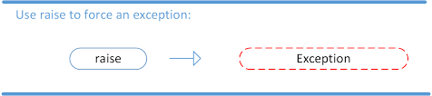
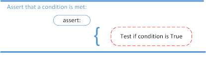
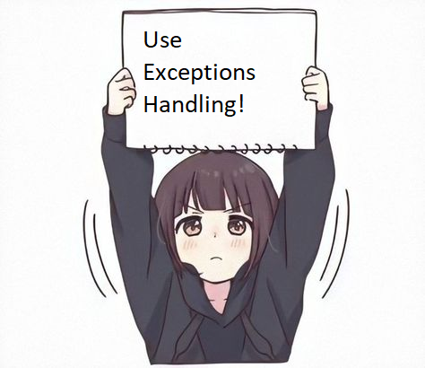

# Exceptions

## What are Exceptions?

Definition: _An exception is an event, which occurs during the execution of a program that disrupts the normal flow of
the program's instructions. In general, when a Python script encounters a situation that it cannot cope with, it raises
an exception. An exception is a Python object that represents an error._

Here are examples of exceptions

### SyntaxError Example

```python
print(2 / (2 - 2)))
```

#### Output:

```python
  File "<stdin>", line 1
    print(2 / (2 - 2)))
                      ^
SyntaxError: unmatched ')'
```

Syntax exceptions are thrown when there are errors in the code when using the program language.

### ZeroDivisionError Example

```python
print(2 / (2 - 2))
```

#### Output

```python
Traceback (most recent call last):
  File "<stdin>", line 1, in <module>
    print(2 / (2 - 2))
          ~~^~~~~~~~~
ZeroDivisionError: division by zero
```

ZeroDivisionError occurs when you try to divide something by zero

```python
print('string' / 25)
```

```python
Traceback (most recent call last):
  File "<stdin>", line 1, in <module>
    print('string' / 25)
          ~~~~~~~~~^~~~
TypeError: unsupported operand type(s) for /: 'str' and 'int'
```

That's a huge number of exceptions in python. You can find all of them in the python documentation.
https://docs.python.org/3/library/exceptions.html

## What is Exceptions Handling?

Definition: _Exception handling is the process of responding to unwanted or unexpected events when a computer program
runs._

## Types of exceptions Handling

### 1. Raising an Exception

The raising instruction is supposed to raise the specified exception. If no exceptions are found in the observable
scope, then a RuntimeError exception is thrown at the place where the promotion is specified, without specifying,
indicating that this is an error.



#### Example 1

```python
x = int(input())
if x > 5:
    raise Exception('x should not exceed 5. The value of x was: {}'.format(x))
```

```python
100
Traceback (most recent call last):
  File "<stdin>", line 3, in <module>
    raise Exception('x should not exceed 5. The value of x was: {}'.format(x))
Exception: x should not exceed 5. The value of x was: 100
```

#### Example 2

```python
def trianglePerimeter(a, b, c):
    if a < 0 or b < 0 or c < 0:
        raise Exception('All sides must be positive')
    else:
        return a + b + c


a, b, c = int(input('a = ')), int(input('b = ')), int(input('c = '))
trianglePerimeter(a, b, c)       
```

```python
Traceback (most recent call last):
  File "<stind>", line 9, in <module>
    trianglePerimeter(a, b, c)
  File "<stind>", line 3, in trianglePerimeter
    raise Exception('All sides must be positive')
Exception: All sides must be positive
```

### 2. The AssertionError Exception

Instead of waiting for a program to crash midway, you can also start by making an assertion in Python. We assert that a
certain condition is met. If this condition turns out to be True, then that is excellent! The program can continue. If
the condition turns out to be False, you can have the program throw an AssertionError exception.

#### Example 1

```python
import sys

assert ('MacOS' in sys.platform), "This code runs on Linux only."
```

```python
Traceback(most recent calllast):
File "<stdin>", line 2, in < module >
assert ('MacOS' in sys.platform), "This code runs on Linux only."
AssertionError: This code runs on Linux only.
```
#### Example 2

```python
def avg(marks):
    assert len(marks) != 0
    return sum(marks)/len(marks)

mark1 = []
print("Average of mark1:", avg(mark1))
```

```python
Traceback (most recent call last):
  File "<stdin>", line 6, in <module>
    print("Average of mark1:", avg(mark1))
                               ^^^^^^^^^^
  File "<stdin>", line 2, in avg
    assert len(marks) != 0
AssertionError
```

Difference between raise and assert is that raise is used for raising an exception unlike assert which is used for
raising an exception if the given condition is False

### 3. Try Except Else Finally Exceptiorns

The try and except block in Python is used to catch and handle exceptions. Python executes code following the try
statement as a “normal” part of the program. The code that follows the except statement is the program’s response to any
exceptions in the preceding try clause.


As you saw earlier, when syntactically correct code runs into an error, Python will throw an exception error. This
exception error will crash the program if it is unhandled. The except clause determines how your program responds to
exceptions.

#### Example

```python
def f(x, y):
    return x / y


FirstNum = int(input('x: '))
SecondNum = int(input('y: '))
try:
    f(FirstNum, SecondNum)
except ZeroDivisionError:
    print("You can`t divide by zero")
```

```python
x: 2
y: 0
You can`t divide by zero
```

#### Example

```python
def f(x, y):
    return x / y


FirstNum = int(input('x: '))
SecondNum = int(input('y: '))
try:
    f(FirstNum, SecondNum)
except ZeroDivisionError as error:
    print(error)
else:
    print(f'Your result is {f(FirstNum, SecondNum)}')
```

```python
x: 2
y: 5
Your result is 0.4
```

#### Example

```python
def f(x, y):
    return x / y


FirstNum = int(input('x: '))
SecondNum = int(input('y: '))
try:
    f(FirstNum, SecondNum)
except ZeroDivisionError as error:
    print(error)
else:
    print(f'Your result is {f(FirstNum, SecondNum)}')
finally:
    print('This row will be here anyway')
```

```python

x: 2
y: 0
division by zero
This row will be here anyway
```

```python
x: 2
y: 6
Your result is 0.3333333333333333
This row will be here anyway
```
### 4. Exception Groups


In python 3.11 we have had new feature in exceptions. This feature is Exception groups.
The following are used when it is necessary to raise multiple unrelated exceptions.

Exception Group Syntax:

1.ExceptionGroup() - creating exception group

2.ExceptionGroup([

    #write exceptions
    Exception1,
    Exception2
    ...]

])

Nested exception group syntax:

1.ExceptionGroup() - creating exception group

2.ExceptionGroup([

    Exception1,
    ExceptionGroup([
    Exception1,
    Exception2
    ...])
])


Let`s look at some examples:
#### Example 1
```python
exc_group = ExceptionGroup(
    'This is exception group', [
        ValueError('value must be greater than 0'),
        ZeroDivisionError('value must be not equal to 0')
    ]
)  # our exception

raise exc_group  # outputs our exception
```
#### Output
```commandline
  + Exception Group Traceback (most recent call last):
  |   File "<stdin>", line 7, in <module>
  |     raise exc_group
  | ExceptionGroup: This is exception group (2 sub-exceptions)
  +-+---------------- 1 ----------------
    | ValueError: value must be greater than 0
    +---------------- 2 ----------------
    | ZeroDivisionError: value must be not equal to 0
    +------------------------------------
```

#### Example 2
```python
exc_group = ExceptionGroup(
    'This is exception group', [
        ValueError('value must be greater than 0'),
        ExceptionGroup[
            'directory errors!', [
                NotADirectoryError('Must be a directory!'),
                NotADirectoryError('Still must be a directory!')
            ]
        ]
    ]
)  # our exception

raise exc_group  # outputs our exception
```
#### Output
```commandline
  + Exception Group Traceback (most recent call last):
  |   File "C:\Users\38097\PycharmProjects\Senior-Dev-Roadmap\tesrt.py", line 13, in <module>
  |     raise exc_group
  | ExceptionGroup: This is exception group (2 sub-exceptions)
  +-+---------------- 1 ----------------
    | ValueError: value must be greater than 0
    +---------------- 2 ----------------
    | ExceptionGroup: directory errors! (2 sub-exceptions)
    +-+---------------- 1 ----------------
      | NotADirectoryError: Must be a directory!
      +---------------- 2 ----------------
      | NotADirectoryError: Still must be a directory!
      +------------------------------------

```

Since it's still just an exception, we can handle it like we always do. But if we want to handle
a few different exceptions we can use except* statement 

#### Example

```python
exc_group = ExceptionGroup(
    'This is exception group', [
        ValueError('value must be greater than 0'),
        ExceptionGroup(
            'directory errors!', [
                NotADirectoryError('Must be a directory!'),
                NotADirectoryError('Still must be a directory!')
            ]
        )
    ]
)  # our exception

try: 
    raise exc_group  
except* ValueError as eg:
    print('ValueError')
except* NotADirectoryError as eg:
    print('NotADirectoryError')
    print(eg.exceptions)  # outputs exceptions that was handled 
```
#### Output
```commandline
ValueError
NotADirectoryError
(ExceptionGroup('directory errors!', [NotADirectoryError('Must be a directory!'), NotADirectoryError('Still must be a directory!')]),)

```

Since ExceptionGroup is a subclass of Exception, you can interact with it using standard Python exception handling.
Although you generally won't do it very often unless you're developing some low-level library, raise allows you to raise
an ExceptionGroup. Additionally, you can use except ExceptionGroup to catch an ExceptionGroup.

## Exception hierarhy

An important thing to know is that exceptions, like everything else in Python, are just objects. They follow an
inheritance hierarchy, just like classes do. For example, the ZeroDivisionError is a subclass of ArithmeticError, which
is a subclass of Exception, itself a subclass of BaseException.

So, if you wanted to catch a divide-by-zero error, you could use except ZeroDivisionError. But you could also use except
ArithmeticError, which would catch not only ZeroDivisionEror, but also OverflowError and FloatingPointError. Here`s
short hierarchy of exceptions 
(full hierarchy you can find in python documentation
https://docs.python.org/3/library/exceptions.html#exception-hierarchy)

- BaseException
- - Exception
- - - ArithmeticError
- - - - FloatingPointError
- - - - OverflowError
- - - - ZeroDivisionError
- - - AssertionError


## Good tone

### Don't catch the exception

It's bad form to catch the generic Exception class. This will catch all types of exceptions that are subclasses of the
Exception class, which is pretty much all of them. You may have bugs that you don't care about and don't affect how your
program works, or maybe you're dealing with an untrusted API and want to swallow the bugs and try again. By catching an
Exception, you run the risk of encountering an unexpected exception that your program can't actually recover from, or
worse, swallowing an important exception without properly logging it - a huge headache when trying to debug programs
that strangely fail.

### Definitely don't catch BaseException

Catching a BaseException is awful idea because you will swallow all types of exceptions, including KeyboardInterrupt,
the exception that causes your program to terminate when SIGINT (Ctrl-C) is sent. Do not do that.


