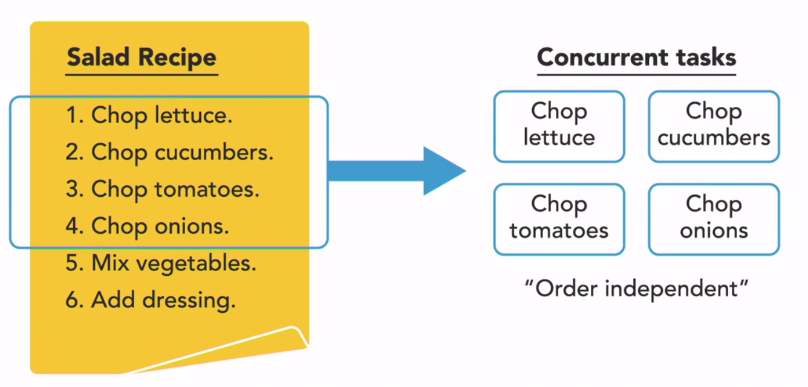
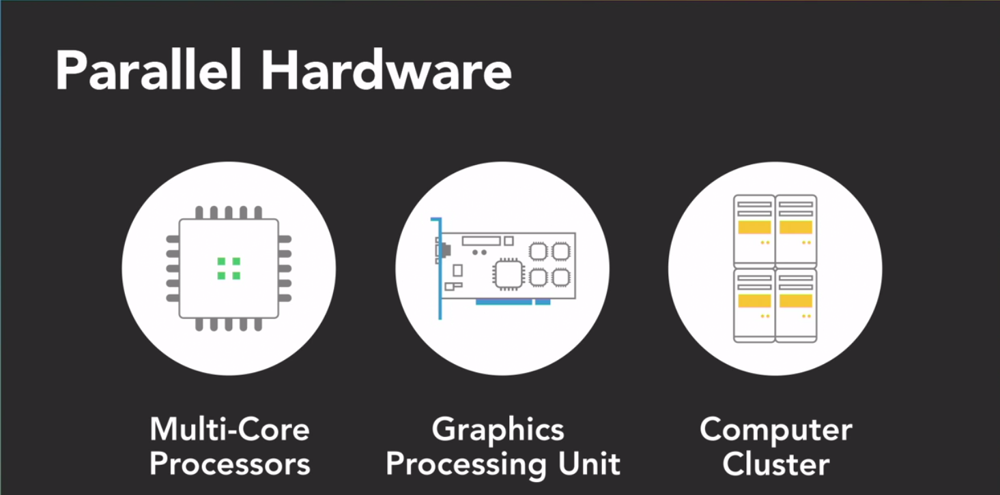

# Concurrent vs Parallel Programming

## Concurrency

_Concurrency refers to the ability of an algorithm or program to be broken into **different** parts that can be executed out of order, or partially out of order, without affecting the end result._

_Concurrency is about how a program is structured and the composition of independently executing processes._

## Real World Example


The main point is that these tasks are completely independent of each other. They can be executed in any order and the result will be the same.


 To keep things simple, let's just focus on two of two tasks for now.
1. Chop onions
   2. Slice cucumbers. 


We only have one knife, so, this is a single-core processor, and only one thread will be able to execute our vegetable-chopping routine at any given time.


More frequently execution (The illusion of parallelism)


## Parallelism

To actually execute in parallel we need parallel hardware. This means that we need multiple processors, each with its own memory and cache.



Parallel execution is when two or more different tasks are executed at the same time.

### Example


And as the resul we have a salad.


Concurrency is about the structure of a program being able to deal with multiple things at once, whereas parallelism is about simultaneous execution, actually doing multiple things at once.

## Concurrency vs Parallelism

| Concurrency                          |          Parallelism           |
|--------------------------------------|:------------------------------:|
| Program structure                    |     Simultaneous Execution     |
| DEALING with multiple things at once | DOING  multiple things at once |


## Usage examples


For example, the software drivers that handle I/O devices, like a mouse, keyboard, and hard drive, need to execute concurrently. 

They're managed by the operating system as independent things to get executed as needed. In a multi-core system, the execution of those drivers might get split amongst the available processors. 

## Parallelism use case


However, since I/O operations occur rather infrequently, relative to the speed at which computer operates, we don't really gain anything from parallel execution.

So that we can use concurrency in this case.


## Concurrency  


### Parallelism

Parallel processing really becomes useful for computationally-intensive tasks, such as calculating the result of multiplying two matrices together.

When large math operations can be divided into independent subparts, executing those parts in parallel on separate processors can really speed things up.


### Code example

```
import threading
import time

```
