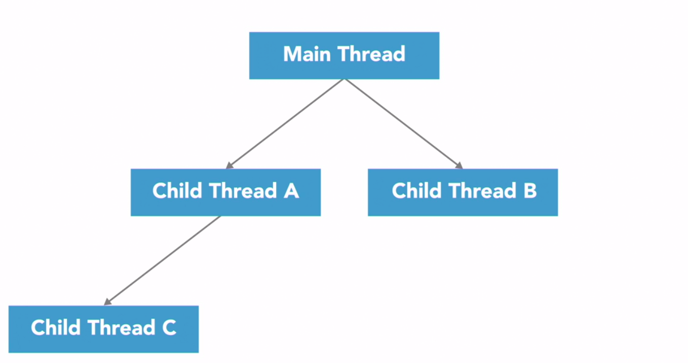
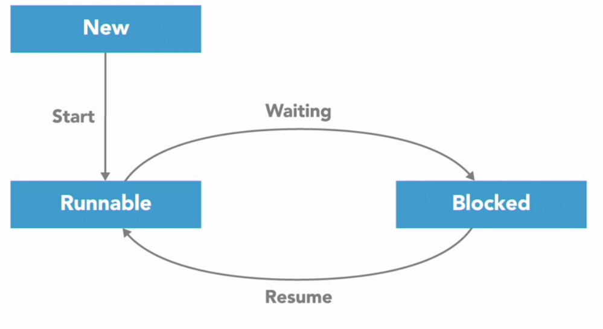

# Thread Lifecycle


_When a new process or program begins running, it will start with just one thread, which is called the main thread 
because it's the main one that runs when the program begins._

_That main thread can then start or spawn additional threads to help out, referred to as its child threads, which are part of the same  **process**  but execute independently to do other tasks_

_After finishing doing tasks child threads can be terminated, and the main thread can continue running._

_The main thread is usually the last to finish the execution of the program, and when it does, the process will end._ 





There are 5 states of threads:
1. _**New**_ - just created
2. _**Runnable**_ - ready to run
3. _**Running**_ - currently running
4. _**Blocked**_ - waiting for something to happen
5. _**Terminated**_ - finished running




We can use join() to wait for another thread to finish

In this case the Thread-1 will be in the blocked state until the Thread-2 finishes


There are two common approaches to managing threads:

## Example
```python
import threading, time

class ChefOlivia(threading.Thread):

    def __init__(self):
        super().__init__()

    def run(self):
        print('Olivia started & waiting for sausage to thaw...')
        time.sleep(3)
        print('Olivia is done cutting sausage.')

# main thread
if __name__ == '__main__':
    print("Barron started & requesting Olivia's help.")
    olivia = ChefOlivia()
    print('  Olivia alive?:', olivia.is_alive())

    print('Barron tells Olivia to start.')
    olivia.start()
    print('  Olivia alive?:', olivia.is_alive())

    print('Barron continues cooking soup.')
    time.sleep(0.5)
    print('  Olivia alive?:', olivia.is_alive())

    print('Barron patiently waits for Olivia to finish and join...')
    olivia.join()
    print('  Olivia alive?:', olivia.is_alive())

    print('Barron and Olivia are both done!')
```

## Output

```bash

Barron started & requesting Olivia's help.
  
  Olivia alive?: False
  
Barron tells Olivia to start.
Olivia started & waiting for sausage to thaw...

  Olivia alive?: True
  
Barron continues cooking soup.

  Olivia alive?: True
  
Barron patiently waits for Olivia to finish and join...
Olivia is done cutting sausage.

  Olivia alive?: False
  
Barron and Olivia are both done!

Process finished with exit code 0
```


## Daemon Threads

_Threads that run in the background are called daemon threads. Daemon threads are not critical to the main execution of the program, and their failure to complete does not impact the program's execution._

_If the main thread terminates, all daemon threads are abruptly stopped without completing their work._

_If the main thread is still running, the program will not terminate until all non-daemon threads have completed._

_If a daemon thread in Python creates another thread, that child thread will also be a daemon thread._

_The daemon thread will not prevent the program from terminating when the main thread is finished._


**It's perfect for background tasks.**

## Quiz:

------------------------------------------------------------------------------------------------------------------------------
1. Why would ThreadA call the ThreadB.join() method?
<details>
    <summary>Answer</summary>
Answer: ThreadA needs to wait until after ThreadB has terminated to continue.
</details>
------------------------------------------------------------------------------------------------------------------------------
2. A thread that calls the join method on another thread will enter the _____ state until the other thread finishes executing.
<details>
    <summary>Answer</summary>
Answer: Blocked
</details>
------------------------------------------------------------------------------------------------------------------------------

3. Why do you have to start a thread after creating it?
<details>
    <summary>Answer</summary>
Answer: Threads do not automatically run when instantiated.
</details>
------------------------------------------------------------------------------------------------------------------------------

4. You can safely expect threads to execute in the same relative order that you create them.
<details>
    <summary>Answer</summary>
Answer: False
</details>
------------------------------------------------------------------------------------------------------------------------------

5. For a Python application to use multiple processor cores for parallel execution, it must be structured to have multiple _____.
<details>
    <summary>Answer</summary>
Answer: Processes
</details>
------------------------------------------------------------------------------------------------------------------------------

6. A hyperthreaded processor with eight logical cores will usually provide _____ performance compared to a regular processor with eight physical cores.
<details>
    <summary>Answer</summary>
Answer: lower
</details>
------------------------------------------------------------------------------------------------------------------------------

7. The operating system assigns each process a unique _____.
<details>
    <summary>Answer</summary>
Answer: Process ID
</details>
------------------------------------------------------------------------------------------------------------------------------

8. The Global Interpreter Lock has a significant, negative impact on the performance of multi-threaded, I/O-bound programs.
<details>
    <summary>Answer</summary>
Answer: False

_I/O-bound tasks spend most of their time waiting on external actions, like network operations or user input. They do not need to possess the GIL while waiting on I/O, so the GIL usually has a minimal impact on I/O-intensive applications._
</details>
------------------------------------------------------------------------------------------------------------------------------

9. The Global Interpreter Lock prevents multiple Python _____ from executing at the same time.
<details>
    <summary>Answer</summary>
Answer: threads
</details>
------------------------------------------------------------------------------------------------------------------------------

10. It is possible for two tasks to execute _____ using a single-core processor.
<details>
    <summary>Answer</summary>
Answer: concurrently  (Concurrent tasks can take turns to execute on the same processor.)
</details>
------------------------------------------------------------------------------------------------------------------------------
11. Concurrent tasks always execute at the same time.

<details>
    <summary>Answer</summary>
         Answer: False

_Concurrency describes the structure that enables a program to execute in parallel (given the necessary hardware), but a concurrent program is not inherently parallel._
</details>

------------------------------------------------------------------------------------------------------------------------------

12. Every thread is independent and has its own separate address space in memory.
<details>
    <summary>Answer</summary>
Answer: False

_Threads share the same address space in memory, so they can access the same variables and data structures._
</details>
------------------------------------------------------------------------------------------------------------------------------

