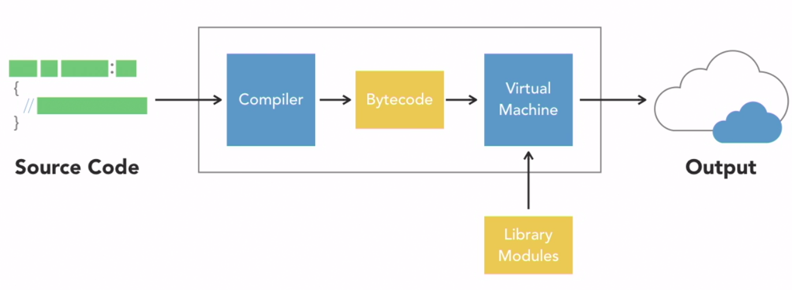

# Global Interpreted Lock

## Definition

_The GIL - is a mechanism in Python that prevents multiple Python threads from executing at the same time._

_Mechanims that limits Python to only execute one thread at a time_

_The global interpreter lock was implemented as a simple way to provide thread-safe memory management in CPython by only letting one Python thread execute at a time._

## How does the Interpreter work?



The interpreter compiles your Python program into an intermediate bytecode which is then executed with a virtual machine along with any necessary modules from the library. The default and by far most widely used interpreter is CPython

GIL is good with I/O bound tasks, but not with CPU bound tasks.


| I/O operation                                                |                          CPU bound                          |
|--------------------------------------------------------------|:-----------------------------------------------------------:|
| Threading module                                             |                       Multiprocessing                       |
| Await for external actions (network operations / user_input) | Execute outside the GIL restrictions using parallel threads |


# Multiple threads


```python
""" Threads that waste CPU cycles """

import os
import threading

# a simple function that wastes CPU cycles forever
def cpu_waster():
    while True:
        pass

# display information about this process
print('\n  Process ID: ', os.getpid())
print('Thread Count: ', threading.active_count())
for thread in threading.enumerate():
    print(thread)

print('\nStarting 12 CPU Wasters...')
for i in range(12):
    threading.Thread(target=cpu_waster).start()

# display information about this process
print('\n  Process ID: ', os.getpid())
print('Thread Count: ', threading.active_count())
for thread in threading.enumerate():
    print(thread)
```

### Output

```bash

  Process ID:  38518
  Thread Count:  1

<_MainThread(MainThread, started 139872115140416)>

Starting 12 CPU Wasters...

    Process ID:  38518

Thread Count:  13
<_MainThread(MainThread, started 139872115140416)>
<Thread(Thread-1, started 139872103769856)>
<Thread(Thread-2, started 139872095377152)>
<Thread(Thread-3, started 139872086984448)>
<Thread(Thread-4, started 139872078329600)>
<Thread(Thread-5, started 139872069936896)>
<Thread(Thread-6, started 139872061544192)>
<Thread(Thread-7, started 139871716898560)>
<Thread(Thread-8, started 139871708505856)>
<Thread(Thread-9, started 139871700113152)>
<Thread(Thread-10, started 139871691720448)>
<Thread(Thread-11, started 139871683327744)>
<Thread(Thread-12, started 139871674935040)>
```

Here we can see the multiple threads inside the one Process ID.
- The threads are running in parallel, but they are not using the CPU at the same time.  
- This is because of the GIL.


# Multiple Processes

```python
import os
import threading
import multiprocessing as mp

# a simple function that wastes CPU cycles forever
def cpu_waster():
    while True:
        pass

print('Hi! My name is', __name__)

if __name__ == '__main__':
    # display information about this process
    print('\n  Process ID: ', os.getpid())
    print('Thread Count: ', threading.active_count())
    for thread in threading.enumerate():
        print(thread)

    print('\nStarting 12 CPU Wasters...')
    for i in range(12):
        mp.Process(target=cpu_waster).start()       # Here we are using multiprocessing instead of threading

    # display information about this process
    print('\n  Process ID: ', os.getpid())
    print('Thread Count: ', threading.active_count())
    for thread in threading.enumerate():
        print(thread)
```

### Output

```bash

  Hi! My name is __main__

  Process ID:  39812
  Thread Count:  1
  <_MainThread(MainThread, started 140284029183808)>

  Starting 12 CPU Wasters...

  Process ID:  39812
  Thread Count:  1
  <_MainThread(MainThread, started 140284029183808)>

```

Basically, here we are using multiprocessing instead of threading. They run in parallel and use the CPU at the same time.

- So that we have created 12 processes (12 separete programs with their own)  
  - memory space
  - global interpreter lock
  - threads


HINT:
- If you want to use multiprocessing, you need to put the code inside the if statement. 
- Because the if statement will only run if the file is run directly, and not if it is imported as a module.
- Python gives each process its own name, so we need to check if the name is main before we start the processes.


