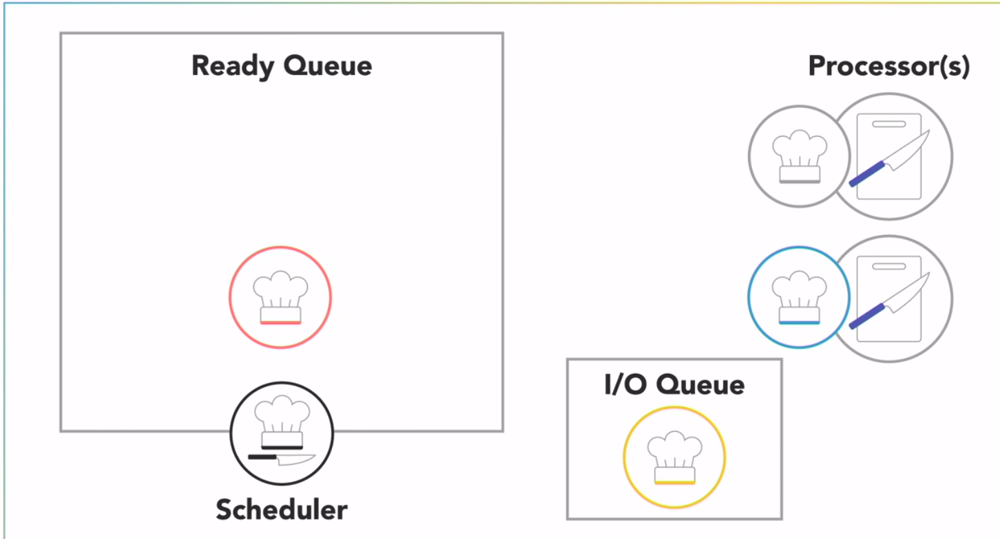
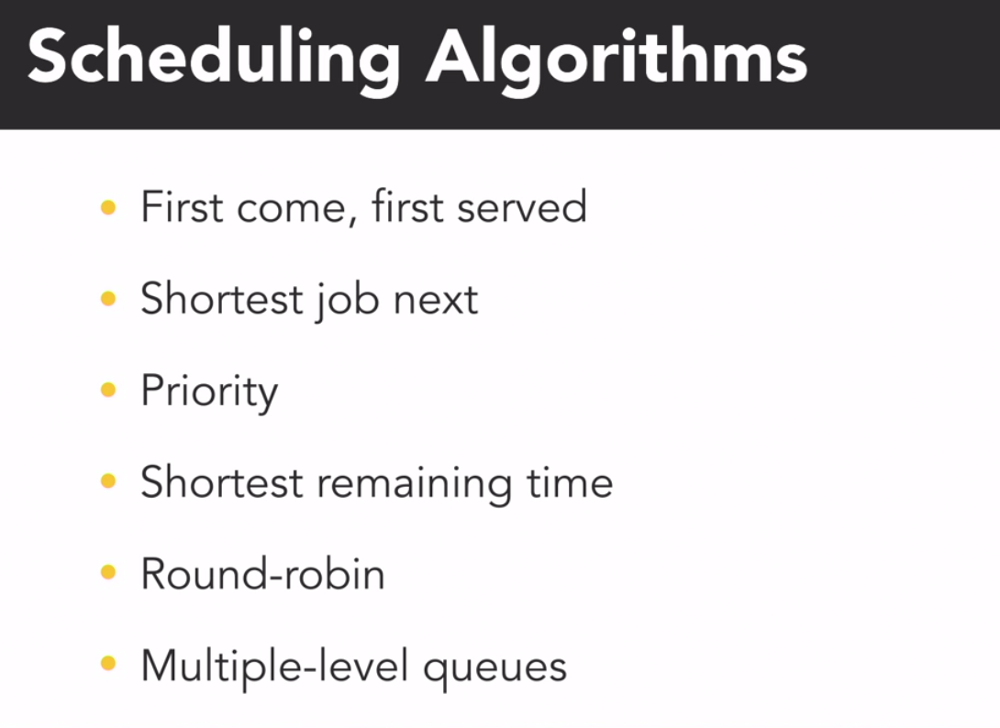

# Global Interpreted Lock

## Definition

_The GIL - is a mechanism in Python that prevents multiple Python threads from executing at the same time._

_Mechanims that limits Python to only execute one thread at a time_

_The global interpreter lock was implemented as a simple way to provide thread-safe memory management in CPython by only letting one Python thread execute at a time._

## How does the Interpreter work?


The interpreter compiles your Python program into an intermediate bytecode which is then executed with a virtual machine along with any necessary modules from the library. The default and by far most widely used interpreter is CPython

GIL is good with I/O bound tasks, but not with CPU bound tasks.


| I/O operation                                                |                          CPU bound                          |
|--------------------------------------------------------------|:-----------------------------------------------------------:|
| Threading module                                             |                       Multiprocessing                       |
| Await for external actions (network operations / user_input) | Execute outside the GIL restrictions using parallel threads |


# Multiple threads


```python
""" Threads that waste CPU cycles """

import os
import threading

# a simple function that wastes CPU cycles forever
def cpu_waster():
    while True:
        pass

# display information about this process
print('\n  Process ID: ', os.getpid())
print('Thread Count: ', threading.active_count())
for thread in threading.enumerate():
    print(thread)

print('\nStarting 12 CPU Wasters...')
for i in range(12):
    threading.Thread(target=cpu_waster).start()

# display information about this process
print('\n  Process ID: ', os.getpid())
print('Thread Count: ', threading.active_count())
for thread in threading.enumerate():
    print(thread)
```

### Output

```bash

  Process ID:  38518
  Thread Count:  1

<_MainThread(MainThread, started 139872115140416)>

Starting 12 CPU Wasters...

    Process ID:  38518

Thread Count:  13
<_MainThread(MainThread, started 139872115140416)>
<Thread(Thread-1, started 139872103769856)>
<Thread(Thread-2, started 139872095377152)>
<Thread(Thread-3, started 139872086984448)>
<Thread(Thread-4, started 139872078329600)>
<Thread(Thread-5, started 139872069936896)>
<Thread(Thread-6, started 139872061544192)>
<Thread(Thread-7, started 139871716898560)>
<Thread(Thread-8, started 139871708505856)>
<Thread(Thread-9, started 139871700113152)>
<Thread(Thread-10, started 139871691720448)>
<Thread(Thread-11, started 139871683327744)>
<Thread(Thread-12, started 139871674935040)>
```

Here we can see the multiple threads inside the one Process ID.
- The threads are running in parallel, but they are not using the CPU at the same time.  
- This is because of the GIL.


# Multiple Processes

```python
import os
import threading
import multiprocessing as mp

# a simple function that wastes CPU cycles forever
def cpu_waster():
    while True:
        pass

print('Hi! My name is', __name__)

if __name__ == '__main__':
    # display information about this process
    print('\n  Process ID: ', os.getpid())
    print('Thread Count: ', threading.active_count())
    for thread in threading.enumerate():
        print(thread)

    print('\nStarting 12 CPU Wasters...')
    for i in range(12):
        mp.Process(target=cpu_waster).start()       # Here we are using multiprocessing instead of threading

    # display information about this process
    print('\n  Process ID: ', os.getpid())
    print('Thread Count: ', threading.active_count())
    for thread in threading.enumerate():
        print(thread)
```

### Output

```bash

  Hi! My name is __main__

  Process ID:  39812
  Thread Count:  1
  <_MainThread(MainThread, started 140284029183808)>

  Starting 12 CPU Wasters...

  Process ID:  39812
  Thread Count:  1
  <_MainThread(MainThread, started 140284029183808)>

```

Basically, here we are using multiprocessing instead of threading. They run in parallel and use the CPU at the same time.

- So that we have created 12 processes (12 separete programs with their own)  
  - memory space
  - global interpreter lock
  - threads


HINT:
- If you want to use multiprocessing, you need to put the code inside the if statement. 
- Because the if statement will only run if the file is run directly, and not if it is imported as a module.
- Python gives each process its own name, so we need to check if the name is main before we start the processes.

# Scheduling

_Threads don't just execute whenever they want to. A computer might have hundreds of processes with thousands of threads that all want their turn to run on just a handful of processors._ 

_The OS includes a scheduler that controls when different threads and processes get their turn to execute on the CPU. The scheduler makes it possible for multiple programs to run concurrently on a single processor._


_When a process is created and ready to run, it gets loaded into memory and placed in the ready **queue**._


## A few real-world exampels

If there are multiple processors, then the OS will schedule processes to run on each of them to make the most use of the additional resources. 

The lifecycle of a process is as follows:

1.  The scheduler cycles through the ready processes so they get a chance to execute on the processor. 
2.  A process will run until it finishes
3.  Then a scheduler will assign another process to execute on that processor.

In case processes are waiting for I/O, they will be placed in the **blocked** **I/O**" queue.





## Context switch 

_Storing the state of a process and restoring it later is called a context switch._

_Loading the state for the **new** process or thread to run_

_It is managed by the OS_

There are a few algorithms that the OS uses to decide which process to run next.




```python
import threading
import time

chopping = True

def vegetable_chopper():
    name = threading.current_thread().getName()
    vegetable_count = 0
    while chopping:
        print(name, 'chopped a vegetable!')
        vegetable_count += 1
    print(name, 'chopped', vegetable_count, 'vegetables.')

if __name__ == '__main__':
    threading.Thread(target=vegetable_chopper, name='Barron').start()
    threading.Thread(target=vegetable_chopper, name='Olivia').start()

    time.sleep(5)    # chop vegetables for 1 second
    chopping = False # stop both threads from chopping
```

### Output

```bash
Olivia chopped a vegetable!
Olivia chopped a vegetable! 
Barron chopped a vegetable!
Barron chopped a vegetable!
Olivia chopped 425069 vegetables.
chopped a vegetable!
Barron chopped 435820 vegetables.
```

Not always data processing with threads will have the same results due to the scheduler it can be locked 

# Thread Lifecycle


_When a new process or program begins running, it will start with just one thread, which is called the main thread 
because it's the main one that runs when the program begins._

_That main thread can then start or spawn additional threads to help out, referred to as its child threads, which are part of the same  **process**  but execute independently to do other tasks_

_After finishing doing tasks child threads can be terminated, and the main thread can continue running._

_The main thread is usually the last to finish the execution of the program, and when it does, the process will end._ 


There are 5 states of threads:
1. _**New**_ - just created
2. _**Runnable**_ - ready to run
3. _**Running**_ - currently running
4. _**Blocked**_ - waiting for something to happen
5. _**Terminated**_ - finished running


We can use join() to wait for another thread to finish

In this case the Thread-1 will be in the blocked state until the Thread-2 finishes


There are two common approaches to managing threads:

## Example
```python
import threading, time

class ChefOlivia(threading.Thread):

    def __init__(self):
        super().__init__()

    def run(self):
        print('Olivia started & waiting for sausage to thaw...')
        time.sleep(3)
        print('Olivia is done cutting sausage.')

# main thread
if __name__ == '__main__':
    print("Barron started & requesting Olivia's help.")
    olivia = ChefOlivia()
    print('  Olivia alive?:', olivia.is_alive())

    print('Barron tells Olivia to start.')
    olivia.start()
    print('  Olivia alive?:', olivia.is_alive())

    print('Barron continues cooking soup.')
    time.sleep(0.5)
    print('  Olivia alive?:', olivia.is_alive())

    print('Barron patiently waits for Olivia to finish and join...')
    olivia.join()
    print('  Olivia alive?:', olivia.is_alive())

    print('Barron and Olivia are both done!')
```

## Output

```bash

Barron started & requesting Olivia's help.
  
  Olivia alive?: False
  
Barron tells Olivia to start.
Olivia started & waiting for sausage to thaw...

  Olivia alive?: True
  
Barron continues cooking soup.

  Olivia alive?: True
  
Barron patiently waits for Olivia to finish and join...
Olivia is done cutting sausage.

  Olivia alive?: False
  
Barron and Olivia are both done!

Process finished with exit code 0
```


## Daemon Threads

_Threads that run in the background are called daemon threads. Daemon threads are not critical to the main execution of the program, and their failure to complete does not impact the program's execution._

_If the main thread terminates, all daemon threads are abruptly stopped without completing their work._

_If the main thread is still running, the program will not terminate until all non-daemon threads have completed._

_If a daemon thread in Python creates another thread, that child thread will also be a daemon thread._

_The daemon thread will not prevent the program from terminating when the main thread is finished._


**It's perfect for background tasks.**

## Quiz:

------------------------------------------------------------------------------------------------------------------------------
1. Why would ThreadA call the ThreadB.join() method?

Answer: ThreadA needs to wait until after ThreadB has terminated to continue.

------------------------------------------------------------------------------------------------------------------------------
2. A thread that calls the join method on another thread will enter the _____ state until the other thread finishes executing.

Answer: Blocked

------------------------------------------------------------------------------------------------------------------------------

3. Why do you have to start a thread after creating it?

Answer: Threads do not automatically run when instantiated.

------------------------------------------------------------------------------------------------------------------------------

4. You can safely expect threads to execute in the same relative order that you create them.

Answer: False

------------------------------------------------------------------------------------------------------------------------------

5. For a Python application to use multiple processor cores for parallel execution, it must be structured to have multiple _____.

Answer: Processes

------------------------------------------------------------------------------------------------------------------------------
6. A hyperthreaded processor with eight logical cores will usually provide _____ performance compared to a regular processor with eight physical cores.

Answer: lower

------------------------------------------------------------------------------------------------------------------------------

7. The operating system assigns each process a unique _____.

Answer: Process ID

------------------------------------------------------------------------------------------------------------------------------

8. The Global Interpreter Lock has a significant, negative impact on the performance of multi-threaded, I/O-bound programs.

Answer: False

_I/O-bound tasks spend most of their time waiting on external actions, like network operations or user input. They do not need to possess the GIL while waiting on I/O, so the GIL usually has a minimal impact on I/O-intensive applications._

------------------------------------------------------------------------------------------------------------------------------

9. The Global Interpreter Lock prevents multiple Python _____ from executing at the same time.

Answer: threads

------------------------------------------------------------------------------------------------------------------------------

10. It is possible for two tasks to execute _____ using a single-core processor.

Answer: concurrently  (Concurrent tasks can take turns to execute on the same processor.)

------------------------------------------------------------------------------------------------------------------------------
11. Concurrent tasks always execute at the same time.

Answer: False

_Concurrency describes the structure that enables a program to execute in parallel (given the necessary hardware), but a concurrent program is not inherently parallel._

------------------------------------------------------------------------------------------------------------------------------

12. Every thread is independent and has its own separate address space in memory.

Answer: False

_Threads share the same address space in memory, so they can access the same variables and data structures._

------------------------------------------------------------------------------------------------------------------------------

